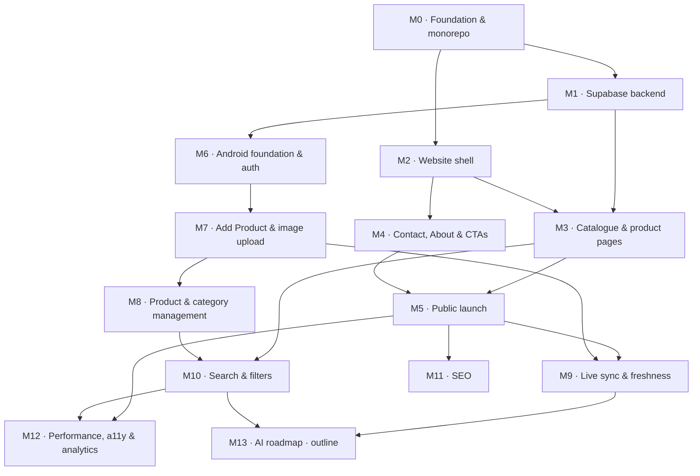

# Development Plan

# Jewellery Catalogue Platform

**Companion to:** [prd.md](prd.md) — the PRD remains the source of truth for *what* to build. This document defines *in what order*, *with what dependencies*, and *how we know each piece is done*.

**Version:** 1.0
**Status:** Not started — repository contains only the PRD.

---

## Planning Decisions

Three decisions shape the ordering below and are recorded here so the rationale is not lost:

1. **Scope of this document** — Phases 1 and 2 of the PRD's Development Roadmap are broken down in full detail (M0–M12). Phase 3 (AI features) is captured as a single forward-looking outline milestone (M13) rather than detailed tasks, because meaningful estimates require the live data model and a real product corpus first.
2. **Repository layout** — single monorepo. Both clients depend on one database schema, and keeping them in one repository makes the schema a single source of truth rather than something to be kept in sync across repositories.
3. **Build order** — Supabase backend → customer website → Android admin app → Phase 2 hardening. The website becomes demoable earliest; products are seeded via SQL and the Supabase dashboard until the admin app exists in M7.

---

## How To Read This Document

Every milestone uses the same six headings: **Goal**, **Tasks**, **Dependencies**, **Estimated complexity**, **Deliverables**, **Acceptance criteria**.

Milestones run in numeric order unless the **Dependencies** line says otherwise. Where two milestones share the same dependency and do not depend on each other, they can proceed in parallel — the dependency graph below makes those branches visible.

A milestone is complete only when **every** acceptance criterion is demonstrably met, in addition to the cross-cutting definition of done at the end of this document.

### Complexity scale

Sizes are relative effort, not calendar time. The PRD names no team size or deadline, so day-estimates would be invented precision. Each milestone states its size plus what drives it.

| Size | Meaning |
|:---:|---|
| **S** | Well-understood work on a single surface. No new infrastructure, no unresolved design questions. |
| **M** | Multiple screens or files, or one new third-party integration to wire up correctly. |
| **L** | Spans two or more of web / android / supabase, or introduces a new pipeline with failure modes worth designing for. |
| **XL** | New subsystem with genuinely unresolved design questions. Needs a spike before it can be estimated. |

### Repository layout

```
SNJewellery/
├── web/                  # Next.js 15 + TypeScript customer website
├── android/              # Kotlin + Jetpack Compose admin application
├── supabase/
│   ├── migrations/       # Versioned SQL — the schema contract
│   ├── policies/         # RLS policy definitions
│   └── seed/             # Categories and sample products
├── prd.md
├── DEVELOPMENT_PLAN.md
└── README.md
```

### Dependency graph



Two branches run in parallel once M1 lands: the **website track** (M2 → M3/M4 → M5) and the **Android track** (M6 → M7 → M8). They converge at M9.

### Milestone summary

| # | Milestone | Size | Depends on | PRD phase |
|:---:|---|:---:|:---:|:---:|
| M0 | Foundation & monorepo scaffold | S | — | 1 |
| M1 | Supabase backend: schema, RLS, storage, auth | L | M0 | 1 |
| M2 | Website shell & design system | M | M0 | 1 |
| M3 | Catalogue & product detail pages | L | M1, M2 | 1 |
| M4 | Contact, About & conversion actions | S | M2 | 1 |
| M5 | Public launch on Vercel | M | M3, M4 | 1 |
| M6 | Android foundation & authentication | M | M1 | 1 |
| M7 | Add Product & image upload pipeline | L | M6 | 1 |
| M8 | Product & category management, offline drafts | L | M7 | 1 |
| M9 | Live sync & content freshness | M | M5, M7 | 1 |
| M10 | Search & filters | L | M3, M8 | 2 |
| M11 | SEO & discoverability | M | M5 | 2 |
| M12 | Performance, accessibility & analytics | L | M5, M10 | 2 |
| M13 | AI roadmap (outline only) | XL | M9, M10 | 3 |

---

# M0 · Foundation & Monorepo Scaffold

### Goal

Establish the repository so that a fresh clone plus documented steps reaches a runnable state, and so that neither client can accidentally commit a secret.

### Tasks

1. Initialise git; create the first commit containing the PRD and this plan.
2. Create the monorepo directory structure shown above (`web/`, `android/`, `supabase/migrations`, `supabase/policies`, `supabase/seed`).
3. Write a combined `.gitignore` covering Node (`node_modules`, `.next`, `.vercel`), Gradle (`build/`, `.gradle/`, `local.properties`, `*.keystore`), Supabase CLI (`.branches`, `.temp`), and environment files (`.env*` with an explicit `!.env.example` exception).
4. Author `web/.env.example` (Supabase URL, anon key, site URL) and document the Android equivalent (`local.properties` entries or `BuildConfig` fields) — placeholder values only.
5. Write `README.md`: what the project is, the monorepo layout, prerequisites (Node version, JDK, Android Studio, Supabase CLI), and per-directory setup steps.
6. Record the three planning decisions above in a short decision log section of the README, so future contributors see the *why*.
7. Choose and document the branch strategy and commit convention.

### Dependencies

None. This is the entry point.

### Estimated complexity

**S** — no application code, no infrastructure. Purely structural.

### Deliverables

- Initialised git repository with a first commit.
- Monorepo directory skeleton.
- `.gitignore`, `web/.env.example`, `README.md` including the decision log.

### Acceptance criteria

- A fresh clone plus the README's documented steps reaches a runnable empty state with no undocumented manual step.
- `git check-ignore` confirms `.env`, `local.properties`, `node_modules/`, and Gradle build output are all excluded, while `.env.example` is tracked.
- No credential, key, or secret appears anywhere in the git history.
- The README names, for each of the three planning decisions, the decision and the reason.

---

# M1 · Supabase Backend — Schema, RLS, Storage, Auth

### Goal

Stand up the complete backend and **freeze the schema contract** that both the website (M3) and the Android app (M7) code against. Changing this schema after M3 and M7 begin means rework in two languages, so it is designed once, here, deliberately.

### Tasks

1. Create Supabase projects — one for development, one for production (production may be provisioned at M5, but the naming and region decision is made here).
2. Write versioned migrations under `supabase/migrations/` for the four tables in the PRD's Database Design section:
   - **`categories`** — `id`, `name`, `slug`, `display_order`, `is_visible`, timestamps.
   - **`products`** — `id`, `name`, `slug`, `description`, `category_id` (FK), `purity`, `weight`, `featured`, `sold`, `created_at`, `updated_at`.
   - **`product_images`** — `id`, `product_id` (FK, cascade delete), `image_url`, `storage_path`, `display_order`.
   - **`users`** — `id` (FK to `auth.users`), `name`, `email`, `role`.
3. Add the fields the PRD's feature list requires but its Database Design section omits, and note each addition in a migration comment:
   - `products.tags` — the PRD specifies search by tags and a Tags field in the Add Product form.
   - `products.archived` — the PRD's Product Management lists Archive as distinct from Delete and from Sold.
   - `products.slug` — needed for SEO-friendly URLs and canonical links in M11.
   - `products.colours` — the PRD's Product Details page lists optional available colours.
4. Add indexes: `products.category_id`, `products.featured`, `products.created_at DESC`, `products.slug` (unique), `product_images(product_id, display_order)`.
5. Create an `updated_at` trigger so the timestamp is maintained by the database, not by client code.
6. Create storage buckets for product images with a documented path convention (e.g. `products/{product_id}/{image_id}.webp`), and configure the image transformation renditions the PRD requires: thumbnail, mobile-optimised, and full optimised.
7. Write RLS policies under `supabase/policies/`:
   - Anonymous/public role: `SELECT` only, and only rows where the product is not archived and its category `is_visible`.
   - Admin role: full `INSERT` / `UPDATE` / `DELETE` on products, images, and categories.
   - Storage: public read of the product bucket; writes restricted to authenticated admins.
   - `users`: a user may read their own row; role is not self-assignable.
8. Configure Supabase Auth for email/password, disable public sign-up, and create the first admin user with `role = 'admin'`.
9. Write seed data covering the eleven categories the PRD names (Gold Rings, Earrings, Chains, Necklaces, Pendants, Bangles, Bracelets, Bridal Jewellery, Diamond Jewellery, Silver Jewellery, Kids Collection) plus a handful of sample products with images, so the website has something real to render in M3.
10. Generate TypeScript types from the schema and document the regeneration command; document the equivalent Kotlin data classes for M6.
11. Write a short `supabase/README.md` documenting the frozen schema contract and the rule that changes to it require updating both clients.

### Dependencies

**M0** — needs the repository structure and the `supabase/` directory layout.

### Estimated complexity

**L** — introduces the database, storage, auth, and the security model, and every later milestone in both tracks depends on getting it right.

### Deliverables

- Versioned SQL migrations that apply cleanly to an empty database.
- RLS policy definitions committed as SQL.
- Configured storage buckets with the three image renditions.
- Auth configured with the first admin account and public sign-up disabled.
- Seed script: eleven categories plus sample products.
- Generated TypeScript types and documented Kotlin model shapes.
- `supabase/README.md` recording the frozen schema contract.

### Acceptance criteria

- Migrations apply cleanly from a completely empty database, in order, with no manual intervention.
- Using the anonymous key: reading published products succeeds; every `INSERT`, `UPDATE`, and `DELETE` is rejected.
- Using an authenticated admin session: all writes succeed.
- A product whose category has `is_visible = false`, and a product with `archived = true`, are both invisible to the anonymous key.
- A signed-out client cannot read a hidden category's products by querying `product_images` or any other table directly.
- Deleting a product cascades to its `product_images` rows.
- Uploading an image as an anonymous user is rejected; uploading as admin succeeds and the public URL is readable without authentication.
- The thumbnail, mobile, and optimised renditions are all retrievable for a test image.
- Generated TypeScript types compile and match the migrations.

---

# M2 · Website Shell & Design System

### Goal

Create the Next.js application with the visual language and layout primitives every page will reuse, so that M3 and M4 build pages rather than re-deciding typography and spacing.

### Tasks

1. Scaffold the Next.js 15 App Router project in `web/` with TypeScript in strict mode.
2. Configure Tailwind CSS, install and configure shadcn/ui, and install Framer Motion.
3. Define the design tokens — colour palette suited to a premium jewellery brand, type scale, spacing scale, radii, shadows — as Tailwind theme extensions rather than ad-hoc classes.
4. Build the shared layout: root layout, header with navigation, footer with store details and social links, mobile navigation drawer.
5. Build reusable primitives that M3 and M4 will consume: product card, section heading, container/grid wrapper, button variants, skeleton loaders, empty state.
6. Create the typed Supabase browser and server clients using the types generated in M1, with environment variables read through a validated config module rather than scattered `process.env` access.
7. Establish `next/image` conventions: which Supabase rendition feeds which layout, required `sizes` values, aspect-ratio boxes to prevent layout shift, and a documented rule that every product image carries alt text derived from product data.
8. Set up ESLint, Prettier, and a `typecheck` script; wire them into a single `verify` command.
9. Define the mobile-first breakpoint strategy and verify the shell across phone, tablet, and desktop widths.

### Dependencies

**M0** — needs the `web/` directory and `.env.example`. Can run in parallel with M1; only M3 needs the live schema.

### Estimated complexity

**M** — well-trodden setup work, but the design decisions made here propagate through every page.

### Deliverables

- Next.js 15 + TypeScript project in `web/` with Tailwind, shadcn/ui, and Framer Motion configured.
- Design tokens committed as Tailwind theme configuration.
- Header, footer, and mobile navigation.
- Reusable component primitives including the product card.
- Typed Supabase clients and a validated environment config module.
- Documented image-handling conventions.
- Lint / format / typecheck tooling behind one `verify` script.

### Acceptance criteria

- `npm run dev` starts cleanly; `npm run build` succeeds; the `verify` script passes with zero errors.
- The shell renders correctly at 375 px, 768 px, and 1440 px widths with no horizontal overflow.
- No cumulative layout shift is observable when images load, at any of those three widths.
- No React hydration warnings appear in the browser console.
- A missing or malformed environment variable fails fast at startup with a clear message, rather than surfacing as a runtime error later.
- Every colour, font size, and spacing value used in the shell comes from a design token, not a hard-coded one-off.

---

# M3 · Catalogue & Product Detail Pages

### Goal

Deliver the customer-facing core: home page, catalogue grid, and product detail pages, all reading live data from Supabase.

### Tasks

1. Build the data-access layer in `web/lib/` — typed query functions for featured products, newest products, products by category, a single product by slug, related products, and the visible category list. All queries go through this layer; no page queries Supabase inline.
2. **Home page** — hero banner, featured collections, newly added jewellery, category shortcuts, store information, contact section (per the PRD's Home Page section).
3. **Catalogue page** — responsive grid of product cards showing image, name, category, purity, weight (when present), and short description, exactly as the PRD's card specification lists. Category-scoped catalogue routes for the category shortcuts to link to.
4. **Product detail page** — large image gallery with thumbnail navigation, name, category, purity, weight, description, available colours when present, and a related-products section.
5. Decide and implement the rendering strategy per route: static generation with ISR for catalogue and product pages, with revalidation tags in place ready for M9 to trigger. Document the choice.
6. Implement loading skeletons and empty states: empty catalogue, empty category, product with no images, product with a missing optional field.
7. Handle a not-found product slug with a proper 404 rather than a crash.
8. Apply tasteful Framer Motion entrance transitions on grid and gallery, respecting `prefers-reduced-motion`.
9. Verify against the M1 seed data, then against a manually added product to confirm nothing is hard-coded.

### Dependencies

**M1** (live schema, seed data, generated types) and **M2** (layout, product card, image conventions).

### Estimated complexity

**L** — the largest surface of the website, spanning data access, three page types, and the rendering strategy that M9 and M12 both build on.

### Deliverables

- Typed data-access layer with documented query functions.
- Home, catalogue, category-scoped catalogue, and product detail routes.
- Image gallery and related-products components.
- Loading, empty, and 404 states.
- Documented rendering and revalidation strategy.

### Acceptance criteria

- Every field the PRD lists for the product card and the product detail page is rendered, and every value comes from Supabase — no placeholder or hard-coded product data remains.
- All eleven seeded categories are reachable from the home page's category shortcuts, and each shows its products.
- A product added directly in the Supabase dashboard appears on the catalogue after revalidation.
- A hidden category and an archived product are absent from every public page — home, catalogue, and related products.
- A product with only one image, and a product with no optional weight or colours, both render without visual breakage.
- An unknown product slug returns a 404 page, not a server error.
- The catalogue grid reflows correctly at 375 px, 768 px, and 1440 px.
- With `prefers-reduced-motion` set, animations are suppressed.

---

# M4 · Contact, About & Conversion Actions

### Goal

Deliver the pages and buttons that turn a browsing customer into a store visit or a phone call — the platform's actual business purpose, since nothing is sold online.

### Tasks

1. **Contact page** — shop address, embedded Google Map, phone number, WhatsApp link, business hours, social media links.
2. **About page** — shop history, experience, mission, certifications (per the PRD's About Us section).
3. Implement the three conversion actions on the product detail page:
   - **WhatsApp Enquiry** — `wa.me` deep link with a pre-filled message naming the specific product and its page URL.
   - **Call Shop** — `tel:` link.
   - **Get Directions** — maps link resolving to the shop location, opening the native maps app on mobile.
4. Centralise all shop details — phone, WhatsApp number, address, coordinates, hours, social handles — in one configuration module, so a change touches exactly one file.
5. Mirror the WhatsApp and call actions in the header or footer so they are reachable from any page.
6. Mark the placeholder shop details clearly (see Open Questions) and file the request for real copy and details.
7. Add `Organization` / `LocalBusiness` semantic markup groundwork for M11 to extend.

### Dependencies

**M2** — needs the layout and component primitives. Independent of M1 and M3; can run in parallel with M3.

### Estimated complexity

**S** — two mostly-static pages plus three deep links. The only real care needed is correct URL encoding of the WhatsApp message.

### Deliverables

- Contact page with embedded map.
- About page.
- WhatsApp / Call / Directions action components.
- Single shop-configuration module.
- Header or footer quick-contact actions.

### Acceptance criteria

- On a real Android device, each of the three buttons opens the correct target application: WhatsApp with the conversation, the dialer with the number pre-entered, and the maps app pointed at the shop.
- On desktop, each button degrades to a working web equivalent rather than a dead link.
- The WhatsApp message arrives containing the product's name and a link to its page, correctly URL-encoded — verified with a product name containing a space and an ampersand.
- Changing the phone number in the configuration module updates every place it appears, verified by grep for any second occurrence of the literal number.
- The embedded map displays the shop's location and is usable on a 375 px viewport.
- Business hours and address render from configuration, not from markup.

---

# M5 · Public Launch on Vercel

### Goal

Put the customer website in production on a real domain, backed by the production Supabase project — completing the PRD's Phase 1 website objective.

### Tasks

1. Provision the production Supabase project; apply all migrations and RLS policies to it; create the production admin account.
2. Create the Vercel project pointed at `web/` in the monorepo; configure the build settings for the monorepo root.
3. Configure environment variables in Vercel for preview and production, using the production Supabase keys. Confirm the service-role key is never exposed to the browser bundle.
4. Configure the custom domain with HTTPS, and set the canonical host (with/without `www`) with a redirect for the other.
5. Add production error handling: `error.tsx`, `not-found.tsx`, and a global error boundary.
6. Add `robots.txt`; keep preview deployments excluded from indexing.
7. Load the real catalogue: enter the initial genuine products through the Supabase dashboard (the admin app arrives in M7).
8. Run a launch smoke checklist across mobile and desktop: every route loads, every conversion button works, no console errors, no placeholder content visible.
9. Record a baseline Lighthouse run — performance, accessibility, SEO — as the reference point M11 and M12 improve against.

### Dependencies

**M3** and **M4** — the site must be complete enough to show the public.

### Estimated complexity

**M** — mostly configuration, but it is the first time production credentials, a real domain, and the production database come together.

### Deliverables

- Production Supabase project with migrations and policies applied.
- Vercel project with configured environments and custom domain.
- Error, 404, and `robots.txt` handling.
- Initial real catalogue content live.
- Completed launch smoke checklist and recorded baseline Lighthouse scores.

### Acceptance criteria

- The custom domain serves the real catalogue over HTTPS, with HTTP redirecting to HTTPS.
- The non-canonical host redirects to the canonical one.
- No development or local Supabase key is present in the production environment, and no service-role key appears anywhere in the client bundle — verified by searching the built output.
- Every route in the smoke checklist loads on both a real mobile device and a desktop browser, with an empty console.
- A deliberately broken route renders the styled error page rather than a stack trace.
- Preview deployments are not indexable.
- Baseline Lighthouse scores for mobile are recorded in the repository for later comparison.

---

# M6 · Android Foundation & Authentication

### Goal

Create the admin application's skeleton — architecture, theme, dependency injection, authenticated session — and prove that only authorised users can get in.

### Tasks

1. Scaffold the Kotlin project in `android/` with Jetpack Compose and a minimum SDK decision recorded.
2. Configure the Material Design 3 theme with light and dark colour schemes and dynamic-colour handling, as the PRD's Android Requirements specify.
3. Establish the MVVM + Repository architecture with a clear module or package split: `data` (remote, local, models), `domain`, `ui` (screens, view models).
4. Configure Hilt for dependency injection.
5. Set up networking — Ktor or Retrofit, decision recorded — plus the Supabase client, and Coil for image loading.
6. Define the Kotlin data models mirroring M1's frozen schema, and document that they must be updated together with any migration.
7. Implement email/password login against Supabase Auth: form validation, loading state, and distinct error messages for wrong credentials versus no network.
8. Persist the session securely so it survives process death and app restart, and implement token refresh.
9. Implement the role check: after authentication, verify `users.role = 'admin'` and reject anyone else with a clear message rather than a blank screen.
10. Implement logout, clearing the persisted session.
11. Build navigation and the authenticated shell with the dashboard as the start destination.
12. Build the dashboard: total products, new uploads, featured products, and recently added items, all read live from Supabase, with loading and error states.

### Dependencies

**M1** — needs the schema, auth configuration, and an admin account. Independent of the entire website track.

### Estimated complexity

**M** — standard Compose scaffolding, but the auth session and role gate need to be genuinely correct, not merely working on the happy path.

### Deliverables

- Kotlin/Compose project with Material 3 theming and dark mode.
- MVVM + Repository structure with Hilt wiring.
- Networking, Supabase, and Coil configured.
- Kotlin models mirroring the frozen schema.
- Login screen, session persistence, role gate, logout.
- Dashboard with the four live metrics.

### Acceptance criteria

- A valid admin logs in and sees the four dashboard metrics matching the database's actual counts.
- An authenticated user whose `role` is not `admin` is refused with an explanatory message and cannot reach the dashboard.
- Wrong credentials and no-network produce different, accurate error messages.
- The session survives a force-stop and relaunch — the user lands on the dashboard, not the login screen.
- An expired token refreshes without forcing a re-login.
- Logout clears the session; relaunching after logout shows the login screen.
- The app renders correctly in both light and dark mode, with no unreadable text in either.
- The app builds as a release variant without errors.

---

# M7 · Add Product & Image Upload Pipeline

### Goal

Deliver the feature the shop owner actually bought this platform for: photograph jewellery and publish it, in under thirty seconds, from a phone.

### Tasks

1. Build the Add Product form covering every field the PRD lists: name, category (picker from live categories), purity, weight, description, tags, featured toggle, images.
2. Implement client-side validation with clear inline errors, and preserve entered state across configuration change and app backgrounding.
3. Implement image capture from camera and selection from gallery, including multi-select, with the correct Android 13+ media permission handling and a graceful path when permission is denied.
4. Implement image reordering and removal before upload, with the first image designated as primary.
5. Implement image compression and resizing before upload, targeting a documented maximum dimension and file size, and verify quality remains acceptable for jewellery detail.
6. Implement the upload pipeline to Supabase Storage using the M1 path convention, with per-image progress indicators and overall progress.
7. Write `products` and `product_images` rows with `display_order` matching the user's chosen order.
8. Make the operation effectively transactional: if an image upload fails mid-way, either complete via retry or roll back so no orphaned product row and no orphaned storage object remains. Implement per-image retry.
9. Handle interruptions: connection lost mid-upload, app backgrounded mid-upload, and duplicate submission from a double tap.
10. Generate the product `slug` and guarantee uniqueness, including for two products with identical names.
11. Show clear success confirmation with a path to view or edit the created product.
12. Measure the end-to-end upload time on mobile data and tune compression and concurrency against the PRD's thirty-second target.

### Dependencies

**M6** — needs auth, DI, networking, and navigation.

### Estimated complexity

**L** — a multi-step pipeline (capture → compress → upload → database write) where each step can fail independently, plus a hard performance target.

### Deliverables

- Add Product screen with all PRD fields and validation.
- Camera and gallery capture with permission handling.
- Image reorder, removal, and compression.
- Upload pipeline with per-image progress and retry.
- Correctly ordered `products` and `product_images` writes.
- Rollback / cleanup on partial failure.
- Recorded upload-time measurement.

### Acceptance criteria

- A product with three images uploads end to end in **under 30 seconds on mobile data** (the PRD's success metric), with the measurement recorded.
- The created product appears in the database with all entered fields, and its `product_images` rows carry `display_order` matching the order chosen on screen.
- Killing the network mid-upload leaves **no** partial product row and **no** orphaned storage object; the user sees an actionable error with retry.
- Backgrounding the app mid-upload does not corrupt the result.
- Double-tapping Save creates exactly one product.
- Denying the camera or media permission produces a clear explanation and a working alternative path, not a crash.
- Two products entered with the same name both save, with distinct slugs.
- The compressed image is visibly acceptable for jewellery detail at full-screen size on the website.
- A rotation or configuration change mid-form does not lose entered data or selected images.
- The uploaded product is visible on the production website (formally timed in M9).

---

# M8 · Product & Category Management, Offline Drafts

### Goal

Give the owner full control of an existing catalogue — edit, delete, feature, mark sold, archive, and organise categories — plus the offline drafting the PRD requires.

### Tasks

1. Build the product list: paginated or lazily loaded, showing thumbnail, name, category, and status badges, ordered most-recent-first.
2. Implement in-app search by name, category, and tags, and status filters.
3. Implement Edit Product, reusing the M7 form: load existing values, add or remove images, reorder images, and save changes.
4. Implement Delete Product with a confirmation step, removing both the database rows and the storage objects so no orphaned images accumulate.
5. Implement the three status toggles the PRD distinguishes — **Featured**, **Sold**, **Archive** — with optimistic UI and rollback on failure. Document what each means for website visibility (see Open Questions on `sold`).
6. Build Category Management: create, edit, delete, hide/show, and drag-to-reorder writing `display_order`.
7. Handle deleting a category that still contains products — block it with an explanation, or require reassignment. Decide and document.
8. Implement offline draft saving with local persistence (Room or DataStore): a draft survives process death, is listed as a pending draft, and syncs automatically when connectivity returns.
9. Show sync status and surface failures for drafts that cannot be uploaded.
10. Implement pull-to-refresh and consistent empty, loading, and error states throughout.

### Dependencies

**M7** — reuses the product form, the image pipeline, and the upload plumbing.

### Estimated complexity

**L** — many CRUD surfaces plus offline persistence with a sync path, which is where the real complexity sits.

### Deliverables

- Product list with search, filters, and pagination.
- Edit and Delete Product, including storage cleanup.
- Featured / Sold / Archive toggles.
- Category management with reorder and hide/show.
- Offline draft persistence with automatic sync.
- Documented meaning of each status flag.

### Acceptance criteria

- Each of Featured, Sold, and Archive is reflected on the website after revalidation, matching the documented visibility rules.
- Deleting a product removes its rows **and** its storage objects — verified by inspecting the bucket afterwards.
- Editing a product's images updates `display_order` correctly and the website gallery order matches.
- Reordering categories in the app changes the order of category shortcuts on the website.
- Hiding a category removes it and its products from every public page.
- A draft created with the device in airplane mode survives a force-stop, appears as pending on relaunch, and uploads intact — with all images — once connectivity returns.
- A draft whose upload fails surfaces the failure and remains retryable rather than silently disappearing.
- In-app search returns matches by name, by category, and by tag.
- Deleting a category containing products behaves as documented, without leaving orphaned products pointing at a missing category.
- A failed toggle rolls the UI back to the true state rather than showing a stale optimistic value.

---

# M9 · Live Sync & Content Freshness

### Goal

Close the loop between the two clients and prove the PRD's headline promise: a product uploaded from the phone is live on the website within one minute.

### Tasks

1. Choose and implement the revalidation mechanism: a Supabase database webhook or Edge Function calling a secured Next.js revalidation route with `revalidateTag` / `revalidatePath`, or Supabase Realtime. Record the decision and its trade-offs.
2. Secure the revalidation endpoint with a shared secret so it cannot be triggered by third parties, and make it idempotent.
3. Map database mutations to the cache tags they must invalidate — product create, product update, delete, featured/sold/archive toggle, category change, image reorder — so a single-product edit does not purge the whole site.
4. Tune CDN and cache headers so revalidation is not defeated by a stale edge cache.
5. Make revalidation failures visible: log them, and ensure a failed webhook does not silently leave the site stale forever — set a fallback ISR interval as a safety net.
6. Run the timed end-to-end test: upload from the phone, then measure until the product is visible on production from a cold client with a cleared cache. Record the result.
7. Repeat the timing for an edit, a delete, and a featured toggle.
8. Document the sync architecture, including how to diagnose a stale page.

### Dependencies

**M5** (production website) and **M7** (real uploads to trigger on). Runs after both tracks have produced something real.

### Estimated complexity

**M** — a small amount of code, but it is distributed-cache behaviour, which needs measurement rather than assumption.

### Deliverables

- Revalidation mechanism, secured and idempotent.
- Mutation-to-cache-tag mapping.
- Tuned cache headers plus a fallback ISR safety net.
- Logging for revalidation failures.
- Recorded timing measurements for create, edit, delete, and toggle.
- Sync architecture documentation.

### Acceptance criteria

- **A product uploaded from the Android app is visible on the production website within 60 seconds** — the PRD's headline metric — measured from a cold client with a cleared cache, and the measurement recorded in the repository.
- Editing a product's name or price-relevant fields is reflected within the same window.
- Deleting a product removes it from the catalogue within the same window.
- Toggling Featured moves the product on or off the home page within the same window.
- Revalidating one product does not purge unrelated cached pages — verified by observing cache status on an untouched page.
- The revalidation endpoint rejects a request without the correct secret.
- A duplicate webhook delivery causes no error or double-work.
- With the webhook deliberately disabled, the page still becomes correct within the documented fallback interval — the site cannot get permanently stuck.

---

# M10 · Search & Filters

### Goal

Make a large catalogue navigable — the first Phase 2 objective — with search and filtering that stays fast as the catalogue grows toward the PRD's 100,000-product target.

### Tasks

1. Add full-text search in Postgres: a generated `tsvector` column over name, description, and tags, with a GIN index, exposed through a database function. Add trigram support if fuzzy matching on misspelled product names is wanted.
2. Build the website search UI: input with debounce, results page, result count, and a clear no-results state suggesting categories to browse instead.
3. Implement the filter set the PRD specifies: category, purity (22K / 18K / Silver / Diamond), Latest, and Featured.
4. Make filters composable and encode all search and filter state in the URL query string, so a filtered view can be shared, bookmarked, and restored on refresh and on back-navigation.
5. Implement pagination or infinite scroll with keyset (cursor) pagination rather than `OFFSET`, so deep pages stay fast at scale.
6. Seed a large synthetic dataset — on the order of 100,000 products — in a scratch environment and measure query latency for search, each filter, and deep pagination. Add indexes until the stated budget is met, and record the numbers.
7. Show active filters as removable chips with a clear-all action.
8. Add category and purity filter entry points from the catalogue and category pages.
9. Confirm the M8 in-app search covers the same fields, and align behaviour between app and website.
10. Ensure search and filter results respect RLS — hidden categories and archived products never appear.

### Dependencies

**M3** (catalogue pages and data layer) and **M8** (tags and status flags being genuinely maintained, so filtering has real data to work on).

### Estimated complexity

**L** — spans a database change, indexing and performance work, and non-trivial URL-state management on the client.

### Deliverables

- `tsvector` column, GIN index, and search function as a migration.
- Search UI with results and no-results states.
- Composable filters with URL-encoded state.
- Keyset pagination or infinite scroll.
- Recorded latency measurements against a ~100,000-product dataset.
- Filter chips and clear-all.

### Acceptance criteria

- Searching a product name, a category name, and a tag each returns the expected products.
- On the ~100,000-product dataset, search and each filter return within the documented latency budget, and the measurements are recorded in the repository.
- Deep pagination (page 500 and beyond) is no slower than the first page.
- Filters compose correctly — category plus purity plus featured returns the intersection, not a union.
- A filtered URL, opened in a fresh browser, reproduces exactly the same result set.
- Refreshing and pressing back both preserve the active search and filters.
- A query with no matches shows the no-results state with browse suggestions, not an empty page.
- Hidden categories and archived products never appear in any search or filter result.
- Search is usable on a 375 px viewport, including the filter controls.

---

# M11 · SEO & Discoverability

### Goal

Make the catalogue findable in search engines and make shared product links look right — hitting the PRD's SEO score target above 95.

### Tasks

1. Implement dynamic per-page metadata via the App Router `generateMetadata`: unique title and description for every product, category, and static page, derived from product data.
2. Implement Open Graph and Twitter Card tags, including a correctly sized product image, so shared links preview properly in WhatsApp — the primary sharing channel for this business.
3. Add JSON-LD structured data: `Product` on product pages, `BreadcrumbList` on catalogue and category pages, and `LocalBusiness` on contact and home, extending the M4 groundwork with address, hours, and geo coordinates.
4. Generate `sitemap.xml` dynamically from the visible catalogue, including products and categories, with `lastModified` from `updated_at`; keep it in step as the catalogue changes.
5. Set canonical URLs on every page, and ensure filtered and paginated catalogue URLs do not create duplicate-content problems.
6. Audit heading hierarchy across all pages: exactly one `<h1>`, no skipped levels.
7. Audit image alt text — every product image's alt derives from real product data, per the M2 convention.
8. Verify `robots.txt` from M5 against the finished route set, and confirm search and filter URLs are handled deliberately.
9. Run Lighthouse SEO and Google's Rich Results test; fix what they flag.

### Dependencies

**M5** — needs a live production site on a real domain to validate against.

### Estimated complexity

**M** — a broad but individually straightforward checklist; the sitemap staying current with the catalogue is the only structural piece.

### Deliverables

- Dynamic metadata on every route.
- Open Graph and Twitter Card tags with product images.
- `Product`, `BreadcrumbList`, and `LocalBusiness` JSON-LD.
- Dynamic `sitemap.xml`.
- Canonical URLs.
- Heading and alt-text audit results.

### Acceptance criteria

- **Lighthouse SEO score above 95** on mobile for the home, catalogue, and product pages — the PRD's target.
- Every product and category page has a unique, descriptive title and meta description; no two pages share a title.
- Pasting a product link into WhatsApp produces a preview with the product's image, name, and description.
- Google's Rich Results test validates the `Product` and `LocalBusiness` structured data with no errors.
- `sitemap.xml` lists every visible product and category, excludes hidden and archived items, and includes a product added after the sitemap was first generated.
- Every page declares a canonical URL, and filtered catalogue URLs canonicalise correctly.
- Every page has exactly one `<h1>` and no skipped heading levels.
- No product image has empty, generic, or filename-derived alt text.

---

# M12 · Performance, Accessibility & Analytics

### Goal

Meet the PRD's non-functional targets — under two seconds on mobile, Lighthouse Performance above 90 — make the site usable for everyone, and start measuring what customers actually do.

### Tasks

1. Audit every image: correct Supabase rendition per layout, accurate `sizes`, modern formats, explicit dimensions, lazy loading below the fold, and priority loading for the hero and the product gallery's first image.
2. Analyse the bundle; remove unused dependencies, dynamically import heavy client components, and confirm Framer Motion is not shipped where it is not used.
3. Optimise fonts: self-host or use `next/font`, subset, and preload to avoid layout shift and blocking.
4. Measure and fix Core Web Vitals — LCP, CLS, INP — on a throttled mobile profile, targeting the sub-two-second load.
5. Review the M10 search and filter paths for performance regressions on the public site.
6. Accessibility pass: full keyboard navigation of catalogue, product gallery, search, and filters; visible focus states; correct ARIA on the gallery, drawer, and filter controls; colour contrast meeting WCAG AA; a screen-reader walkthrough of the primary journey.
7. Verify `prefers-reduced-motion` is honoured everywhere motion was added.
8. Add analytics (Vercel Analytics or a privacy-respecting alternative): pageviews plus events for WhatsApp enquiry clicks, call clicks, directions clicks, searches, and filter usage — so the business can see which products drive enquiries.
9. Set up Core Web Vitals monitoring in production, so regressions surface after launch rather than at the next audit.
10. Re-run the full audit against the M5 baseline and record the before/after.

### Dependencies

**M5** (production site) and **M10** (search and filters must exist to be included in the audit).

### Estimated complexity

**L** — three distinct workstreams (performance, accessibility, analytics), each with its own measurement loop.

### Deliverables

- Image, bundle, and font optimisations.
- Core Web Vitals meeting the stated targets.
- Accessibility fixes with a documented audit.
- Analytics with conversion-event tracking.
- Production Core Web Vitals monitoring.
- Before/after comparison against the M5 baseline.

### Acceptance criteria

- **Mobile Lighthouse Performance above 90** on home, catalogue, and product pages — the PRD's target.
- **Page load under two seconds** on a throttled mobile profile simulating a mobile network — the PRD's target — with the measurement recorded.
- Lighthouse Accessibility score above 95, and no critical issues in an axe scan.
- The full journey — home → catalogue → filter → product → enquiry — is completable using only the keyboard, with a visible focus indicator at every step.
- A screen-reader walkthrough of that journey conveys product information and button purpose intelligibly; the walkthrough is documented.
- All text meets WCAG AA contrast in both light and dark rendering.
- WhatsApp, call, and directions clicks appear as distinct analytics events, attributable to the product page they came from.
- Searches and filter usage are recorded as events.
- Core Web Vitals are visible in a production dashboard.
- The before/after comparison against M5's baseline is recorded in the repository.

---

# M13 · AI Roadmap — Outline Only

### Goal

Turn the PRD's Phase 3 AI wishlist into evaluated, costed decisions before any of it is built. **This milestone deliberately produces documents and spikes, not shipped features** — each item's real cost and feasibility depend on the live catalogue, which only exists after M9.

### Tasks

Each item below is a time-boxed spike producing a decision document — candidate model or service, integration point, cost at expected volume, quality assessment on real catalogue images, and a go/no-go recommendation.

1. **Automatic image tagging** — classify uploaded images into the categories the PRD lists (ring, necklace, bracelet, bridal, temple, diamond, gold, silver) and write to `products.tags` from M1. Integration point: the M7 upload pipeline. Question: on-device, Edge Function, or third-party vision API.
2. **AI description generation** — generate professional product descriptions from images and structured fields. Question: generate at upload time in M7, or as a batch tool over the existing catalogue; and whether the owner reviews before publish.
3. **Background removal** — clean distracting backgrounds from jewellery photographs. Integration point: the M7 compression step, before upload. Question: quality on real jewellery photographs, where fine chains and gemstone edges are the hard cases.
4. **Visual similarity search** — customer uploads an image and gets visually similar catalogue items. **This is the one Phase 3 item that requires a schema migration beyond M1's frozen contract**: pgvector plus an embedding column on `products`, plus a backfill for the existing catalogue. Plan it as such.
5. **Natural-language search** — "show me lightweight bridal necklaces". Layers on M10's search rather than replacing it. Question: query understanding into structured filters versus semantic embedding search, and how it degrades when the model is unavailable.
6. **Smart recommendations** — recommendations from browsing history. Question: what is stored client-side versus server-side, and the privacy implications, given the site currently has no customer accounts.
7. Also from PRD Phase 3, non-AI: **appointment booking** and **inventory synchronisation** — scoped separately, since neither depends on any model.
8. Consolidate the spikes into a prioritised Phase 3 plan with milestones sized properly once the unknowns are resolved.

### Dependencies

**M9** (a working end-to-end pipeline to extend) and **M10** (search to build natural-language search on). Visual search additionally requires a real catalogue of sufficient size for similarity to be meaningful.

### Estimated complexity

**XL** — a new subsystem with unresolved design questions and unknown per-image costs. Deliberately not broken into task-level estimates; that is the output of this milestone, not its input.

### Deliverables

- One decision document per feature — model/service candidate, integration point, cost at volume, quality assessment, go/no-go.
- A migration plan for pgvector and embeddings, if visual search is a go.
- A consolidated, prioritised Phase 3 plan with properly sized milestones.

### Acceptance criteria

- Every feature above has a decision document naming a specific model or service candidate, not a category of solution.
- Every document contains a cost estimate at the expected upload and traffic volume, and states the assumed volume.
- Every document records an explicit go / no-go / defer decision with reasoning.
- Quality assessments are based on the shop's real jewellery photographs, not on stock imagery.
- The visual-search document specifies the exact schema migration required and the backfill approach for the existing catalogue.
- The consolidated plan orders the approved features by value-to-effort and sizes each on the same scale used in this document.

---

# Cross-Cutting Definition Of Done

These apply to **every** milestone, in addition to its own acceptance criteria:

1. **No secrets committed.** No key, token, or credential enters git. Anything new is added to `.env.example` with a placeholder and documented in the README.
2. **RLS respected.** No feature works by bypassing row-level security or by using the service-role key from a client. If a feature seems to need that, the policy is wrong and gets fixed.
3. **Typed end to end.** TypeScript strict mode passes with no new `any`; Kotlin builds with no new warnings suppressed. Schema changes regenerate the TypeScript types and update the Kotlin models in the same change.
4. **Verified on a real device.** Anything customer-facing is checked on a physical mobile phone, not only in a desktop browser's device emulation.
5. **Both clients considered.** Any change to the schema or to a status flag's meaning is reflected in the website, the Android app, and `supabase/README.md` — never just one of the three.
6. **States handled.** Every new screen or surface handles loading, empty, and error states, not only the happy path.
7. **Documented.** Any decision a future contributor would otherwise have to reverse-engineer is written down in the README or the relevant directory's documentation.

---

# Risks & Open Questions

These are genuinely unresolved in the PRD. They are recorded as questions rather than assumed away, and each names the milestone it blocks.

| # | Question | Blocks | Impact if unanswered |
|:---:|---|:---:|---|
| 1 | **Real shop details and copy.** The PRD specifies Contact and About pages but supplies no address, phone number, WhatsApp number, business hours, social handles, shop history, or certifications. | M4, M5 | Pages ship with visible placeholders. M4 builds against a single configuration module so filling these in is a one-file change — but the site cannot go public with placeholder contact details. |
| 2 | **Supabase tier limits.** High-resolution jewellery photography is storage- and bandwidth-heavy. The free tier's storage and egress ceilings may be reached quickly. | M1, M5 | Uploads or image delivery could fail in production without warning. Needs a projected estimate — average image size × images per product × expected catalogue size — and a decision on tier before launch. |
| 3 | **Actual initial catalogue size.** The PRD's non-functional requirements target 100,000+ products, but the shop's real starting catalogue is likely in the hundreds. | M10 | Decides whether M10's indexed search and keyset pagination are needed on day one or can be simplified. Building for 100,000 when the answer is 500 is wasted effort; the reverse is a rewrite. |
| 4 | **Single admin or multiple users.** The schema has a `users.role` field, but the PRD describes one shop owner. | M1, M6 | Decides how much the role model must carry. If staff accounts with narrower permissions are ever wanted, the policies are much cheaper to design for now than to retrofit. |
| 5 | **Android distribution.** The PRD does not say whether the admin app goes on the Play Store or is sideloaded. | M6, M8 | Play Store means developer account, store listing, privacy policy, and review delays. Direct APK means a documented install and update path. Affects release planning and signing setup. |
| 6 | **What `sold` means for visibility.** The PRD lists Mark Sold and Archive as separate actions but never says whether a sold item stays visible with a "sold" badge or disappears. | M3, M8 | Changes the M3 queries and the M8 toggle semantics. A jewellery shop may well want sold items visible as portfolio pieces — this needs the owner's answer. |
| 7 | **Weight and purity display.** Weight is optional in the PRD, and gold prices fluctuate. | M3 | Whether weight is shown to customers at all, and in what unit, is a business decision with pricing implications. |
| 8 | **Analytics and privacy.** M12 adds analytics, and M13's recommendations would track browsing history. | M12, M13 | Determines whether a cookie consent mechanism and privacy policy are needed — which depends on the audience's jurisdiction. |

---

# Traceability

Every item in the PRD's Development Roadmap and every Success Metric maps to a milestone below, so nothing in the PRD is silently dropped.

### PRD Phase 1 → milestones

| PRD Phase 1 item | Delivered by |
|---|---|
| Backend setup | M1 |
| Authentication | M1 (configuration), M6 (client login) |
| Database | M1 |
| Storage | M1 |
| Admin Android App | M6, M7, M8 |
| Product upload | M7 |
| Category management | M8 |
| Website homepage | M3 |
| Catalogue | M3 |
| Product pages | M3 |
| Responsive design | M2, M3, M4 |
| Deployment | M5 |

### PRD Phase 2 → milestones

| PRD Phase 2 item | Delivered by |
|---|---|
| Search | M10 |
| Filters | M10 |
| Featured collections | M3 (display), M8 (management) |
| Analytics | M12 |
| SEO improvements | M11 |
| Performance optimization | M12 |

### PRD Phase 3 → milestones

| PRD Phase 3 item | Addressed by |
|---|---|
| AI auto-tagging | M13 · spike 1 |
| AI descriptions | M13 · spike 2 |
| Background removal | M13 · spike 3 |
| Visual search | M13 · spike 4 |
| Recommendations | M13 · spike 6 |
| Appointment booking | M13 · item 7 |
| Inventory synchronization | M13 · item 7 |

### PRD Success Metrics → acceptance criteria

| PRD success metric | Verified in |
|---|---|
| New products visible online within one minute of upload | **M9** — timed end-to-end measurement |
| Website loads in under two seconds on mobile networks | **M12** — throttled mobile profile measurement |
| Mobile Lighthouse Performance above 90 | **M12** |
| SEO score above 95 | **M11** |
| Admin can upload a product in under 30 seconds | **M7** — timed on mobile data |
| Responsive across desktop, tablet, and mobile | **M2, M3, M4** — verified at 375 / 768 / 1440 px and on a physical device |
| Stable architecture supporting future AI without redesign | **M1** (frozen schema contract) and **M13** (which identifies pgvector as the only migration Phase 3 requires beyond it) |

### PRD sections not in the roadmap

| PRD requirement | Delivered by |
|---|---|
| Website: SSR, lazy loading, image optimization, dynamic metadata, Open Graph | M2, M3, M11, M12 |
| Website: accessibility support | M12 |
| Android: dark mode, Material Design 3 | M6 |
| Android: offline draft saving | M8 |
| Android: image compression, progress indicators | M7 |
| Security: RLS, storage policies, role-based access | M1 |
| Security: HTTPS only, environment variables for secrets | M0, M5 |
| Storage: thumbnail / mobile / optimized renditions | M1 |
| Scalable to 100,000+ products | M10 (see Open Question 3) |
| CDN-based image delivery | M1, M5, M12 |
| Future Enhancements (favourites, QR codes, Instagram sync, multi-language, multi-branch, push notifications, inquiry management, video catalogue) | Out of scope for this document — revisited after M13 |

---

## Next Step

Begin **M0**. It has no dependencies, and its acceptance criteria are the precondition for everything else.

Before starting **M4**, raise Open Question 1 — real shop details and copy — since that is the only blocker on the path to a genuine public launch at M5.
