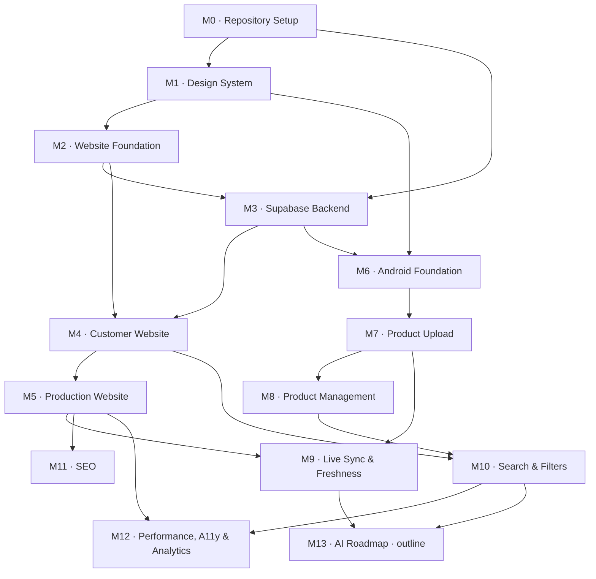

# Development Plan

# Jewellery Catalogue Platform

**Companion to:** [prd.md](prd.md) — the PRD remains the source of truth for *what* to build. This document defines *in what order*, *with what dependencies*, and *how we know each piece is done*.

**Version:** 2.0
**Status:** Not started — M0 partially complete (see M0 task list).
**Architectural decisions:** recorded as ADRs in [docs/adr/](docs/adr/)
**Repository instructions for Claude Code:** [CLAUDE.md](CLAUDE.md)

---

## Planning Decisions

Five decisions shape the ordering below. They are recorded here so the rationale survives, and the significant ones are expanded as ADRs.

1. **Design before code.** A dedicated design-system milestone (M1) precedes all application code. Both the website and the Android app consume the same design system, so it is built once, first, rather than being invented twice and reconciled later. See [ADR-0008](docs/adr/0008-design-tokens-single-source.md).
2. **Website first, then Android.** Order runs: repository → design system → website foundation → backend → website → production → Android. This surfaces visible progress earliest. See [ADR-0009](docs/adr/0009-website-first-with-mock-data-adapter.md).
3. **Monorepo.** One repository holding `web/`, `android/`, and `supabase/`. Both clients depend on one schema; a single repository makes that schema one source of truth instead of something to keep in sync. See [ADR-0001](docs/adr/0001-monorepo.md).
4. **Scope of this document.** PRD Phases 1 and 2 are broken down in full (M0–M12). Phase 3 (AI) is a single outline milestone (M13) of costed spikes, because meaningful estimates need the live data model and a real product corpus first.
5. **Task granularity.** Every milestone is decomposed into numbered tasks (`M4.3`, `M7.6`, …), each scoped to a single focused development session. Milestones are units of *review*; tasks are units of *work*. Claude Code implements one task at a time and stops — see the workflow rules in [CLAUDE.md](CLAUDE.md).

### The website-first problem, and how it is solved

Building the website foundation (M2) before the database (M3) means the site has nothing real to read. Solving this badly — hard-coded arrays scattered through components — would guarantee rework at M4.

Instead, **M2.5 defines the data-access layer as an interface** with a hand-written draft of the domain types, backed by a fixture implementation. M3 then formalises those types as the real schema and generates them from the database; M4 swaps the fixture implementation for the Supabase one behind the same interface. No page or component changes when the swap happens.

This has a second benefit: hand-writing the draft types in M2 forces the schema conversation *before* migrations are written, so M3 codifies a contract that has already been exercised by real UI.

---

## How To Read This Document

Every milestone uses the same six headings: **Goal**, **Tasks**, **Dependencies**, **Estimated complexity**, **Deliverables**, **Acceptance criteria**.

Milestones run in numeric order unless the **Dependencies** line says otherwise. Where two milestones share a dependency and do not depend on each other, they may proceed in parallel — the dependency graph makes those branches visible.

**Tasks** are listed as `Mn.k`, each with a size and a *Done when* condition. A task is the unit Claude Code implements in one iteration. Tasks within a milestone run in order unless noted as independent.

A **milestone** is complete only when every one of its acceptance criteria is demonstrably met **and** every task's *Done when* holds **and** the cross-cutting definition of done at the end of this document is satisfied. Task-level *Done when* conditions are lightweight checks to close a session; milestone acceptance criteria are the real gate.

### Complexity scale

Sizes are relative effort, not calendar time. The PRD names no team size or deadline, so day-estimates would be invented precision. Milestones and tasks use the same scale.

| Size | Meaning |
|:---:|---|
| **S** | Well-understood work on a single surface. No new infrastructure, no unresolved design questions. |
| **M** | Multiple screens or files, or one new third-party integration to wire up correctly. |
| **L** | Spans two or more of web / android / supabase, or introduces a new pipeline with failure modes worth designing for. |
| **XL** | New subsystem with genuinely unresolved design questions. Needs a spike before it can be estimated. |

At task level, read **S** as a comfortable single session, **M** as a full focused session, and **L** as a task that should probably have been split — if a task is sized L, question whether it is really one task.

### Repository layout

```
SNJewellery/
├── android/                     # Kotlin + Jetpack Compose admin application
├── docs/
│   ├── adr/                     # Architecture Decision Records
│   ├── api/                     # Data-access contracts, queries, Edge Functions
│   ├── architecture/            # System architecture, data flow, sync design
│   ├── database/                # Schema contract, migrations guide, RLS model
│   ├── deployment/              # Environments, deploy runbooks, rollback
│   ├── design/                  # Design system: brand, tokens, components, UX
│   └── README.md                # Documentation index
├── supabase/
│   ├── migrations/              # Versioned SQL — the schema contract,
│   │                            #   including RLS policies
│   ├── config.toml              # Local stack + auth configuration
│   └── seed.sql                 # Categories, purities, sample products
├── web/                         # Next.js 15 + TypeScript customer website
├── CLAUDE.md                    # Permanent repository instructions for Claude Code
├── DEVELOPMENT_PLAN.md          # This document
├── README.md                    # Entry point and documentation index
└── prd.md                       # Source of truth for requirements
```

`prd.md` and `DEVELOPMENT_PLAN.md` stay at the repository root deliberately: they are the two canonical project documents and are referenced constantly. Everything else lives under `docs/`. See [docs/README.md](docs/README.md) for the rationale.

### Dependency graph



**Parallelism.** M3 depends on M0 and on M2's draft contract, but not on M2's UI work — once M2.5 lands, backend work can proceed alongside the rest of M2. After M5, the website track (M11, M12) and the Android track (M6–M8) are independent until they converge at M9.

### Milestone summary

| # | Milestone | Size | Depends on | PRD phase |
|:---:|---|:---:|:---:|:---:|
| M0 | Repository Setup | S | — | 1 |
| M1 | Design System | L | M0 | 1 |
| M2 | Website Foundation | M | M1 | 1 |
| M3 | Supabase Backend | L | M0, M2.5 | 1 |
| M4 | Customer Website | L | M2, M3 | 1 |
| M5 | Production Website | M | M4 | 1 |
| M6 | Android Foundation | M | M1, M3 | 1 |
| M7 | Product Upload | L | M6 | 1 |
| M8 | Product Management | L | M7 | 1 |
| M9 | Live Sync & Content Freshness | M | M5, M7 | 1 |
| M10 | Search & Filters | L | M4, M8 | 2 |
| M11 | SEO & Discoverability | M | M5 | 2 |
| M12 | Performance, Accessibility & Analytics | L | M5, M10 | 2 |
| M13 | AI Roadmap (outline only) | XL | M9, M10 | 3 |

---

# M0 · Repository Setup

### Goal

Establish the repository, its documentation structure, and its working rules, so that a fresh clone reaches a runnable state from documented steps and neither client can accidentally commit a secret.

### Tasks

- **`M0.1` Fix the git repository root** — `S` — ✅ **complete**
  The repository is now correctly rooted in the project directory, with a remote on `main`. The stray `C:/.git` still exists but is empty (0 commits, 0 tracked files); removing it is pending approval.
  *Done when:* `git rev-parse --show-toplevel` returns the project directory, and `git status` lists only project files.

- **`M0.2` Monorepo skeleton and ignore rules** — `S` — ✅ **complete**
  Create `web/`, `android/`, `supabase/{migrations,policies,seed}`. Write a combined `.gitignore` covering Node (`node_modules`, `.next`, `.vercel`), Gradle (`build/`, `.gradle/`, `local.properties`, `*.keystore`), Supabase CLI (`.branches`, `.temp`), and `.env*` with an explicit `!.env.example` exception.
  *Done when:* `git check-ignore` confirms each pattern; `.env.example` remains trackable.

- **`M0.3` Environment variable templates** — `S` — ✅ **complete**
  `web/.env.example` and `android/local.properties.example`, both documenting every variable with a comment, and both carrying an explicit warning that the service-role key must never appear.
  *Done when:* every variable either client needs is present with a placeholder and a comment explaining it.

- **`M0.4` Documentation structure** — `S` — ✅ **complete**
  Create `docs/{architecture,adr,api,database,deployment,design}`, each with a README stating its purpose and which milestone produces its contents.
  *Done when:* `docs/README.md` indexes every subdirectory.

- **`M0.5` ADR template and initial records** — `S` — ✅ **complete**
  Create `docs/adr/` with a template and the initial decisions.
  *Done when:* the template exists and every already-made architectural decision has a numbered ADR.

- **`M0.6` CLAUDE.md** — `M` — ✅ **complete**
  Write the permanent repository instructions: philosophy, standards, conventions, expectations, and the Claude Code workflow rules.
  *Done when:* `CLAUDE.md` exists at the root and the eight workflow rules are stated unambiguously.

- **`M0.7` Root README** — `S` — ✅ **complete**
  Thin entry point: what the project is, the layout, prerequisites, and links into `docs/`. No content duplicated from `docs/`.
  *Done when:* README links to the PRD, this plan, CLAUDE.md, and the documentation index.

- **`M0.8` Branch strategy and commit convention** — `S` — ◐ **documented, one decision open**
  The convention is stated in [CLAUDE.md](CLAUDE.md) §10 and is not restated here (one home per fact). Open: whether to branch per task or commit directly to `main` on a solo repo.
  *Done when:* the convention is documented and the first commit follows it.

### Dependencies

None. This is the entry point.

### Estimated complexity

**S** — no application code, no infrastructure. Purely structural. Tasks M0.4–M0.7 are already complete.

### Deliverables

- Git repository correctly rooted in the project directory, with a first commit.
- Monorepo directory skeleton and `.gitignore`.
- `web/.env.example` and documented Android environment configuration.
- `docs/` structure with per-directory READMEs.
- `docs/adr/` with template and initial ADRs.
- `CLAUDE.md` and root `README.md`.
- Documented branch strategy and commit convention.

### Acceptance criteria

- A fresh clone plus the README's documented steps reaches a runnable empty state with no undocumented manual step.
- `git rev-parse --show-toplevel` returns the project directory, not `C:/`.
- `git check-ignore` confirms `.env`, `local.properties`, `node_modules/`, and Gradle build output are all excluded, while `.env.example` is tracked.
- No credential, key, or secret appears anywhere in the git history.
- Every architectural decision already made has a corresponding ADR with status, context, decision, and consequences.
- `CLAUDE.md` states all eight workflow rules, and each is specific enough to be followed without interpretation.
- No documentation file other than `prd.md`, `DEVELOPMENT_PLAN.md`, `README.md`, and `CLAUDE.md` sits at the repository root.

---

# M1 · Design System

### Goal

Define the brand and the complete visual and interaction language **before any application code exists**, and publish it as the single reference both the website and the Android app build against. The output is documentation plus a token definition — no application code.

This milestone exists because the PRD demands a "clean and premium browsing experience" for a luxury product but specifies no visual direction whatsoever. Deciding that inside component code, twice, on two platforms, is how a catalogue ends up looking like a generic template.

### Tasks

- **`M1.1` Brand discovery** — `M` — ✅ **complete**
  Gather what already exists: shop name and its correct treatment, any logo, signage, existing print material, business cards, existing social media presence. Review reference points in luxury jewellery retail and articulate what this brand is and is not.
  *Done when:* `docs/design/brand.md` records the shop's real name, existing assets inventory, three-to-five brand attributes, and an explicit list of visual clichés to avoid.

- **`M1.2` Brand identity direction** — `M` — ✅ **complete**
  Define logo usage rules (clear space, minimum size, placement), the wordmark treatment, tagline if any, and tone of voice for all customer-facing copy.
  *Done when:* `docs/design/brand.md` covers identity usage, and tone of voice includes three do/don't copy examples.

- **`M1.3` Colour palette** — `M` — ✅ **complete**
  Build the palette: restrained neutrals as the foundation, metallic accents appropriate to gold and silver merchandise, and semantic roles (surface, surface-raised, text-primary, text-muted, border, accent, focus, success, warning, danger). Define light and dark variants — the Android app requires dark mode per the PRD, and the website should honour it.
  *Done when:* every colour has a name, a role, light and dark values, and a recorded contrast ratio against the surfaces it is used on; every text/surface pair meets WCAG AA.

- **`M1.4` Typography** — `M` — ✅ **complete**
  Select the typefaces — the usual luxury pairing is a high-contrast serif for display and a quiet sans for UI — and define the type scale, weights, line heights, letter spacing, and the specific role of each step (page title, section heading, product name, price/spec, body, caption, label). Confirm licensing permits both web self-hosting and Android bundling.
  *Done when:* `docs/design/typography.md` defines every step with size, weight, line height, tracking, and usage rule, and licensing is confirmed for both platforms.

- **`M1.5` Spacing, shape, elevation, and layout grid** — `S` — ✅ **complete** (`docs/design/layout.md`, which is also the canonical home for breakpoint values)
  Define the spacing scale, corner radii, border weights, shadow/elevation levels, and the responsive layout grid including maximum content width and gutters.
  *Done when:* each scale is enumerated with names and values, and the grid is specified at every breakpoint from M1.8.

- **`M1.6` Design tokens as a single source of truth** — `M` — ✅ **complete**
  Express everything from M1.3–M1.5 as a platform-neutral token definition, with a documented path to consume it in Tailwind (`web`) and in a Compose theme (`android`). Record the sharing mechanism decision in an ADR.
  *Done when:* the token file exists in `docs/design/`, the generator emits both platform artefacts, and the consumption path for each is documented.

- **`M1.7` Component inventory** — `M` — ✅ **complete**
  Enumerate every component both platforms need, before either is built. For each: purpose, variants, and all states (default, hover, focus, active, disabled, loading, empty, error). Mark each as web-only, Android-only, or shared-concept.
  *Done when:* `docs/design/components.md` covers at minimum — web: header, mobile drawer, footer, product card, image gallery, category chip, filter control, search input, button variants, skeleton, empty state, error state, pagination; Android: top bar, bottom navigation, form field, category picker, image picker tile, upload progress, status badge, confirmation dialog, list row, snackbar.

- **`M1.8` Responsive design principles** — `S` — ✅ **complete**
  Define breakpoints, how the catalogue grid reflows at each, product image aspect ratios (fixed, to prevent layout shift), minimum touch target size, and the mobile-first authoring rule the PRD requires.
  *Done when:* `docs/design/responsive.md` specifies column counts per breakpoint, image aspect ratios, and a minimum touch target in both `dp` and `px`.

- **`M1.9` Animation and motion guidelines** — `S` — ✅ **complete**
  Define duration scale, easing curves, which interactions animate and which deliberately do not, page and gallery transition behaviour, and the `prefers-reduced-motion` / Android reduced-animation requirement. Jewellery photography should be the focus; motion supports it rather than competing with it.
  *Done when:* `docs/design/motion.md` gives named durations and easings, a list of permitted animations, and the reduced-motion rule.

- **`M1.10` UX guidelines** — `M` — ✅ **complete**
  Define product photography standards (background, framing, minimum resolution, consistency across the catalogue — this directly constrains what the owner shoots), imagery rules, CTA hierarchy on the product page, and the standard patterns for loading, empty, and error states.
  *Done when:* `docs/design/ux.md` covers photography standards, CTA hierarchy, and a canonical pattern for each of loading/empty/error.

- **`M1.11` Accessibility standard** — `S` — ✅ **complete**
  State the target (WCAG 2.1 AA), and the concrete rules that follow: contrast minimums, visible focus indicator specification, minimum touch target, alt-text derivation rule for product images, heading hierarchy rule, and keyboard/screen-reader expectations.
  *Done when:* `docs/design/accessibility.md` states the target and each rule as a checkable statement, and M12's audit criteria reference it.

- **`M1.12` Publish and cross-reference** — `S` — ✅ **complete**
  Assemble `docs/design/README.md` as the design system index, and cross-reference it from CLAUDE.md and this plan.
  *Done when:* every design document is reachable from `docs/design/README.md`, and M2 and M6 both cite it as their visual source of truth.

### Dependencies

**M0** — needs the repository and `docs/design/` structure. All inputs received; nothing outstanding.

### Estimated complexity

**L** — twelve deliverables spanning brand, visual, interaction, and accessibility standards, and both platforms depend on the result. It is documentation, but it is the highest-leverage documentation in the project: every later visual decision either follows it or contradicts it.

### Deliverables

- `docs/design/brand.md` — identity, attributes, tone of voice.
- `docs/design/typography.md` — typefaces, scale, roles, licensing.
- `docs/design/colour.md` — palette with semantic roles, light and dark, contrast ratios.
- `docs/design/tokens.*` — platform-neutral token definition plus per-platform consumption path.
- `docs/design/components.md` — full component inventory with variants and states.
- `docs/design/responsive.md` — breakpoints, grid, aspect ratios, touch targets.
- `docs/design/motion.md` — durations, easings, permitted animations, reduced-motion rule.
- `docs/design/ux.md` — photography standards, CTA hierarchy, state patterns.
- `docs/design/accessibility.md` — WCAG AA target and checkable rules.
- `docs/design/README.md` — index.
- [ADR-0008](docs/adr/0008-design-tokens-single-source.md) accepted.

### Acceptance criteria

- Every colour, type step, spacing value, radius, and elevation used anywhere in the project after this milestone traces to a named token defined here — verified at M2.9 and M6.2 by the absence of hard-coded values.
- Every text/background pair in the palette meets WCAG AA contrast in **both** light and dark, with the measured ratios recorded — not asserted.
- The component inventory covers every component the PRD's screens imply; walking the PRD's page and screen lists surfaces no component absent from the inventory.
- Typeface licensing is confirmed in writing to permit both web self-hosting and Android app bundling.
- The token definition is consumable by Tailwind and by a Compose theme, and the documented path for each has been dry-run at least once.
- The photography standard is specific enough for the shop owner to follow without a designer present — it names background, framing, and minimum resolution.
- The accessibility document's rules are each checkable, and M12's acceptance criteria reference them rather than restating them.
- No application code was written in this milestone.

---

# M2 · Website Foundation

### Goal

Stand up the Next.js application with the design system rendered as working code and a data-access interface backed by fixtures, so that M4 builds pages against a real contract without waiting on the database.

### Tasks

- **`M2.1` Scaffold the Next.js application** — `S` — ✅ **complete**
  Next.js **15.5.21** (pinned exactly — `create-next-app` now ships 16) with React 19, Tailwind v4, App Router, TypeScript strict. Scaffold demo content, default palette, and Geist fonts were removed rather than kept, so M1 is not designing against values it would have to undo. See the implementation note in [ADR-0002](docs/adr/0002-nextjs-app-router.md).
  *Done when:* `npm run dev` serves a page and `npm run build` succeeds.

- **`M2.2` Tooling and verification script** — `S` — ✅ **complete**
  ESLint (via `FlatCompat`, which Next 15's legacy config format requires), Prettier with the Tailwind class-sorting plugin, and `npm run verify` = typecheck + lint + format:check.
  *Done when:* `npm run verify` passes with zero errors and is documented in the README.

- **`M2.3` Validated environment configuration** — `S` — ✅ **complete**
  `web/lib/config/env.ts` is the only place `process.env` is read. Validation is **lazy and memoised** rather than eager: eager validation would make the app unrunnable until M3.1 supplies Supabase credentials, blocking M2.5–M2.10, which need no database. The failure is still immediate and still names the variable.
  *Done when:* a missing or malformed variable fails at startup with a message naming the variable.

- **`M2.4` Tokens into Tailwind** — `M` — ✅ **complete** (generated by the M1.6 pipeline; verified all token utilities resolve in the built CSS)
  Consume the M1.6 token definition as Tailwind theme extensions — colours with semantic names, spacing scale, radii, shadows, breakpoints. Configure light/dark.
  *Done when:* every M1 token is reachable as a Tailwind utility, and no colour or spacing literal appears in any component.

- **`M2.5` Data-access interface and fixtures** — `M` — ✅ **complete** (35 contract tests, wired into `npm run verify`)
  Define the domain types by hand as the **draft schema contract** (product, category, product image), and the data-access interface: featured products, newest products, products by category, product by slug, related products, visible categories. Provide a fixture implementation with realistic sample data.
  *Done when:* the interface is fully typed, a fixture implementation satisfies it, and `docs/api/data-access.md` documents both. This task is M3's input — flag any schema question it raises.

- **`M2.6` Typography and base styles** — `S` — ✅ **complete** (self-hosted via `next/font`; 70 KB preloaded, remaining subsets conditional by `unicode-range`)
  Wire the M1.4 typefaces via `next/font` with subsetting and preload; implement the type scale as reusable classes or components.
  *Done when:* every type step from M1.4 is rendered and visually matches its specification, with no layout shift on font load.

- **`M2.7` Application shell** — `M` — ✅ **complete**
  Root layout, header with navigation, footer with store details and social links, mobile navigation drawer — per the M1.7 inventory.
  *Done when:* the shell renders at 375 / 768 / 1440 px with no horizontal overflow, and the drawer is keyboard-operable.

- **`M2.8` Core component primitives** — `M` — ✅ **complete** (built natively rather than via shadcn/ui — see the note below)
  Install and configure shadcn/ui, then build the shared primitives from M1.7: product card, section heading, container/grid, button variants, skeleton loaders, empty state, error state.
  *Done when:* each primitive exists with every state M1.7 specifies, rendered from fixture data.

- **`M2.9` Image handling conventions** — `S` — ✅ **complete** (`AspectBox` + accurate `sizes` matching the grid)
  Establish `next/image` conventions: which rendition feeds which layout, required `sizes` values, fixed aspect-ratio boxes per M1.8, and the alt-text derivation rule from M1.11.
  *Done when:* `docs/design/` or `docs/architecture/` records the conventions, and a fixture-driven grid shows zero cumulative layout shift as images load.

- **`M2.10` Motion setup** — `S` — ✅ **complete** (tokens + global reduced-motion rule; Framer Motion not installed — see note)
  Install Framer Motion; implement the M1.9 durations and easings as shared constants and a reduced-motion-aware wrapper.
  *Done when:* animations use only named M1.9 values, and setting `prefers-reduced-motion` suppresses them.

### Dependencies

**M1** — every task from M2.4 onward consumes the design system. M2.1–M2.3 need only M0.

### Estimated complexity

**M** — well-trodden setup work. The one task carrying real design weight is M2.5, whose interface both M3 and M4 depend on.

### Deliverables

- Next.js 15 + TypeScript project in `web/` with Tailwind, shadcn/ui, and Framer Motion configured.
- M1 tokens as Tailwind theme configuration.
- Validated environment config module.
- Data-access interface, draft domain types, and fixture implementation.
- Application shell: header, footer, mobile drawer.
- Component primitives from the M1.7 inventory.
- Documented image and motion conventions.
- `verify` script covering lint, format, and types.

### Acceptance criteria

- `npm run dev` starts cleanly, `npm run build` succeeds, and `npm run verify` passes with zero errors.
- The shell and a fixture-driven catalogue grid render correctly at 375 px, 768 px, and 1440 px with no horizontal overflow.
- No cumulative layout shift is observable when images load, at any of those three widths.
- No React hydration warnings appear in the browser console.
- A missing or malformed environment variable fails fast at startup with a message naming the variable, rather than surfacing as a runtime error later.
- Every colour, font size, spacing, radius, and duration used in the shell and primitives resolves to an M1 token — a search for hex colours, `px` font sizes, and raw millisecond durations in component code returns nothing.
- Every component in the M1.7 web inventory exists, with every state M1.7 specifies.
- The data-access interface is consumed by at least one rendered surface, proving the fixture path works end to end.
- Swapping the fixture implementation for a different one requires no change to any component or page — verified by substituting an empty-data implementation and observing empty states rather than crashes.
- With `prefers-reduced-motion` set, no animation plays.

---

# M3 · Supabase Backend

### Goal

Stand up the backend and **freeze the schema contract** both clients code against, formalising the draft types from M2.5. Changing this schema after M4 and M7 begin means rework in two languages, so it is designed once, deliberately, here.

### Tasks

- **`M3.1` Provision projects and local development** — `S` — ✅ **complete** (CLI pinned in-repo; dev project linked. Docker not installed, so no local stack — migrations go straight to the dev project)
  Create the development Supabase project, install and configure the CLI, and establish the local development workflow.
  *Done when:* the CLI links to the project and a local instance runs from the repository.

- **`M3.2` Categories and products migrations** — `M` — ✅ **complete**
  `categories` (`id`, `name`, `slug`, `display_order`, `is_visible`, timestamps) and `products` (`id`, `name`, `slug`, `description`, `category_id` FK, `purity`, `weight`, `featured`, `sold`, `created_at`, `updated_at`) per the PRD's Database Design section.
  *Done when:* both migrations apply to an empty database and match the M2.5 draft types.

- **`M3.3` Product images and users migrations** — `S` — ✅ **complete**
  `product_images` (`id`, `product_id` FK cascade-delete, `image_url`, `storage_path`, `display_order`) and `users` (`id` FK to `auth.users`, `name`, `email`, `role`).
  *Done when:* deleting a product cascades to its image rows.

- **`M3.4` Schema-gap fields** — `S` — ✅ **complete** (included at table creation rather than patched in, each with a SQL comment citing the PRD requirement)
  Add the four fields the PRD's feature list requires but its Database Design section omits, each with a migration comment explaining why: `products.tags` (search by tags, Add Product form), `products.archived` (Archive is distinct from Delete and Sold), `products.slug` (SEO URLs and canonicals in M11), `products.colours` (optional available colours on the detail page).
  *Done when:* each field exists and its comment cites the PRD requirement driving it.

- **`M3.5` Indexes and timestamp trigger** — `S` — ✅ **complete**
  Indexes on `products.category_id`, `products.featured`, `products.created_at DESC`, unique `products.slug`, and `product_images(product_id, display_order)`. An `updated_at` trigger so the timestamp is maintained by the database, not client code.
  *Done when:* `EXPLAIN` shows index use for the catalogue and category queries, and an update changes `updated_at` without client involvement.

- **`M3.6` Storage buckets and rendition pipeline** — `M` — ◐ **bucket + policies done**; rendition parameters verified in M4.1 when real images are served
  Create the product image bucket with a documented path convention (`products/{product_id}/{image_id}.webp`) and configure the thumbnail, mobile, and optimised renditions the PRD requires.
  *Done when:* all three renditions are retrievable for a test image, and the convention is recorded in [ADR-0005](docs/adr/0005-image-storage-and-renditions.md).

- **`M3.7` RLS policies** — `M` — ✅ **complete** (24 adversarial checks against the live database, all passing)
  Public role: `SELECT` only, and only where the product is not archived and its category `is_visible`. Admin role: full write on products, images, categories. Storage: public read, admin-only write. `users`: self-read only, role not self-assignable.
  *Done when:* the adversarial checks in this milestone's acceptance criteria all pass.

- **`M3.8` Authentication configuration** — `S` — ◐ **config.toml done**; the hosted project still needs signup disabled and the first admin created in the dashboard
  Email/password enabled, public sign-up disabled, first admin user created with `role = 'admin'`.
  *Done when:* the admin can authenticate and a self-service sign-up attempt is rejected.

- **`M3.9` Seed data** — `S` — ✅ **complete** (applied to the dev project)
  The eleven categories the PRD names — Gold Rings, Earrings, Chains, Necklaces, Pendants, Bangles, Bracelets, Bridal Jewellery, Diamond Jewellery, Silver Jewellery, Kids Collection — plus sample products with images.
  *Done when:* the seed script runs idempotently against an empty database and produces renderable data.

- **`M3.10` Generated types and contract reconciliation** — `M` — ✅ **complete** (one real finding: `aspect` and `role` were text+CHECK and generated as `string`, losing the draft's unions — converted to enums)
  Generate TypeScript types from the schema and reconcile them against the M2.5 hand-written draft, resolving every difference deliberately. Document the equivalent Kotlin data classes for M6.6.
  *Done when:* generated types compile, the M2.5 draft is replaced by generated types with no component changes required, and every reconciliation difference is explained in the commit.

- **`M3.11` Schema contract documentation** — `S` — ✅ **complete** (`docs/database/schema.md`)
  Write `docs/database/schema.md` recording the frozen contract, the rule that changes require updating both clients, and the migration workflow.
  *Done when:* the document exists and CLAUDE.md's schema-change rule references it.

### Dependencies

**M0** for structure, and **M2.5** for the draft contract this milestone formalises. Independent of the rest of M2 — can run in parallel with M2.6–M2.10.

### Estimated complexity

**L** — introduces the database, storage, auth, and the entire security model. Every later milestone in both tracks depends on getting it right.

### Deliverables

- Versioned SQL migrations applying cleanly to an empty database.
- RLS policies committed as SQL under `supabase/policies/`.
- Storage buckets with three configured renditions.
- Auth configured, public sign-up disabled, first admin account created.
- Seed script: eleven categories plus sample products.
- Generated TypeScript types and documented Kotlin model shapes.
- `docs/database/schema.md` recording the frozen contract.

### Acceptance criteria

- Migrations apply cleanly from a completely empty database, in order, with no manual intervention.
- Using the anonymous key: reading published products succeeds; every `INSERT`, `UPDATE`, and `DELETE` is rejected.
- Using an authenticated admin session: all writes succeed.
- A product whose category has `is_visible = false`, and a product with `archived = true`, are both invisible to the anonymous key.
- A signed-out client cannot read a hidden category's products by querying `product_images` or any other table directly.
- A non-admin authenticated user cannot escalate their own `role`.
- Deleting a product cascades to its `product_images` rows.
- Uploading an image as an anonymous user is rejected; uploading as admin succeeds and the public URL is readable without authentication.
- The thumbnail, mobile, and optimised renditions are all retrievable for a test image.
- Generated TypeScript types compile and match the migrations.
- Replacing M2.5's draft types with the generated types requires no change to any component or page.
- `EXPLAIN` confirms index use for the catalogue, category, and slug-lookup queries.

---

# M4 · Customer Website

### Goal

Deliver the complete customer-facing website reading live data — home, catalogue, product detail, contact, about — and the conversion actions that turn a browsing customer into a store visit or a phone call. Nothing is sold online, so those actions *are* the business outcome.

### Tasks

- **`M4.1` Real data-access implementation** — `M` — ✅ **complete** (the same 38 contract tests pass unchanged against both fixtures and the live database)
  Implement the M2.5 interface against Supabase, replacing the fixture implementation. All queries live in this layer; no page queries Supabase inline.
  *Done when:* every interface method is backed by a real query, fixtures are retained for tests only, and no component changed.

- **`M4.2` Home page** — `M`
  Hero banner, featured collections, newly added jewellery, category shortcuts, store information, contact section — per the PRD's Home Page section.
  *Done when:* every section listed in the PRD renders from live data.

- **`M4.3` Catalogue grid and category routes** — `M` — ✅ **complete** (all eleven categories pre-rendered and reachable; unknown slug 404s)
  Responsive grid of product cards showing image, name, category, purity, weight when present, and short description — exactly the PRD's card specification. Category-scoped routes for the home page's shortcuts to link to.
  *Done when:* all eleven categories are reachable and each shows its products.

- **`M4.4` Product detail — information** — `S` — ✅ **complete**
  Name, category, purity, weight, description, and available colours when present.
  *Done when:* every field the PRD's Product Details section lists is rendered from live data.

- **`M4.5` Product detail — image gallery** — `M` — ✅ **complete** (keyboard tablist; frame locked to the first image's aspect)
  Large image gallery with thumbnail navigation, honouring the M1.9 motion rules and M2.9 image conventions.
  *Done when:* the gallery is keyboard-operable, respects reduced-motion, and shows no layout shift.

- **`M4.6` Related products** — `S` — ✅ **complete** (hides when empty)
  Related-products section on the product page.
  *Done when:* related products exclude the current product, archived products, and hidden categories.

- **`M4.7` Rendering and revalidation strategy** — `M` — ✅ **complete** (every route static + ISR at 10 min; tags placed for M9)
  Choose per-route rendering — static with ISR for catalogue and product pages — and place the revalidation tags M9 will trigger. Document the choice.
  *Done when:* `docs/architecture/rendering.md` records the strategy and every cacheable route carries a tag.

- **`M4.8` Loading, empty, and 404 states** — `S` — ✅ **complete** (every case renders an M1.10 pattern with a next step; skeletons share the real components' geometry)
  Empty catalogue, empty category, product with no images, product missing optional fields, unknown slug.
  *Done when:* each case renders the M1.10 pattern rather than breaking or erroring.

- **`M4.9` Shop configuration module** — `S` — ✅ **complete** (`web/lib/config/site.ts`; the number is one literal, every other form derived — grep returns exactly one occurrence)
  Centralise phone, WhatsApp number, address, coordinates, business hours, and social handles in one module.
  *Done when:* a grep for the literal phone number returns exactly one occurrence.

- **`M4.10` Contact page** — `S` — ✅ **complete** (address, hours, WhatsApp, call and the rates panel, all from M4.9)
  Address, embedded Google Map, phone, WhatsApp, business hours, social links — all from M4.9.
  *Done when:* ~~the map displays the shop location and is usable at 375 px~~ — **superseded by the owner's decision of 2026-07-27: there is no map.** The map criterion no longer applies, the embed was removed rather than left hiding, and the address plus Get Directions are how a customer finds the shop. Social links still hide until Open Question 18 supplies them.

- **`M4.11` About page** — `S` — ✅ **complete** (real copy supplied by the owner 2026-07-27, so no placeholder was needed)
  Shop history, experience, mission, certifications — per the PRD's About Us section.
  *Done when:* the page renders; ~~placeholder copy is clearly marked pending Open Question 1~~ — the owner supplied one paragraph covering history, experience and mission. It is stored verbatim in `site.about.intro`. **Certifications were not supplied and that section renders nothing** — on a page asserting a jeweller's trustworthiness, implying an unclaimed hallmark certification would undermine the copy itself.

- **`M4.12` Conversion actions** — `M` — ◐ **built and wired everywhere**; WhatsApp encoding verified for a name containing a space and an ampersand. Two things outstanding, neither in code: physical Android device verification, and Get Directions, which renders nothing until Open Question 18 supplies a Maps location.
  WhatsApp enquiry (`wa.me` deep link, message pre-filled with the product name and page URL), Call Shop (`tel:`), Get Directions (maps link opening the native app on mobile). Mirror WhatsApp and call in the header or footer.
  *Done when:* all three work on a physical Android device, and the WhatsApp message is correctly encoded for a product name containing a space and an ampersand.

- **`M4.14` Today's gold and silver rates** — `S` — ✅ **complete** (`metal_rates` table, RLS, data-access method, home page panel)
  Owner's decision 2026-07-27, replacing per-piece purity and weight on the customer-facing site. Two rows, updated daily by the owner. Panel hides entirely until both are published.
  *Done when:* the rates render from live data, and hide cleanly while unpublished. Contact page placement lands with M4.10.

- **`M4.15` Remove purity and weight from the website** — `S` — ✅ **complete**
  Card, product page, image alt text and metadata. Schema, fixtures and the admin contract keep both. Supersedes the PRD's card and Product Details specifications — see the amendment in [prd.md](prd.md).
  *Done when:* no website surface renders purity or weight, and the contract tests assert it. Open Question 20 records what "hidden" does and does not mean.

- **`M4.13` Motion and visual polish** — `S` — ✅ **complete** (`sn-enter` on appended cards only; one deviation found and fixed)
  Apply the M1.9 entrance transitions to grid and gallery; final pass against the design system.
  *Done when:* a page-by-page comparison against `docs/design/` finds no deviation.

  The sweep found **one** deviation: the skeleton used Tailwind's `animate-pulse` (2s, its own curve) where motion.md §4 specifies `deliberate` with `standard` easing. Now `sn-pulse`, emitted by the token generator. No raw millisecond value, hex colour, Tailwind palette colour, or hover-zoom on a photograph exists anywhere in `app/` or `components/`.

  Kept deliberately: the `Load more` spinner's rotation. motion.md §4 does not cover an indeterminate spinner, and §3's "never `linear` for anything spatial" is aimed at transitions — a spinner easing in and out reads as broken. It is paired with the word "Loading", so motion is not carrying the meaning alone (rule 5).

  **Not observed in a browser:** the entrance applies only to cards appended by `Load more`, and the catalogue is 11 products against a page size of 24, so that control never renders. Verified statically instead — the class is absent from every prerendered page (above-the-fold must not animate) and present in the client bundle. Confirm visually once M5.6 loads real content; reduced-motion behaviour is M12.8's check.

### Dependencies

**M2** (shell, primitives, data interface) and **M3** (live schema, seed data, generated types).

### Estimated complexity

**L** — the largest surface of the website: five page types, the real data layer, and the rendering strategy that M9 and M12 both build on.

### Deliverables

- Supabase-backed data-access implementation.
- Home, catalogue, category, product detail, contact, and about routes.
- Image gallery and related-products components.
- Loading, empty, and 404 states.
- Shop configuration module and the three conversion actions.
- `docs/architecture/rendering.md`.

### Acceptance criteria

- Every field the PRD lists for the product card and the product detail page is rendered, and every value comes from Supabase — no placeholder or hard-coded product data remains.
- All eleven seeded categories are reachable from the home page's category shortcuts, and each shows its products.
- A product added directly in the Supabase dashboard appears on the catalogue after revalidation.
- A hidden category and an archived product are absent from every public page — home, catalogue, product detail, and related products.
- A product with only one image, and a product missing optional weight or colours, both render without visual breakage.
- An unknown product slug returns a 404 page, not a server error.
- The catalogue grid reflows per M1.8 at 375 px, 768 px, and 1440 px.
- On a physical Android device, each conversion button opens the correct application: WhatsApp with the conversation, the dialer with the number pre-entered, and the maps app pointed at the shop.
- On desktop, each conversion button degrades to a working web equivalent rather than a dead link.
- The WhatsApp message arrives containing the product's name and a link to its page, correctly URL-encoded — verified with a product name containing a space and an ampersand.
- Changing the phone number in the configuration module updates every place it appears.
- Business hours and address render from configuration, not from markup.
- With `prefers-reduced-motion` set, animations are suppressed.
- No component required modification when the fixture data layer was replaced with the real one.

---

# M5 · Production Website

### Goal

Put the customer website in production on a real domain, backed by the production Supabase project — completing the PRD's Phase 1 website objective.

### Tasks

- **`M5.1` Production Supabase project** — `S`
  Provision it; apply all migrations and RLS policies; create the production admin account.
  *Done when:* the production database matches development schema-for-schema and the RLS checks from M3 pass against it.

- **`M5.2` Vercel project and monorepo build** — `S`
  Create the project pointed at `web/`, with build settings correct for the monorepo root.
  *Done when:* a push to the default branch produces a successful deployment.

- **`M5.3` Environment variables and secret audit** — `S`
  Configure preview and production environments with production Supabase keys.
  *Done when:* no service-role key appears in the client bundle — verified by searching the built output — and no development key is present in production.

- **`M5.4` Domain, HTTPS, and canonical host** — `S`
  Custom domain with HTTPS; choose the canonical host and redirect the other.
  *Done when:* HTTP redirects to HTTPS and the non-canonical host redirects to the canonical one.

- **`M5.5` Production error handling and robots** — `S`
  `error.tsx`, `not-found.tsx`, a global error boundary, and `robots.txt`. Preview deployments excluded from indexing.
  *Done when:* a deliberately broken route renders the styled error page, and previews are non-indexable.

- **`M5.6` Real catalogue content** — `M`
  Enter the initial genuine products through the Supabase dashboard — the admin app does not arrive until M7.
  *Done when:* the live catalogue contains real products with real photographs, and no seed sample data remains visible.

- **`M5.7` Launch smoke checklist** — `S`
  Every route, every conversion button, mobile and desktop, console clean, no placeholder content.
  *Done when:* the checklist is completed and committed with its results.

- **`M5.8` Baseline measurement and deployment docs** — `S`
  Record a baseline Lighthouse run (performance, accessibility, SEO) as the reference M11 and M12 improve against, and write `docs/deployment/`.
  *Done when:* baseline scores are committed to the repository and the deployment runbook covers deploy, rollback, and environment variable changes.

### Dependencies

**M4** — the site must be complete enough to show the public.

### Estimated complexity

**M** — mostly configuration, but the first time production credentials, a real domain, and the production database come together.

### Deliverables

- Production Supabase project with migrations and policies applied.
- Vercel project with configured environments and custom domain.
- Error, 404, and `robots.txt` handling.
- Initial real catalogue content live.
- Completed launch smoke checklist and recorded baseline Lighthouse scores.
- `docs/deployment/` runbook covering deploy and rollback.

### Acceptance criteria

- The custom domain serves the real catalogue over HTTPS, with HTTP redirecting to HTTPS.
- The non-canonical host redirects to the canonical one.
- No development or local Supabase key is present in the production environment, and no service-role key appears anywhere in the client bundle — verified by searching the built output.
- Every route in the smoke checklist loads on both a real mobile device and a desktop browser, with an empty console.
- A deliberately broken route renders the styled error page rather than a stack trace.
- Preview deployments are not indexable.
- Baseline mobile Lighthouse scores are recorded in the repository for later comparison.
- The deployment runbook is complete enough that someone else could deploy and roll back from it alone.

---

# M6 · Android Foundation

### Goal

Create the admin application's skeleton — design system applied, architecture, dependency injection, authenticated session — and prove that only authorised users can get in.

### Tasks

- **`M6.1` Scaffold the Android project** — `S` — ✅ **complete** (`assembleDebug` succeeds; minSdk 26, reasoned in `docs/architecture/android-build.md` §2)
  Kotlin project in `android/` with Jetpack Compose; record the minimum SDK decision and its reasoning.
  *Done when:* the project builds a debug variant and the minSdk decision is documented.

  **minSdk 26 (Android 8.0)**, not the 33 ADR-0007's testing note pointed at. The app is for three or four known administrators on direct APK, so excluding a working phone means that person cannot upload at all — and the permission branching ADR-0007 wanted to avoid is avoided instead by the Photo Picker, which needs no storage permission on any version. ADR-0007 left `minSdk` to this task rather than deciding it, so this refines its note rather than contradicting it.

  Also verified: a clean clone with no Supabase credentials in `local.properties` still builds, and the debug APK contains no `service_role` string.

- **`M6.2` Material 3 theme from design tokens** — `M` — ◐ **built and building**; both schemes, the type scale, shape and elevation all trace to tokens, and dynamic colour is decided. Not yet seen on a screen — see below.
  Implement the M1 tokens as a Compose theme with light and dark colour schemes, the M1.4 type scale, and M1.5 shape and elevation. Decide and document dynamic-colour handling — a brand-led luxury identity usually overrides it.
  *Done when:* both schemes render correctly and every value traces to an M1 token, with no hard-coded colours or dimensions.

  **Dynamic colour is overridden** — recorded against ADR-0008's open sub-question, which left the decision here. The palette is the brand, not a preference, and wallpaper-derived colour would both make the two clients disagree and void the generator's contrast validation. Dark mode is still honoured.

  **Elevation needed a token change.** `tokens.json` held elevation only as CSS box-shadow strings, which Compose cannot use — Android elevation is a distance. Each step now carries both a `shadow` and a `dp`, layout.md §3 documents the pair, and the generated CSS is byte-identical, so the website is unaffected.

  **Outstanding:** "both schemes render correctly" is unverified — it needs a device or an emulator, neither of which this environment has. The build compiles, lint passes, and both font files are confirmed in the APK, but nobody has looked at it. `@PreviewLightDark` previews exist for that check. Fold into the same device pass as M4.12.

- **`M6.3` Architecture and package structure** — `S` — ✅ **complete** (`domain`/`data`/`di`/`ui` exist and are documented in `docs/architecture/android-app.md`; ADR-0007 was already Accepted)
  MVVM + Repository with a clear split: `data` (remote, local, models), `domain`, `ui` (screens, view models). Record it in [ADR-0007](docs/adr/0007-android-architecture.md).
  *Done when:* the structure exists, is documented, and the ADR moves to Accepted.

  Done together with M6.4 in one commit, deliberately: an empty package cannot be committed, so the structure only exists once something real occupies it, and M6.4's wiring is the first thing that does. Packages beyond these appear with the milestone that needs them — `data/remote` in M6.5, `data/models` in M6.6, `data/local` in M8.

  Each documented rule has a check rather than an assertion. Two were run: `BuildConfig` is named only under `data/`, and nothing under `ui/` imports `data`.

- **`M6.4` Dependency injection** — `S` — ✅ **complete** (Hilt; `ShellViewModel` resolves `ConfigRepository` through the graph)
  Configure the chosen DI framework — the PRD leaves Koin and Hilt open; see Open Question 11.
  *Done when:* a view model resolves its repository through DI, and the choice is recorded in ADR-0007.

  Verified two ways rather than by the build merely passing: the generated `ShellViewModel_Factory` takes `ConfigRepository`, the **domain interface** and not the implementation; and deleting the `@Binds` produces `[Dagger/MissingBinding]` at compile time — the compile-time safety ADR-0007 chose Hilt for, demonstrated rather than claimed.

  The repository is real, not a demonstration fixture: it reports whether the build was given Supabase credentials, so an admin handed an unconfigured APK is told which `local.properties` entries are missing instead of meeting an unexplained network error at first sign-in. M6.5 injects the same `BackendConfig` into the Supabase client.

- **`M6.5` Networking, Supabase, and image loading** — `M` — ◐ **built**; the stack compiles and the backend answers, but neither half of the *done when* can be observed yet. Two blockers, both outside the code.
  Configure the chosen HTTP client (Ktor or Retrofit — Open Question 12), the Supabase client, and Coil.
  *Done when:* an authenticated request succeeds and a remote image renders through Coil.

  One OkHttp client is shared by Ktor and Coil, so there is a single connection pool, one TLS handshake to the Supabase host, and one place timeouts are set. The Supabase client is built on first injection rather than at startup, so a build without credentials still reaches the shell and reports what is missing (M6.4) instead of crashing before it draws.

  **Verified out of band**, against the dev project with the anon key the app uses: `GET /rest/v1/categories` returns 200 with real rows, `/auth/v1/settings` returns 200, and the `product-images` bucket exists and lists. So the URL, the key and the endpoints are all good.

  **Blocked on:** (1) no device or emulator here, so no in-app request or render can be observed; (2) **the storage bucket is empty** — zero objects — so there is no remote image for Coil to render at all. The second is not a device problem and does not clear until M5.6 loads real content or M7 uploads something. A signed-in request also needs admin credentials, which belong to M6.7.

  **Required a version-set change**, recorded in `docs/architecture/android-build.md` §1.1–1.2: every supabase-kt 3.x is built against Kotlin 2.1+, so Kotlin went 2.0.21 → 2.1.20, which in turn forced Hilt 2.52 → 2.56.2 and pinned KSP to its KSP1 suffix line. Both traps produce error messages that point nowhere near the cause, so both are written down.

- **`M6.6` Domain models mirroring the schema contract** — `S`
  Kotlin data classes mirroring M3's frozen contract.
  *Done when:* the models match `docs/database/schema.md` field for field, and the file notes that schema changes must update both clients.

- **`M6.7` Login screen** — `M`
  Email/password form with validation, loading state, and distinct error messages for wrong credentials versus no network.
  *Done when:* both failure modes produce different, accurate messages.

- **`M6.8` Session persistence and token refresh** — `M`
  Persist the session securely so it survives process death, and refresh tokens transparently.
  *Done when:* a force-stop and relaunch lands on the dashboard, and an expired token refreshes without a re-login.

- **`M6.9` Role gate** — `S`
  After authentication, verify `users.role = 'admin'`; reject anyone else with an explanation rather than a blank screen.
  *Done when:* a non-admin account is refused with a clear message and cannot reach the dashboard.

- **`M6.10` Navigation shell and logout** — `S`
  Authenticated navigation with the dashboard as start destination, plus logout that clears the persisted session.
  *Done when:* relaunching after logout shows the login screen.

- **`M6.11` Dashboard** — `M`
  Total products, new uploads, featured products, and recently added items — live from Supabase, with loading and error states per M1.10.
  *Done when:* all four metrics match the database's actual counts.

### Dependencies

**M1** (design system to theme from) and **M3** (schema, auth configuration, admin account). Independent of the entire website track — can run in parallel with M4 and M5.

### Estimated complexity

**M** — standard Compose scaffolding, but the auth session and role gate must be genuinely correct, not merely working on the happy path.

### Deliverables

- Kotlin/Compose project with a Material 3 theme derived from M1 tokens, light and dark.
- MVVM + Repository structure with DI wiring.
- Networking, Supabase, and Coil configured.
- Kotlin models mirroring the frozen contract.
- Login, session persistence, role gate, logout.
- Dashboard with the four live metrics.
- ADR-0007 accepted with the DI and HTTP client decisions recorded.

### Acceptance criteria

- A valid admin logs in and sees the four dashboard metrics matching the database's actual counts.
- An authenticated user whose `role` is not `admin` is refused with an explanatory message and cannot reach the dashboard.
- Wrong credentials and no-network produce different, accurate error messages.
- The session survives a force-stop and relaunch — the user lands on the dashboard, not the login screen.
- An expired token refreshes without forcing a re-login.
- Logout clears the session; relaunching after logout shows the login screen.
- The app renders correctly in both light and dark mode, with no unreadable text in either, and both match the M1.3 palette.
- Every colour, dimension, and type style traces to an M1 token — no hard-coded values in Compose code.
- The Kotlin models match `docs/database/schema.md` field for field.
- The app builds as a release variant without errors.

---

# M7 · Product Upload

### Goal

Deliver the feature the shop owner actually bought this platform for: photograph jewellery and publish it, in under thirty seconds, from a phone.

### Tasks

- **`M7.1` Add Product form** — `M`
  Every field the PRD lists: name, category (picker from live categories), purity, weight, description, tags, featured toggle.
  *Done when:* every PRD field is present and writes to the correct column.

- **`M7.2` Validation and state preservation** — `S`
  Inline validation with clear errors; entered state survives configuration change and backgrounding.
  *Done when:* rotating the device mid-form loses neither field values nor selected images.

- **`M7.3` Camera capture** — `M`
  Capture from camera with Android 13+ media permission handling and a graceful denied-permission path.
  *Done when:* denying the permission produces an explanation and a working alternative, not a crash.

- **`M7.4` Gallery selection** — `S`
  Multi-select from the gallery with correct permission handling.
  *Done when:* selecting several images at once works, and denial is handled as in M7.3.

- **`M7.5` Image ordering and removal** — `S`
  Reorder and remove images before upload; first image designated primary.
  *Done when:* the on-screen order is the order that will be persisted.

- **`M7.6` Compression and resizing** — `M`
  Compress and resize before upload to a documented maximum dimension and file size.
  *Done when:* the target is documented, and the result is visibly acceptable for jewellery detail at full-screen size on the website.

- **`M7.7` Upload pipeline with progress** — `M`
  Upload to Supabase Storage using the M3.6 path convention, with per-image and overall progress indicators.
  *Done when:* progress is accurate and visible for every image.

- **`M7.8` Database writes with ordering** — `S`
  Write `products` and `product_images` rows with `display_order` matching the chosen order.
  *Done when:* the website gallery order matches the app's order exactly.

- **`M7.9` Transactional integrity** — `M`
  If an image upload fails mid-way, either complete via retry or roll back so no orphaned product row and no orphaned storage object remains. Per-image retry.
  *Done when:* killing the network mid-upload leaves neither a partial product row nor an orphaned storage object.

- **`M7.10` Interruption handling** — `S`
  Connection lost mid-upload, app backgrounded mid-upload, double-tap submission.
  *Done when:* each case is handled, and double-tapping Save creates exactly one product.

- **`M7.11` Slug generation** — `S`
  Generate the product `slug` with guaranteed uniqueness, including for two products with identical names.
  *Done when:* two products named identically both save with distinct slugs.

- **`M7.12` Success confirmation** — `S`
  Clear confirmation with a path to view or edit the created product.
  *Done when:* the confirmation appears and its link resolves to the new product.

- **`M7.13` Timing measurement and tuning** — `M`
  Measure end-to-end upload time on mobile data; tune compression and upload concurrency against the PRD's thirty-second target.
  *Done when:* a three-image product uploads in under 30 seconds on mobile data, with the measurement recorded in the repository.

### Dependencies

**M6** — needs auth, DI, networking, theming, and navigation.

### Estimated complexity

**L** — a multi-step pipeline (capture → compress → upload → database write) where each step fails independently, plus a hard performance target.

### Deliverables

- Add Product screen with all PRD fields and validation.
- Camera and gallery capture with permission handling.
- Image reorder, removal, and compression.
- Upload pipeline with per-image progress and retry.
- Correctly ordered `products` and `product_images` writes.
- Rollback and cleanup on partial failure.
- Recorded upload-time measurement.

### Acceptance criteria

- A product with three images uploads end to end in **under 30 seconds on mobile data** — the PRD's success metric — with the measurement recorded.
- The created product appears in the database with all entered fields, and its `product_images` rows carry `display_order` matching the order chosen on screen.
- Killing the network mid-upload leaves **no** partial product row and **no** orphaned storage object; the user sees an actionable error with retry.
- Backgrounding the app mid-upload does not corrupt the result.
- Double-tapping Save creates exactly one product.
- Denying the camera or media permission produces a clear explanation and a working alternative path, not a crash.
- Two products entered with the same name both save, with distinct slugs.
- The compressed image is visibly acceptable for jewellery detail at full-screen size on the website.
- A rotation or configuration change mid-form does not lose entered data or selected images.
- The uploaded product is visible on the production website — formally timed in M9.

---

# M8 · Product Management

### Goal

Give the owner full control of an existing catalogue — edit, delete, feature, mark sold, archive, and organise categories — plus the offline drafting the PRD requires.

### Tasks

- **`M8.1` Product list** — `M`
  Paginated or lazily loaded list showing thumbnail, name, category, and status badges, most-recent-first.
  *Done when:* the list scrolls smoothly over several hundred products.

- **`M8.2` In-app search and status filters** — `S`
  Search by name, category, and tags; filter by status.
  *Done when:* each of the three search fields returns correct matches.

- **`M8.3` Edit Product** — `M`
  Reuse the M7.1 form: load existing values, add and remove images, reorder images, save changes.
  *Done when:* editing images updates `display_order` and the website gallery order matches.

- **`M8.4` Delete Product** — `S`
  Confirmation step, then remove both database rows and storage objects.
  *Done when:* inspecting the bucket afterwards shows no orphaned images.

- **`M8.5` Status toggles** — `M`
  Featured, Sold, and Archive as the three distinct actions the PRD names, with optimistic UI and rollback on failure. Document what each means for website visibility.
  *Done when:* each toggle is reflected on the website per the documented rules — **sold stays visible with a badge, archived disappears from the site but remains in the app** — and a failed toggle rolls the UI back to the true state.

- **`M8.6` Category create, edit, delete** — `M`
  Full CRUD on categories.
  *Done when:* a created category appears on the website's shortcuts after revalidation.

- **`M8.7` Category reorder and visibility** — `S`
  Drag-to-reorder writing `display_order`; hide and show.
  *Done when:* reordering in the app changes the website's category order, and hiding removes the category and its products from every public page.

- **`M8.8` Category deletion with products** — `S`
  Block deletion of a non-empty category with an explanation, or require reassignment. Decide and document.
  *Done when:* the behaviour is documented and no orphaned product can point at a missing category.

- **`M8.9` Offline draft persistence** — `M`
  Local persistence (Room or DataStore) so a draft survives process death and is listed as pending.
  *Done when:* a draft created in airplane mode survives a force-stop and appears as pending on relaunch.

- **`M8.10` Draft sync and failure surfacing** — `M`
  Automatic sync on reconnect, with visible sync status and surfaced failures.
  *Done when:* a pending draft uploads intact with all images on reconnect, and a failed draft remains retryable rather than silently disappearing.

- **`M8.11` Refresh and state consistency** — `S`
  Pull-to-refresh and consistent empty, loading, and error states per M1.10 throughout.
  *Done when:* every screen in the milestone handles all three states.

### Dependencies

**M7** — reuses the product form, image pipeline, and upload plumbing.

### Estimated complexity

**L** — many CRUD surfaces plus offline persistence with a sync path, which is where the real complexity sits.

### Deliverables

- Product list with search, filters, and pagination.
- Edit and Delete Product, including storage cleanup.
- Featured / Sold / Archive toggles with documented visibility semantics.
- Category management with reorder and hide/show.
- Offline draft persistence with automatic sync.

### Acceptance criteria

- Each of Featured, Sold, and Archive is reflected on the website after revalidation, matching the documented visibility rules.
- Deleting a product removes its rows **and** its storage objects — verified by inspecting the bucket afterwards.
- Editing a product's images updates `display_order` correctly and the website gallery order matches.
- Reordering categories in the app changes the order of category shortcuts on the website.
- Hiding a category removes it and its products from every public page.
- A draft created with the device in airplane mode survives a force-stop, appears as pending on relaunch, and uploads intact — with all images — once connectivity returns.
- A draft whose upload fails surfaces the failure and remains retryable rather than silently disappearing.
- In-app search returns matches by name, by category, and by tag.
- Deleting a category containing products behaves as documented, without leaving orphaned products pointing at a missing category.
- A failed toggle rolls the UI back to the true state rather than showing a stale optimistic value.

---

# M9 · Live Sync & Content Freshness

### Goal

Close the loop between the two clients and prove the PRD's headline promise: a product uploaded from the phone is live on the website within one minute.

### Tasks

- **`M9.1` Choose the mechanism** — `S`
  Decide between a database webhook or Edge Function calling a secured revalidation route, and Supabase Realtime. Record the trade-offs.
  *Done when:* the mechanism is implemented as [ADR-0006](docs/adr/0006-cache-revalidation-strategy.md) specifies — webhook plus `revalidateTag`.

- **`M9.2` Secured revalidation endpoint** — `M`
  Implement it with a shared secret so third parties cannot trigger it, and make it idempotent.
  *Done when:* a request without the correct secret is rejected, and a duplicate delivery causes no error or double-work.

- **`M9.3` Mutation-to-tag mapping** — `M`
  Map each mutation — product create, update, delete, status toggle, category change, image reorder — to the cache tags it must invalidate, so a single edit does not purge the site.
  *Done when:* revalidating one product leaves unrelated cached pages untouched, verified by observing cache status.

- **`M9.4` Cache header tuning** — `S`
  Tune CDN and cache headers so revalidation is not defeated by a stale edge cache.
  *Done when:* a revalidated page serves fresh content to a cold client with a cleared cache.

- **`M9.5` Failure logging and ISR fallback** — `S`
  Log revalidation failures, and set a fallback ISR interval so a failed webhook cannot leave the site stale forever.
  *Done when:* with the webhook deliberately disabled, the page still becomes correct within the documented fallback interval.

- **`M9.6` Timed end-to-end measurement** — `M`
  Upload from the phone; measure until visible on production from a cold client. Repeat for edit, delete, and featured toggle.
  *Done when:* all four measurements are recorded in the repository and the create path is under 60 seconds.

- **`M9.7` Sync architecture documentation** — `S`
  Write `docs/architecture/sync.md` including how to diagnose a stale page.
  *Done when:* the document explains the mechanism, the tag map, and a diagnosis procedure.

### Dependencies

**M5** (production website) and **M7** (real uploads to trigger on). Runs after both tracks have produced something real.

### Estimated complexity

**M** — a small amount of code, but it is distributed-cache behaviour, which needs measurement rather than assumption.

### Deliverables

- Revalidation mechanism, secured and idempotent.
- Mutation-to-cache-tag mapping.
- Tuned cache headers plus a fallback ISR safety net.
- Logging for revalidation failures.
- Recorded timing measurements for create, edit, delete, and toggle.
- `docs/architecture/sync.md` with a diagnosis runbook.
- ADR-0006 accepted.

### Acceptance criteria

- **A product uploaded from the Android app is visible on the production website within 60 seconds** — the PRD's headline metric — measured from a cold client with a cleared cache, and the measurement recorded in the repository.
- Editing a product's fields is reflected within the same window.
- Deleting a product removes it from the catalogue within the same window.
- Toggling Featured moves the product on or off the home page within the same window.
- Revalidating one product does not purge unrelated cached pages — verified by observing cache status on an untouched page.
- The revalidation endpoint rejects a request without the correct secret.
- A duplicate webhook delivery causes no error or double-work.
- With the webhook deliberately disabled, the page still becomes correct within the documented fallback interval — the site cannot get permanently stuck.

---

# M10 · Search & Filters

### Goal

Make a large catalogue navigable — the first Phase 2 objective — with search and filtering that stays fast as the catalogue grows toward the PRD's 100,000-product target.

### Tasks

- **`M10.1` Full-text search in Postgres** — `M`
  A generated `tsvector` column over name, description, and tags, with a GIN index, exposed through a database function. Add trigram support if fuzzy matching on misspelled names is wanted.
  *Done when:* the migration applies and the function returns ranked results.

- **`M10.2` Search input** — `S`
  Debounced input per the M1.7 inventory.
  *Done when:* typing does not fire a query per keystroke, and the input is keyboard-accessible.

- **`M10.3` Results page and no-results state** — `S`
  Results with count, and a no-results state suggesting categories to browse instead.
  *Done when:* a query with no matches shows the M1.10 empty pattern with browse suggestions.

- **`M10.4` Filter set** — `M`
  Category, purity (22K / 18K / Silver / Diamond), Latest, and Featured — the PRD's filter list.
  *Done when:* filters compose correctly; category plus purity plus featured returns the intersection, not a union.

- **`M10.5` URL-encoded filter state** — `M`
  Encode all search and filter state in the query string so views are shareable, bookmarkable, and restored on refresh and back-navigation.
  *Done when:* a filtered URL opened in a fresh browser reproduces the same result set.

- **`M10.6` Keyset pagination** — `M`
  Cursor pagination rather than `OFFSET`, so deep pages stay fast at scale.
  *Done when:* page 500 is no slower than page 1.

- **`M10.7` Scale testing and latency budget** — `M`
  Seed a synthetic dataset an order of magnitude above the real target — roughly **10,000 products**, against a real catalogue of 500 growing to ~1,000 (resolved question 3) — then measure search, each filter, and deep pagination.
  *Done when:* measurements are recorded in the repository and every path meets the documented budget.

  **Note on the revised target.** The PRD's 100,000+ figure is aspirational; the real catalogue is ~500 at launch and ~1,000 within a year. Testing at 10,000 keeps a 10× safety margin without the effort of engineering for a scale that will not arrive. Keyset pagination (M10.6) is retained anyway — it is no harder than `OFFSET` and removes the question permanently. What this *does* justify dropping is trigram/fuzzy indexing and any query-cost work beyond a GIN index, unless measurement shows a real problem.

- **`M10.8` Filter chips and clear-all** — `S`
  Active filters as removable chips with a clear-all action.
  *Done when:* removing a chip updates both results and URL.

- **`M10.9` Filter entry points** — `S`
  Category and purity entry points from the catalogue and category pages.
  *Done when:* each entry point lands on a correctly pre-filtered view.

- **`M10.10` App alignment and RLS verification** — `S`
  Confirm M8.2's in-app search covers the same fields and behaves consistently; verify search and filters respect RLS.
  *Done when:* hidden categories and archived products never appear in any search or filter result.

### Dependencies

**M4** (catalogue pages and data layer) and **M8** (tags and status flags genuinely maintained, so filtering has real data to work on).

### Estimated complexity

**L** — spans a database change, indexing and performance work, and non-trivial URL-state management on the client.

### Deliverables

- `tsvector` column, GIN index, and search function as a migration.
- Search UI with results and no-results states.
- Composable filters with URL-encoded state.
- Keyset pagination.
- Recorded latency measurements against a ~100,000-product dataset.
- Filter chips and clear-all.

### Acceptance criteria

- Searching a product name, a category name, and a tag each returns the expected products.
- On the ~100,000-product dataset, search and each filter return within the documented latency budget, and the measurements are recorded in the repository.
- Deep pagination (page 500 and beyond) is no slower than the first page.
- Filters compose correctly — category plus purity plus featured returns the intersection, not a union.
- A filtered URL, opened in a fresh browser, reproduces exactly the same result set.
- Refreshing and pressing back both preserve the active search and filters.
- A query with no matches shows the no-results state with browse suggestions, not an empty page.
- Hidden categories and archived products never appear in any search or filter result.
- Search is usable at 375 px, including the filter controls.

---

# M11 · SEO & Discoverability

### Goal

Make the catalogue findable in search engines and make shared product links look right — hitting the PRD's SEO score target above 95.

### Tasks

- **`M11.1` Dynamic metadata** — `M`
  `generateMetadata` for every product, category, and static page, with titles and descriptions derived from product data.
  *Done when:* no two pages share a title, and every page has a descriptive meta description.

- **`M11.2` Open Graph and social previews** — `S`
  Open Graph and Twitter Card tags with a correctly sized product image. WhatsApp is this business's primary sharing channel, so verify there specifically.
  *Done when:* pasting a product link into WhatsApp produces a preview with the product's image, name, and description.

- **`M11.3` Structured data** — `M`
  JSON-LD: `Product` on product pages, `BreadcrumbList` on catalogue and category pages, `LocalBusiness` on home and contact — extending M4.9's shop configuration with address, hours, and geo coordinates.
  *Done when:* Google's Rich Results test validates `Product` and `LocalBusiness` with no errors.

- **`M11.4` Dynamic sitemap** — `S`
  Generate `sitemap.xml` from the visible catalogue, with `lastModified` from `updated_at`.
  *Done when:* a product added after first generation appears, and hidden and archived items are excluded.

- **`M11.5` Canonicals and filtered URLs** — `S`
  Canonical URLs everywhere; ensure M10's filtered and paginated URLs create no duplicate-content problem.
  *Done when:* every page declares a canonical and filtered catalogue URLs canonicalise correctly.

- **`M11.6` Heading hierarchy audit** — `S`
  Exactly one `<h1>` per page, no skipped levels.
  *Done when:* an automated check across all route types passes.

- **`M11.7` Alt text audit** — `S`
  Every product image's alt derives from real product data per the M1.11 rule.
  *Done when:* no image has empty, generic, or filename-derived alt text.

- **`M11.8` Verification pass** — `S`
  Review `robots.txt` against the finished route set; run Lighthouse SEO and Rich Results; fix what they flag.
  *Done when:* Lighthouse SEO exceeds 95 on home, catalogue, and product pages.

### Dependencies

**M5** — needs a live production site on a real domain to validate against.

### Estimated complexity

**M** — a broad but individually straightforward checklist; the sitemap staying current with the catalogue is the only structural piece.

### Deliverables

- Dynamic metadata on every route.
- Open Graph and Twitter Card tags with product images.
- `Product`, `BreadcrumbList`, and `LocalBusiness` JSON-LD.
- Dynamic `sitemap.xml`.
- Canonical URLs.
- Heading and alt-text audit results.

### Acceptance criteria

- **Lighthouse SEO score above 95** on mobile for the home, catalogue, and product pages — the PRD's target.
- Every product and category page has a unique, descriptive title and meta description; no two pages share a title.
- Pasting a product link into WhatsApp produces a preview with the product's image, name, and description.
- Google's Rich Results test validates the `Product` and `LocalBusiness` structured data with no errors.
- `sitemap.xml` lists every visible product and category, excludes hidden and archived items, and includes a product added after the sitemap was first generated.
- Every page declares a canonical URL, and filtered catalogue URLs canonicalise correctly.
- Every page has exactly one `<h1>` and no skipped heading levels.
- No product image has empty, generic, or filename-derived alt text.

---

# M12 · Performance, Accessibility & Analytics

### Goal

Meet the PRD's non-functional targets — under two seconds on mobile, Lighthouse Performance above 90 — make the site usable for everyone, and start measuring what customers actually do.

### Tasks

- **`M12.1` Image audit** — `M`
  Correct rendition per layout, accurate `sizes`, modern formats, explicit dimensions, lazy loading below the fold, priority loading for the hero and the gallery's first image.
  *Done when:* every image on every route type is audited against the M2.9 conventions.

- **`M12.2` Bundle analysis** — `M`
  Remove unused dependencies, dynamically import heavy client components, confirm Framer Motion is not shipped where unused.
  *Done when:* the bundle report is committed and no unused dependency remains.

- **`M12.3` Font optimisation** — `S`
  Self-host or `next/font`, subset, and preload.
  *Done when:* no layout shift or render blocking is attributable to fonts.

- **`M12.4` Core Web Vitals** — `M`
  Measure and fix LCP, CLS, and INP on a throttled mobile profile.
  *Done when:* the sub-two-second target is met and the measurement is recorded.

- **`M12.5` Search and filter performance review** — `S`
  Review M10's paths for regressions on the public site.
  *Done when:* search and filtered views meet the same vitals targets as the catalogue.

- **`M12.6` Keyboard navigation and focus** — `M`
  Full keyboard operation of catalogue, gallery, search, and filters, with the M1.11 focus indicator.
  *Done when:* home → catalogue → filter → product → enquiry is completable by keyboard alone with a visible indicator at every step.

- **`M12.7` ARIA and screen reader pass** — `M`
  Correct ARIA on gallery, drawer, and filter controls; a documented screen-reader walkthrough of the primary journey.
  *Done when:* the walkthrough is documented and conveys product information and button purpose intelligibly.

- **`M12.8` Contrast and reduced-motion verification** — `S`
  Verify against M1.3's recorded ratios and M1.9's reduced-motion rule in the shipped site.
  *Done when:* all text meets WCAG AA in both light and dark rendering, and no animation plays under reduced-motion.

- **`M12.9` Analytics and conversion events** — `M`
  Pageviews plus events for WhatsApp enquiry, call, directions, search, and filter usage — so the business can see which products drive enquiries.
  *Done when:* each event fires with the product it originated from, verified in the analytics dashboard.

- **`M12.10` Production monitoring** — `S`
  Core Web Vitals monitoring in production so regressions surface between audits.
  *Done when:* vitals are visible in a dashboard and a regression threshold is documented.

- **`M12.11` Before/after comparison** — `S`
  Re-run the full audit against the M5.8 baseline and record the delta.
  *Done when:* the comparison is committed to the repository.

### Dependencies

**M5** (production site) and **M10** (search and filters must exist to be included in the audit).

### Estimated complexity

**L** — three distinct workstreams (performance, accessibility, analytics), each with its own measurement loop.

### Deliverables

- Image, bundle, and font optimisations.
- Core Web Vitals meeting the stated targets.
- Accessibility fixes with a documented audit.
- Analytics with conversion-event tracking.
- Production Core Web Vitals monitoring.
- Before/after comparison against the M5 baseline.

### Acceptance criteria

- **Mobile Lighthouse Performance above 90** on home, catalogue, and product pages — the PRD's target.
- **Page load under two seconds** on a throttled mobile profile simulating a mobile network — the PRD's target — with the measurement recorded.
- Lighthouse Accessibility above 95, and no critical issues in an axe scan.
- The full journey — home → catalogue → filter → product → enquiry — is completable using only the keyboard, with a visible focus indicator at every step.
- A screen-reader walkthrough of that journey conveys product information and button purpose intelligibly; the walkthrough is documented.
- All text meets the WCAG AA contrast ratios recorded in M1.3, in both light and dark rendering.
- WhatsApp, call, and directions clicks appear as distinct analytics events, attributable to the product page they came from.
- Searches and filter usage are recorded as events.
- Core Web Vitals are visible in a production dashboard.
- The before/after comparison against M5's baseline is recorded in the repository.

---

# M13 · AI Roadmap — Outline Only

### Goal

Turn the PRD's Phase 3 AI wishlist into evaluated, costed decisions before any of it is built. **This milestone deliberately produces documents and spikes, not shipped features** — each item's real cost and feasibility depend on the live catalogue, which only exists after M9.

### Tasks

Each task is a time-boxed spike producing a decision document: candidate model or service, integration point, cost at expected volume, quality assessment on real catalogue images, and a go/no-go recommendation.

- **`M13.1` Automatic image tagging** — `M`
  Classify uploads into the categories the PRD lists (ring, necklace, bracelet, bridal, temple, diamond, gold, silver), writing to `products.tags`. Integration point: the M7.7 upload pipeline. Open question: on-device, Edge Function, or third-party vision API.

- **`M13.2` AI description generation** — `M`
  Generate professional descriptions from images and structured fields. Open questions: at upload time or as a batch tool over the existing catalogue, and whether the owner reviews before publish.

- **`M13.3` Background removal** — `M`
  Clean distracting backgrounds. Integration point: the M7.6 compression step, before upload. The hard cases are fine chains and gemstone edges — assess there specifically.

- **`M13.4` Visual similarity search** — `L`
  Customer uploads an image, gets visually similar catalogue items. **This is the one Phase 3 item requiring a schema migration beyond M3's frozen contract**: pgvector plus an embedding column on `products`, plus a backfill for the existing catalogue.

- **`M13.5` Natural-language search** — `M`
  "Show me lightweight bridal necklaces." Layers on M10 rather than replacing it. Open questions: query understanding into structured filters versus semantic embedding search, and graceful degradation when the model is unavailable.

- **`M13.6` Smart recommendations** — `M`
  Recommendations from browsing history. Open question: what is stored client-side versus server-side, and the privacy implications, given the site has no customer accounts.

- **`M13.7` Appointment booking and inventory sync** — `M`
  Both are PRD Phase 3 but neither is AI; scope them separately.

- **`M13.8` Consolidated Phase 3 plan** — `M`
  Fold the spikes into a prioritised plan with milestones sized on this document's scale.
  *Done when:* approved features are ordered by value-to-effort and each is sized properly.

### Dependencies

**M9** (a working end-to-end pipeline to extend) and **M10** (search to build natural-language search on). Visual search additionally requires a real catalogue large enough for similarity to be meaningful.

### Estimated complexity

**XL** — a new subsystem with unresolved design questions and unknown per-image costs. Deliberately not broken into implementation tasks; that decomposition is the *output* of this milestone, not its input.

### Deliverables

- One decision document per feature — model/service candidate, integration point, cost at volume, quality assessment, go/no-go.
- A migration plan for pgvector and embeddings, if visual search is a go.
- A consolidated, prioritised Phase 3 plan with properly sized milestones.

### Acceptance criteria

- Every feature above has a decision document naming a specific model or service candidate, not a category of solution.
- Every document contains a cost estimate at the expected upload and traffic volume, and states the assumed volume.
- Every document records an explicit go / no-go / defer decision with reasoning.
- Quality assessments are based on the shop's real jewellery photographs, not on stock imagery.
- The visual-search document specifies the exact schema migration required and the backfill approach for the existing catalogue.
- The consolidated plan orders approved features by value-to-effort and sizes each on the same scale used in this document.

---

# Cross-Cutting Definition Of Done

These apply to **every** milestone and every task, in addition to their own criteria. [CLAUDE.md](CLAUDE.md) states the working rules that enforce them.

1. **No secrets committed.** No key, token, or credential enters git. Anything new is added to `.env.example` with a placeholder and documented.
2. **RLS respected.** No feature works by bypassing row-level security or by using the service-role key from a client. If a feature seems to need that, the policy is wrong and gets fixed.
3. **Typed end to end.** TypeScript strict mode passes with no new `any`; Kotlin builds with no new warnings suppressed. Schema changes regenerate the TypeScript types and update the Kotlin models in the same change.
4. **Design system honoured.** Every visual value traces to an M1 token. No hard-coded colour, font size, spacing, radius, or duration in component code, on either platform.
5. **Verified on a real device.** Anything customer-facing is checked on a physical mobile phone, not only in a desktop browser's device emulation.
6. **Both clients considered.** Any change to the schema or to a status flag's meaning is reflected in the website, the Android app, and `docs/database/schema.md` — never just one of the three.
7. **States handled.** Every new screen or surface handles loading, empty, and error states per M1.10, not only the happy path.
8. **It builds.** The relevant build and `verify` script pass before a task is called complete.
9. **Nothing left unfinished.** No `TODO`, no stub returning fake data, no commented-out half-implementation. A task is either complete or explicitly reported as incomplete.
10. **Documented.** Any decision a future contributor would otherwise have to reverse-engineer is written down — in an ADR if architectural, in `docs/` otherwise.

---

# Resolved Decisions

Answered by the project owner on **2026-07-25**. Recorded here because several
of them change scope or schema, and the reasoning should not be lost.

| # | Question | Answer |
|:---:|---|---|
| 1 | Shop details and copy | **Name:** SN Jewellery & Silver Palace. **Address:** 4-394/A, Temple Street, Markapur – 523316. **Phone / WhatsApp:** +91 9440248401 (same number). **Hours:** 10:00–21:00, open every day. Maps, social links, email, logo, About copy, and business history arrive later — build against configurable defaults ([ADR-0010](docs/adr/0010-configurable-site-content.md)). |
| 2 | Supabase tier | Development project **SNJewellery** already exists and is the primary development environment. All schema changes go through migrations; the dashboard is only for provider and bucket configuration. Storage/egress projection still needed before M5. |
| 3 | Catalogue size | **~500 at launch, 800–1,000 within a year.** Optimise for the low thousands, **not** 100,000+. This materially reduces M10 — see the note in that milestone. |
| 4 | Admin users | **3–4 administrators, all with full permissions in v1.** Design so role-based permissions can be added later without major change. |
| 5 | Android distribution | **Direct APK.** Needs a documented install/update path and release signing in M6.1. |
| 6 | `sold` vs `archived` | **Sold: visible to customers with a clear "Sold" badge.** **Archived: hidden from customers, still visible in the admin app.** Two different queries and two different policies. |
| 7 | Weight and purity | **Show weight in grams.** Purity at launch: 22K Gold, 18K Gold, Silver — extensible without redesign, so a `purities` lookup table rather than a CHECK constraint. |
| 8 | Analytics | **Vercel Analytics.** No cookie banner required. |
| 9 | Brand assets | Name confirmed. Logo and existing brand material arrive later; no tagline. Direction: **traditional jewellery store, modern premium digital presence.** All brand assets configurable. |
| 10 | Design tokens | **Single source of truth, generated per platform** — [ADR-0008](docs/adr/0008-design-tokens-single-source.md) accepted. |
| 11 | Android DI | **Hilt** — [ADR-0007](docs/adr/0007-android-architecture.md) accepted. |
| 12 | Android HTTP | **Ktor** — ADR-0007 accepted. |
| 13 | Revalidation | **Webhook + `revalidateTag`** — [ADR-0006](docs/adr/0006-cache-revalidation-strategy.md) accepted. |
| 14 | Typefaces | **Open-source only.** Must permit web self-hosting and Android bundling. |
| — | Repository workflow | Commit after every completed task, directly to `main`. Stray `C:/.git` deleted. |
| 16 | Configurable site content | **Typed config module**, not a database table. The owner will send updated details for a developer to apply. No  table, no admin settings screen — [ADR-0010](docs/adr/0010-configurable-site-content.md) accepted. |
| — | Design references | Tanishq, Candere, Palmonas, Apple. Direction: premium, elegant, modern luxury, minimal, large product photography, excellent mobile. Palette: **white, gold, black, subtle neutrals**; avoid bright or flashy colours. |

# Risks & Open Questions

What remains genuinely unresolved. Each names the milestone it blocks.

| # | Question | Blocks | Impact if unanswered |
|:---:|---|:---:|---|
| 15 | **Next.js 15 or 16.** The PRD and [ADR-0002](docs/adr/0002-nextjs-app-router.md) specify 15, but `create-next-app` now installs 16. M2.1 pinned 15 to honour the PRD. | M2 onward | Cheap to change now, expensive after M4. Next 16's own agent guidance warns its APIs differ from pre-16 knowledge, which favours staying on 15 while the project is agent-built. Against that, 15 is a major version behind and will age out of support sooner. |

| 17 | **Storage and egress projection.** Roughly 500 products × how many photographs each, at what average size? | M5 | Decides the Supabase tier before launch. High-resolution jewellery photography is heavy on both storage and egress, and the free tier's ceilings are reachable. Feeds the compression target in M7.6. |
| 18 | **Social links and a Maps location.** Partly answered 2026-07-27: **there is no map**, so the embed was removed and M4.10's map criterion is superseded. Social handles remain pending, and no coordinates have been supplied. | M11.3 | Social links hide cleanly per ADR-0010, so nothing is blocked. Two things still ride on a location, and neither is the embed: **Get Directions** (M4.12, a PRD-required conversion action) renders nothing without `geo` or `mapsUrl`, and M11.3's `LocalBusiness` structured data wants real coordinates. A plain Google Maps share link into `mapsUrl` satisfies the first; coordinates satisfy both. |
| 19 | **Domain name.** Not yet purchased; no Vercel account. | M5.2, M5.4 | Deployment is documented but cannot be executed. Does not block M1–M4. Needed before the launch milestone. |
| 20 | **Purity and weight are hidden, not unpublished.** The owner's decision of 2026-07-27 removed them from every website surface, but the anon key still returns `purity_id` and `weight_grams`, and both appear in the RSC payload of any page rendering a product card. | — | Nothing sensitive: purity is readable from the API regardless, and no customer sees it. But "hidden on the site" is not "not published". If it must be genuinely unavailable, that is a column-privilege or view change in RLS — the security boundary — not a UI change, and it should be asked for explicitly. |
| 21 | **Nobody can set a metal rate until M7.** `metal_rates` ships with both rows unpublished and the website hides the panel, which is correct — but the rate stays invisible until the Android app has a screen for it. | M7 | The panel is dead on the live site until then. If rates are wanted sooner, the interim is a direct SQL update by the owner, which needs a documented runbook. |

---

# Traceability

Every item in the PRD's Development Roadmap and every Success Metric maps to a milestone, so nothing in the PRD is silently dropped.

### PRD Phase 1 → milestones

| PRD Phase 1 item | Delivered by |
|---|---|
| Backend setup | M3 |
| Authentication | M3.7–M3.8 (configuration), M6.7–M6.9 (client login) |
| Database | M3.2–M3.5 |
| Storage | M3.6 |
| Admin Android App | M6, M7, M8 |
| Product upload | M7 |
| Category management | M8.6–M8.8 |
| Website homepage | M4.2 |
| Catalogue | M4.3 |
| Product pages | M4.4–M4.6 |
| Responsive design | M1.8 (principles), M2, M4 (implementation) |
| Deployment | M5 |

### PRD Phase 2 → milestones

| PRD Phase 2 item | Delivered by |
|---|---|
| Search | M10.1–M10.3 |
| Filters | M10.4–M10.9 |
| Featured collections | M4.2 (display), M8.5 (management) |
| Analytics | M12.9–M12.10 |
| SEO improvements | M11 |
| Performance optimization | M12.1–M12.5 |

### PRD Phase 3 → milestones

| PRD Phase 3 item | Addressed by |
|---|---|
| AI auto-tagging | M13.1 |
| AI descriptions | M13.2 |
| Background removal | M13.3 |
| Visual search | M13.4 |
| Recommendations | M13.6 |
| Appointment booking | M13.7 |
| Inventory synchronization | M13.7 |

### PRD Success Metrics → acceptance criteria

| PRD success metric | Verified in |
|---|---|
| New products visible online within one minute of upload | **M9.6** — timed end-to-end measurement |
| Website loads in under two seconds on mobile networks | **M12.4** — throttled mobile profile measurement |
| Mobile Lighthouse Performance above 90 | **M12** |
| SEO score above 95 | **M11.8** |
| Admin can upload a product in under 30 seconds | **M7.13** — timed on mobile data |
| Responsive across desktop, tablet, and mobile | **M1.8, M2, M4** — verified at 375 / 768 / 1440 px and on a physical device |
| Stable architecture supporting future AI without redesign | **M3** (frozen schema contract) and **M13.4** (which identifies pgvector as the only migration Phase 3 requires beyond it) |

### PRD sections not in the roadmap

| PRD requirement | Delivered by |
|---|---|
| Customers get "a clean and premium browsing experience" | **M1** — the milestone that exists to make this specific rather than aspirational |
| Website: SSR, lazy loading, image optimization, dynamic metadata, Open Graph | M2.9, M4.7, M11, M12.1 |
| Website: accessibility support | M1.11 (standard), M12.6–M12.8 (verification) |
| Android: dark mode, Material Design 3 | M1.3 (dark palette), M6.2 |
| Android: offline draft saving | M8.9–M8.10 |
| Android: image compression, progress indicators | M7.6, M7.7 |
| Security: RLS, storage policies, role-based access | M3.7 |
| Security: HTTPS only, environment variables for secrets | M0.2–M0.3, M5.3–M5.4 |
| Storage: thumbnail / mobile / optimized renditions | M3.6 |
| Scalable to 100,000+ products | M10.6–M10.7 (see Open Question 3) |
| CDN-based image delivery | M3.6, M5, M12.1 |
| Future Enhancements (favourites, QR codes, Instagram sync, multi-language, multi-branch, push notifications, inquiry management, video catalogue) | Out of scope for this document — revisited after M13 |

---

## Next Step

**Answer Open Question 9** — the shop's exact name and any existing brand assets. M1.1 cannot start without it, and M1 blocks every other milestone except M0.

Then begin **M0.1**: the git repository is currently rooted at `C:/` and is tracking the entire system drive. That is worth fixing before the first real commit.

Work one task at a time. See [CLAUDE.md](CLAUDE.md) for the workflow rules.
