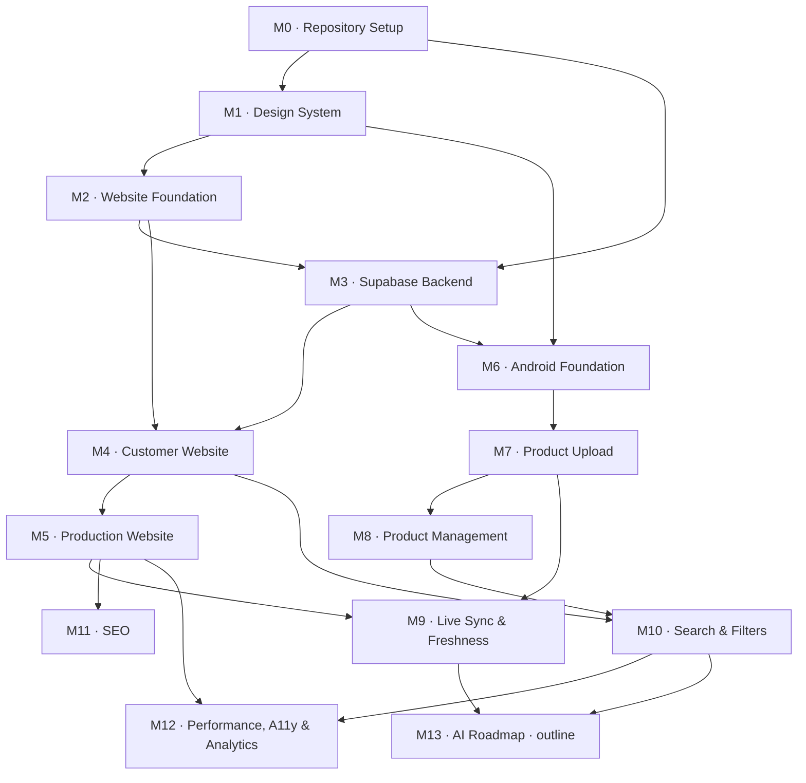

# Development Plan

# Jewellery Catalogue Platform

**Companion to:** [prd.md](prd.md) — the PRD remains the source of truth for *what* to build. This document defines *in what order*, *with what dependencies*, and *how we know each piece is done*.

**Version:** 2.0
**Status:** Not started — M0 partially complete (see M0 task list).
**Architectural decisions:** recorded as ADRs in [docs/adr/](docs/adr/)
**Repository instructions for Claude Code:** [CLAUDE.md](CLAUDE.md)

---

## Planning Decisions

Five decisions shape the ordering below. They are recorded here so the rationale survives, and the significant ones are expanded as ADRs.

1. **Design before code.** A dedicated design-system milestone (M1) precedes all application code. Both the website and the Android app consume the same design system, so it is built once, first, rather than being invented twice and reconciled later. See [ADR-0008](docs/adr/0008-design-tokens-single-source.md).
2. **Website first, then Android.** Order runs: repository → design system → website foundation → backend → website → production → Android. This surfaces visible progress earliest. See [ADR-0009](docs/adr/0009-website-first-with-mock-data-adapter.md).
3. **Monorepo.** One repository holding `web/`, `android/`, and `supabase/`. Both clients depend on one schema; a single repository makes that schema one source of truth instead of something to keep in sync. See [ADR-0001](docs/adr/0001-monorepo.md).
4. **Scope of this document.** PRD Phases 1 and 2 are broken down in full (M0–M12). Phase 3 (AI) is a single outline milestone (M13) of costed spikes, because meaningful estimates need the live data model and a real product corpus first.
5. **Task granularity.** Every milestone is decomposed into numbered tasks (`M4.3`, `M7.6`, …), each scoped to a single focused development session. Milestones are units of *review*; tasks are units of *work*. Claude Code implements one task at a time and stops — see the workflow rules in [CLAUDE.md](CLAUDE.md).

### The website-first problem, and how it is solved

Building the website foundation (M2) before the database (M3) means the site has nothing real to read. Solving this badly — hard-coded arrays scattered through components — would guarantee rework at M4.

Instead, **M2.5 defines the data-access layer as an interface** with a hand-written draft of the domain types, backed by a fixture implementation. M3 then formalises those types as the real schema and generates them from the database; M4 swaps the fixture implementation for the Supabase one behind the same interface. No page or component changes when the swap happens.

This has a second benefit: hand-writing the draft types in M2 forces the schema conversation *before* migrations are written, so M3 codifies a contract that has already been exercised by real UI.

---

## How To Read This Document

Every milestone uses the same six headings: **Goal**, **Tasks**, **Dependencies**, **Estimated complexity**, **Deliverables**, **Acceptance criteria**.

Milestones run in numeric order unless the **Dependencies** line says otherwise. Where two milestones share a dependency and do not depend on each other, they may proceed in parallel — the dependency graph makes those branches visible.

**Tasks** are listed as `Mn.k`, each with a size and a *Done when* condition. A task is the unit Claude Code implements in one iteration. Tasks within a milestone run in order unless noted as independent.

A **milestone** is complete only when every one of its acceptance criteria is demonstrably met **and** every task's *Done when* holds **and** the cross-cutting definition of done at the end of this document is satisfied. Task-level *Done when* conditions are lightweight checks to close a session; milestone acceptance criteria are the real gate.

### Complexity scale

Sizes are relative effort, not calendar time. The PRD names no team size or deadline, so day-estimates would be invented precision. Milestones and tasks use the same scale.

| Size | Meaning |
|:---:|---|
| **S** | Well-understood work on a single surface. No new infrastructure, no unresolved design questions. |
| **M** | Multiple screens or files, or one new third-party integration to wire up correctly. |
| **L** | Spans two or more of web / android / supabase, or introduces a new pipeline with failure modes worth designing for. |
| **XL** | New subsystem with genuinely unresolved design questions. Needs a spike before it can be estimated. |

At task level, read **S** as a comfortable single session, **M** as a full focused session, and **L** as a task that should probably have been split — if a task is sized L, question whether it is really one task.

### Repository layout

```
SNJewellery/
├── android/                     # Kotlin + Jetpack Compose admin application
├── docs/
│   ├── adr/                     # Architecture Decision Records
│   ├── api/                     # Data-access contracts, queries, Edge Functions
│   ├── architecture/            # System architecture, data flow, sync design
│   ├── database/                # Schema contract, migrations guide, RLS model
│   ├── deployment/              # Environments, deploy runbooks, rollback
│   ├── design/                  # Design system: brand, tokens, components, UX
│   └── README.md                # Documentation index
├── supabase/
│   ├── migrations/              # Versioned SQL — the schema contract,
│   │                            #   including RLS policies
│   ├── config.toml              # Local stack + auth configuration
│   └── seed.sql                 # Categories, purities, sample products
├── web/                         # Next.js 15 + TypeScript customer website
├── CLAUDE.md                    # Permanent repository instructions for Claude Code
├── DEVELOPMENT_PLAN.md          # This document
├── README.md                    # Entry point and documentation index
└── prd.md                       # Source of truth for requirements
```

`prd.md` and `DEVELOPMENT_PLAN.md` stay at the repository root deliberately: they are the two canonical project documents and are referenced constantly. Everything else lives under `docs/`. See [docs/README.md](docs/README.md) for the rationale.

### Dependency graph



**Parallelism.** M3 depends on M0 and on M2's draft contract, but not on M2's UI work — once M2.5 lands, backend work can proceed alongside the rest of M2. After M5, the website track (M11, M12) and the Android track (M6–M8) are independent until they converge at M9.

### Milestone summary

| # | Milestone | Size | Depends on | PRD phase |
|:---:|---|:---:|:---:|:---:|
| M0 | Repository Setup | S | — | 1 |
| M1 | Design System | L | M0 | 1 |
| M2 | Website Foundation | M | M1 | 1 |
| M3 | Supabase Backend | L | M0, M2.5 | 1 |
| M4 | Customer Website | L | M2, M3 | 1 |
| M5 | Production Website | M | M4 | 1 |
| M6 | Android Foundation | M | M1, M3 | 1 |
| M7 | Product Upload | L | M6 | 1 |
| M8 | Product Management | L | M7 | 1 |
| M9 | Live Sync & Content Freshness | M | M5, M7 | 1 |
| M10 | Search & Filters | L | M4, M8 | 2 |
| M11 | SEO & Discoverability | M | M5 | 2 |
| M12 | Performance, Accessibility & Analytics | L | M5, M10 | 2 |
| M13 | AI Roadmap (outline only) | XL | M9, M10 | 3 |

---

# M0 · Repository Setup

### Goal

Establish the repository, its documentation structure, and its working rules, so that a fresh clone reaches a runnable state from documented steps and neither client can accidentally commit a secret.

### Tasks

- **`M0.1` Fix the git repository root** — `S` — ✅ **complete**
  The repository is now correctly rooted in the project directory, with a remote on `main`. The stray `C:/.git` still exists but is empty (0 commits, 0 tracked files); removing it is pending approval.
  *Done when:* `git rev-parse --show-toplevel` returns the project directory, and `git status` lists only project files.

- **`M0.2` Monorepo skeleton and ignore rules** — `S` — ✅ **complete**
  Create `web/`, `android/`, `supabase/{migrations,policies,seed}`. Write a combined `.gitignore` covering Node (`node_modules`, `.next`, `.vercel`), Gradle (`build/`, `.gradle/`, `local.properties`, `*.keystore`), Supabase CLI (`.branches`, `.temp`), and `.env*` with an explicit `!.env.example` exception.
  *Done when:* `git check-ignore` confirms each pattern; `.env.example` remains trackable.

- **`M0.3` Environment variable templates** — `S` — ✅ **complete**
  `web/.env.example` and `android/local.properties.example`, both documenting every variable with a comment, and both carrying an explicit warning that the service-role key must never appear.
  *Done when:* every variable either client needs is present with a placeholder and a comment explaining it.

- **`M0.4` Documentation structure** — `S` — ✅ **complete**
  Create `docs/{architecture,adr,api,database,deployment,design}`, each with a README stating its purpose and which milestone produces its contents.
  *Done when:* `docs/README.md` indexes every subdirectory.

- **`M0.5` ADR template and initial records** — `S` — ✅ **complete**
  Create `docs/adr/` with a template and the initial decisions.
  *Done when:* the template exists and every already-made architectural decision has a numbered ADR.

- **`M0.6` CLAUDE.md** — `M` — ✅ **complete**
  Write the permanent repository instructions: philosophy, standards, conventions, expectations, and the Claude Code workflow rules.
  *Done when:* `CLAUDE.md` exists at the root and the eight workflow rules are stated unambiguously.

- **`M0.7` Root README** — `S` — ✅ **complete**
  Thin entry point: what the project is, the layout, prerequisites, and links into `docs/`. No content duplicated from `docs/`.
  *Done when:* README links to the PRD, this plan, CLAUDE.md, and the documentation index.

- **`M0.8` Branch strategy and commit convention** — `S` — ◐ **documented, one decision open**
  The convention is stated in [CLAUDE.md](CLAUDE.md) §10 and is not restated here (one home per fact). Open: whether to branch per task or commit directly to `main` on a solo repo.
  *Done when:* the convention is documented and the first commit follows it.

### Dependencies

None. This is the entry point.

### Estimated complexity

**S** — no application code, no infrastructure. Purely structural. Tasks M0.4–M0.7 are already complete.

### Deliverables

- Git repository correctly rooted in the project directory, with a first commit.
- Monorepo directory skeleton and `.gitignore`.
- `web/.env.example` and documented Android environment configuration.
- `docs/` structure with per-directory READMEs.
- `docs/adr/` with template and initial ADRs.
- `CLAUDE.md` and root `README.md`.
- Documented branch strategy and commit convention.

### Acceptance criteria

- A fresh clone plus the README's documented steps reaches a runnable empty state with no undocumented manual step.
- `git rev-parse --show-toplevel` returns the project directory, not `C:/`.
- `git check-ignore` confirms `.env`, `local.properties`, `node_modules/`, and Gradle build output are all excluded, while `.env.example` is tracked.
- No credential, key, or secret appears anywhere in the git history.
- Every architectural decision already made has a corresponding ADR with status, context, decision, and consequences.
- `CLAUDE.md` states all eight workflow rules, and each is specific enough to be followed without interpretation.
- No documentation file other than `prd.md`, `DEVELOPMENT_PLAN.md`, `README.md`, and `CLAUDE.md` sits at the repository root.

---

# M1 · Design System

### Goal

Define the brand and the complete visual and interaction language **before any application code exists**, and publish it as the single reference both the website and the Android app build against. The output is documentation plus a token definition — no application code.

This milestone exists because the PRD demands a "clean and premium browsing experience" for a luxury product but specifies no visual direction whatsoever. Deciding that inside component code, twice, on two platforms, is how a catalogue ends up looking like a generic template.

### Tasks

- **`M1.1` Brand discovery** — `M` — ✅ **complete**
  Gather what already exists: shop name and its correct treatment, any logo, signage, existing print material, business cards, existing social media presence. Review reference points in luxury jewellery retail and articulate what this brand is and is not.
  *Done when:* `docs/design/brand.md` records the shop's real name, existing assets inventory, three-to-five brand attributes, and an explicit list of visual clichés to avoid.

- **`M1.2` Brand identity direction** — `M` — ✅ **complete**
  Define logo usage rules (clear space, minimum size, placement), the wordmark treatment, tagline if any, and tone of voice for all customer-facing copy.
  *Done when:* `docs/design/brand.md` covers identity usage, and tone of voice includes three do/don't copy examples.

- **`M1.3` Colour palette** — `M` — ✅ **complete**
  Build the palette: restrained neutrals as the foundation, metallic accents appropriate to gold and silver merchandise, and semantic roles (surface, surface-raised, text-primary, text-muted, border, accent, focus, success, warning, danger). Define light and dark variants — the Android app requires dark mode per the PRD, and the website should honour it.
  *Done when:* every colour has a name, a role, light and dark values, and a recorded contrast ratio against the surfaces it is used on; every text/surface pair meets WCAG AA.

- **`M1.4` Typography** — `M` — ✅ **complete**
  Select the typefaces — the usual luxury pairing is a high-contrast serif for display and a quiet sans for UI — and define the type scale, weights, line heights, letter spacing, and the specific role of each step (page title, section heading, product name, price/spec, body, caption, label). Confirm licensing permits both web self-hosting and Android bundling.
  *Done when:* `docs/design/typography.md` defines every step with size, weight, line height, tracking, and usage rule, and licensing is confirmed for both platforms.

- **`M1.5` Spacing, shape, elevation, and layout grid** — `S` — ✅ **complete** (`docs/design/layout.md`, which is also the canonical home for breakpoint values)
  Define the spacing scale, corner radii, border weights, shadow/elevation levels, and the responsive layout grid including maximum content width and gutters.
  *Done when:* each scale is enumerated with names and values, and the grid is specified at every breakpoint from M1.8.

- **`M1.6` Design tokens as a single source of truth** — `M` — ✅ **complete**
  Express everything from M1.3–M1.5 as a platform-neutral token definition, with a documented path to consume it in Tailwind (`web`) and in a Compose theme (`android`). Record the sharing mechanism decision in an ADR.
  *Done when:* the token file exists in `docs/design/`, the generator emits both platform artefacts, and the consumption path for each is documented.

- **`M1.7` Component inventory** — `M` — ✅ **complete**
  Enumerate every component both platforms need, before either is built. For each: purpose, variants, and all states (default, hover, focus, active, disabled, loading, empty, error). Mark each as web-only, Android-only, or shared-concept.
  *Done when:* `docs/design/components.md` covers at minimum — web: header, mobile drawer, footer, product card, image gallery, category chip, filter control, search input, button variants, skeleton, empty state, error state, pagination; Android: top bar, bottom navigation, form field, category picker, image picker tile, upload progress, status badge, confirmation dialog, list row, snackbar.

- **`M1.8` Responsive design principles** — `S` — ✅ **complete**
  Define breakpoints, how the catalogue grid reflows at each, product image aspect ratios (fixed, to prevent layout shift), minimum touch target size, and the mobile-first authoring rule the PRD requires.
  *Done when:* `docs/design/responsive.md` specifies column counts per breakpoint, image aspect ratios, and a minimum touch target in both `dp` and `px`.

- **`M1.9` Animation and motion guidelines** — `S` — ✅ **complete**
  Define duration scale, easing curves, which interactions animate and which deliberately do not, page and gallery transition behaviour, and the `prefers-reduced-motion` / Android reduced-animation requirement. Jewellery photography should be the focus; motion supports it rather than competing with it.
  *Done when:* `docs/design/motion.md` gives named durations and easings, a list of permitted animations, and the reduced-motion rule.

- **`M1.10` UX guidelines** — `M` — ✅ **complete**
  Define product photography standards (background, framing, minimum resolution, consistency across the catalogue — this directly constrains what the owner shoots), imagery rules, CTA hierarchy on the product page, and the standard patterns for loading, empty, and error states.
  *Done when:* `docs/design/ux.md` covers photography standards, CTA hierarchy, and a canonical pattern for each of loading/empty/error.

- **`M1.11` Accessibility standard** — `S` — ✅ **complete**
  State the target (WCAG 2.1 AA), and the concrete rules that follow: contrast minimums, visible focus indicator specification, minimum touch target, alt-text derivation rule for product images, heading hierarchy rule, and keyboard/screen-reader expectations.
  *Done when:* `docs/design/accessibility.md` states the target and each rule as a checkable statement, and M12's audit criteria reference it.

- **`M1.12` Publish and cross-reference** — `S` — ✅ **complete**
  Assemble `docs/design/README.md` as the design system index, and cross-reference it from CLAUDE.md and this plan.
  *Done when:* every design document is reachable from `docs/design/README.md`, and M2 and M6 both cite it as their visual source of truth.

### Dependencies

**M0** — needs the repository and `docs/design/` structure. All inputs received; nothing outstanding.

### Estimated complexity

**L** — twelve deliverables spanning brand, visual, interaction, and accessibility standards, and both platforms depend on the result. It is documentation, but it is the highest-leverage documentation in the project: every later visual decision either follows it or contradicts it.

### Deliverables

- `docs/design/brand.md` — identity, attributes, tone of voice.
- `docs/design/typography.md` — typefaces, scale, roles, licensing.
- `docs/design/colour.md` — palette with semantic roles, light and dark, contrast ratios.
- `docs/design/tokens.*` — platform-neutral token definition plus per-platform consumption path.
- `docs/design/components.md` — full component inventory with variants and states.
- `docs/design/responsive.md` — breakpoints, grid, aspect ratios, touch targets.
- `docs/design/motion.md` — durations, easings, permitted animations, reduced-motion rule.
- `docs/design/ux.md` — photography standards, CTA hierarchy, state patterns.
- `docs/design/accessibility.md` — WCAG AA target and checkable rules.
- `docs/design/README.md` — index.
- [ADR-0008](docs/adr/0008-design-tokens-single-source.md) accepted.

### Acceptance criteria

- Every colour, type step, spacing value, radius, and elevation used anywhere in the project after this milestone traces to a named token defined here — verified at M2.9 and M6.2 by the absence of hard-coded values.
- Every text/background pair in the palette meets WCAG AA contrast in **both** light and dark, with the measured ratios recorded — not asserted.
- The component inventory covers every component the PRD's screens imply; walking the PRD's page and screen lists surfaces no component absent from the inventory.
- Typeface licensing is confirmed in writing to permit both web self-hosting and Android app bundling.
- The token definition is consumable by Tailwind and by a Compose theme, and the documented path for each has been dry-run at least once.
- The photography standard is specific enough for the shop owner to follow without a designer present — it names background, framing, and minimum resolution.
- The accessibility document's rules are each checkable, and M12's acceptance criteria reference them rather than restating them.
- No application code was written in this milestone.

---

# M2 · Website Foundation

### Goal

Stand up the Next.js application with the design system rendered as working code and a data-access interface backed by fixtures, so that M4 builds pages against a real contract without waiting on the database.

### Tasks

- **`M2.1` Scaffold the Next.js application** — `S` — ✅ **complete**
  Next.js **15.5.21** (pinned exactly — `create-next-app` now ships 16) with React 19, Tailwind v4, App Router, TypeScript strict. Scaffold demo content, default palette, and Geist fonts were removed rather than kept, so M1 is not designing against values it would have to undo. See the implementation note in [ADR-0002](docs/adr/0002-nextjs-app-router.md).
  *Done when:* `npm run dev` serves a page and `npm run build` succeeds.

- **`M2.2` Tooling and verification script** — `S` — ✅ **complete**
  ESLint (via `FlatCompat`, which Next 15's legacy config format requires), Prettier with the Tailwind class-sorting plugin, and `npm run verify` = typecheck + lint + format:check.
  *Done when:* `npm run verify` passes with zero errors and is documented in the README.

- **`M2.3` Validated environment configuration** — `S` — ✅ **complete**
  `web/lib/config/env.ts` is the only place `process.env` is read. Validation is **lazy and memoised** rather than eager: eager validation would make the app unrunnable until M3.1 supplies Supabase credentials, blocking M2.5–M2.10, which need no database. The failure is still immediate and still names the variable.
  *Done when:* a missing or malformed variable fails at startup with a message naming the variable.

- **`M2.4` Tokens into Tailwind** — `M` — ✅ **complete** (generated by the M1.6 pipeline; verified all token utilities resolve in the built CSS)
  Consume the M1.6 token definition as Tailwind theme extensions — colours with semantic names, spacing scale, radii, shadows, breakpoints. Configure light/dark.
  *Done when:* every M1 token is reachable as a Tailwind utility, and no colour or spacing literal appears in any component.

- **`M2.5` Data-access interface and fixtures** — `M` — ✅ **complete** (35 contract tests, wired into `npm run verify`)
  Define the domain types by hand as the **draft schema contract** (product, category, product image), and the data-access interface: featured products, newest products, products by category, product by slug, related products, visible categories. Provide a fixture implementation with realistic sample data.
  *Done when:* the interface is fully typed, a fixture implementation satisfies it, and `docs/api/data-access.md` documents both. This task is M3's input — flag any schema question it raises.

- **`M2.6` Typography and base styles** — `S` — ✅ **complete** (self-hosted via `next/font`; 70 KB preloaded, remaining subsets conditional by `unicode-range`)
  Wire the M1.4 typefaces via `next/font` with subsetting and preload; implement the type scale as reusable classes or components.
  *Done when:* every type step from M1.4 is rendered and visually matches its specification, with no layout shift on font load.

- **`M2.7` Application shell** — `M` — ✅ **complete**
  Root layout, header with navigation, footer with store details and social links, mobile navigation drawer — per the M1.7 inventory.
  *Done when:* the shell renders at 375 / 768 / 1440 px with no horizontal overflow, and the drawer is keyboard-operable.

- **`M2.8` Core component primitives** — `M` — ✅ **complete** (built natively rather than via shadcn/ui — see the note below)
  Install and configure shadcn/ui, then build the shared primitives from M1.7: product card, section heading, container/grid, button variants, skeleton loaders, empty state, error state.
  *Done when:* each primitive exists with every state M1.7 specifies, rendered from fixture data.

- **`M2.9` Image handling conventions** — `S` — ✅ **complete** (`AspectBox` + accurate `sizes` matching the grid)
  Establish `next/image` conventions: which rendition feeds which layout, required `sizes` values, fixed aspect-ratio boxes per M1.8, and the alt-text derivation rule from M1.11.
  *Done when:* `docs/design/` or `docs/architecture/` records the conventions, and a fixture-driven grid shows zero cumulative layout shift as images load.

- **`M2.10` Motion setup** — `S` — ✅ **complete** (tokens + global reduced-motion rule; Framer Motion not installed — see note)
  Install Framer Motion; implement the M1.9 durations and easings as shared constants and a reduced-motion-aware wrapper.
  *Done when:* animations use only named M1.9 values, and setting `prefers-reduced-motion` suppresses them.

### Dependencies

**M1** — every task from M2.4 onward consumes the design system. M2.1–M2.3 need only M0.

### Estimated complexity

**M** — well-trodden setup work. The one task carrying real design weight is M2.5, whose interface both M3 and M4 depend on.

### Deliverables

- Next.js 15 + TypeScript project in `web/` with Tailwind, shadcn/ui, and Framer Motion configured.
- M1 tokens as Tailwind theme configuration.
- Validated environment config module.
- Data-access interface, draft domain types, and fixture implementation.
- Application shell: header, footer, mobile drawer.
- Component primitives from the M1.7 inventory.
- Documented image and motion conventions.
- `verify` script covering lint, format, and types.

### Acceptance criteria

- `npm run dev` starts cleanly, `npm run build` succeeds, and `npm run verify` passes with zero errors.
- The shell and a fixture-driven catalogue grid render correctly at 375 px, 768 px, and 1440 px with no horizontal overflow.
- No cumulative layout shift is observable when images load, at any of those three widths.
- No React hydration warnings appear in the browser console.
- A missing or malformed environment variable fails fast at startup with a message naming the variable, rather than surfacing as a runtime error later.
- Every colour, font size, spacing, radius, and duration used in the shell and primitives resolves to an M1 token — a search for hex colours, `px` font sizes, and raw millisecond durations in component code returns nothing.
- Every component in the M1.7 web inventory exists, with every state M1.7 specifies.
- The data-access interface is consumed by at least one rendered surface, proving the fixture path works end to end.
- Swapping the fixture implementation for a different one requires no change to any component or page — verified by substituting an empty-data implementation and observing empty states rather than crashes.
- With `prefers-reduced-motion` set, no animation plays.

---

# M3 · Supabase Backend

### Goal

Stand up the backend and **freeze the schema contract** both clients code against, formalising the draft types from M2.5. Changing this schema after M4 and M7 begin means rework in two languages, so it is designed once, deliberately, here.

### Tasks

- **`M3.1` Provision projects and local development** — `S` — ✅ **complete** (CLI pinned in-repo; dev project linked. Docker not installed, so no local stack — migrations go straight to the dev project)
  Create the development Supabase project, install and configure the CLI, and establish the local development workflow.
  *Done when:* the CLI links to the project and a local instance runs from the repository.

- **`M3.2` Categories and products migrations** — `M` — ✅ **complete**
  `categories` (`id`, `name`, `slug`, `display_order`, `is_visible`, timestamps) and `products` (`id`, `name`, `slug`, `description`, `category_id` FK, `purity`, `weight`, `featured`, `sold`, `created_at`, `updated_at`) per the PRD's Database Design section.
  *Done when:* both migrations apply to an empty database and match the M2.5 draft types.

- **`M3.3` Product images and users migrations** — `S` — ✅ **complete**
  `product_images` (`id`, `product_id` FK cascade-delete, `image_url`, `storage_path`, `display_order`) and `users` (`id` FK to `auth.users`, `name`, `email`, `role`).
  *Done when:* deleting a product cascades to its image rows.

- **`M3.4` Schema-gap fields** — `S` — ✅ **complete** (included at table creation rather than patched in, each with a SQL comment citing the PRD requirement)
  Add the four fields the PRD's feature list requires but its Database Design section omits, each with a migration comment explaining why: `products.tags` (search by tags, Add Product form), `products.archived` (Archive is distinct from Delete and Sold), `products.slug` (SEO URLs and canonicals in M11), `products.colours` (optional available colours on the detail page).
  *Done when:* each field exists and its comment cites the PRD requirement driving it.

- **`M3.5` Indexes and timestamp trigger** — `S` — ✅ **complete**
  Indexes on `products.category_id`, `products.featured`, `products.created_at DESC`, unique `products.slug`, and `product_images(product_id, display_order)`. An `updated_at` trigger so the timestamp is maintained by the database, not client code.
  *Done when:* `EXPLAIN` shows index use for the catalogue and category queries, and an update changes `updated_at` without client involvement.

- **`M3.6` Storage buckets and rendition pipeline** — `M` — ◐ **bucket + policies done**; rendition parameters verified in M4.1 when real images are served
  Create the product image bucket with a documented path convention (`products/{product_id}/{image_id}.webp`) and configure the thumbnail, mobile, and optimised renditions the PRD requires.
  *Done when:* all three renditions are retrievable for a test image, and the convention is recorded in [ADR-0005](docs/adr/0005-image-storage-and-renditions.md).

- **`M3.7` RLS policies** — `M` — ✅ **complete** (24 adversarial checks against the live database, all passing)
  Public role: `SELECT` only, and only where the product is not archived and its category `is_visible`. Admin role: full write on products, images, categories. Storage: public read, admin-only write. `users`: self-read only, role not self-assignable.
  *Done when:* the adversarial checks in this milestone's acceptance criteria all pass.

- **`M3.8` Authentication configuration** — `S` — ◐ **config.toml done**; the hosted project still needs signup disabled and the first admin created in the dashboard
  Email/password enabled, public sign-up disabled, first admin user created with `role = 'admin'`.
  *Done when:* the admin can authenticate and a self-service sign-up attempt is rejected.

- **`M3.9` Seed data** — `S` — ✅ **complete** (applied to the dev project)
  The eleven categories the PRD names — Gold Rings, Earrings, Chains, Necklaces, Pendants, Bangles, Bracelets, Bridal Jewellery, Diamond Jewellery, Silver Jewellery, Kids Collection — plus sample products with images.
  *Done when:* the seed script runs idempotently against an empty database and produces renderable data.

- **`M3.10` Generated types and contract reconciliation** — `M` — ✅ **complete** (one real finding: `aspect` and `role` were text+CHECK and generated as `string`, losing the draft's unions — converted to enums)
  Generate TypeScript types from the schema and reconcile them against the M2.5 hand-written draft, resolving every difference deliberately. Document the equivalent Kotlin data classes for M6.6.
  *Done when:* generated types compile, the M2.5 draft is replaced by generated types with no component changes required, and every reconciliation difference is explained in the commit.

- **`M3.11` Schema contract documentation** — `S` — ✅ **complete** (`docs/database/schema.md`)
  Write `docs/database/schema.md` recording the frozen contract, the rule that changes require updating both clients, and the migration workflow.
  *Done when:* the document exists and CLAUDE.md's schema-change rule references it.

### Dependencies

**M0** for structure, and **M2.5** for the draft contract this milestone formalises. Independent of the rest of M2 — can run in parallel with M2.6–M2.10.

### Estimated complexity

**L** — introduces the database, storage, auth, and the entire security model. Every later milestone in both tracks depends on getting it right.

### Deliverables

- Versioned SQL migrations applying cleanly to an empty database.
- RLS policies committed as SQL under `supabase/policies/`.
- Storage buckets with three configured renditions.
- Auth configured, public sign-up disabled, first admin account created.
- Seed script: eleven categories plus sample products.
- Generated TypeScript types and documented Kotlin model shapes.
- `docs/database/schema.md` recording the frozen contract.

### Acceptance criteria

- Migrations apply cleanly from a completely empty database, in order, with no manual intervention.
- Using the anonymous key: reading published products succeeds; every `INSERT`, `UPDATE`, and `DELETE` is rejected.
- Using an authenticated admin session: all writes succeed.
- A product whose category has `is_visible = false`, and a product with `archived = true`, are both invisible to the anonymous key.
- A signed-out client cannot read a hidden category's products by querying `product_images` or any other table directly.
- A non-admin authenticated user cannot escalate their own `role`.
- Deleting a product cascades to its `product_images` rows.
- Uploading an image as an anonymous user is rejected; uploading as admin succeeds and the public URL is readable without authentication.
- The thumbnail, mobile, and optimised renditions are all retrievable for a test image.
- Generated TypeScript types compile and match the migrations.
- Replacing M2.5's draft types with the generated types requires no change to any component or page.
- `EXPLAIN` confirms index use for the catalogue, category, and slug-lookup queries.

---

# M4 · Customer Website

### Goal

Deliver the complete customer-facing website reading live data — home, catalogue, product detail, contact, about — and the conversion actions that turn a browsing customer into a store visit or a phone call. Nothing is sold online, so those actions *are* the business outcome.

### Tasks

- **`M4.1` Real data-access implementation** — `M` — ✅ **complete** (the same 38 contract tests pass unchanged against both fixtures and the live database)
  Implement the M2.5 interface against Supabase, replacing the fixture implementation. All queries live in this layer; no page queries Supabase inline.
  *Done when:* every interface method is backed by a real query, fixtures are retained for tests only, and no component changed.

- **`M4.2` Home page** — `M`
  Hero banner, featured collections, newly added jewellery, category shortcuts, store information, contact section — per the PRD's Home Page section.
  *Done when:* every section listed in the PRD renders from live data.

- **`M4.3` Catalogue grid and category routes** — `M` — ✅ **complete** (all eleven categories pre-rendered and reachable; unknown slug 404s)
  Responsive grid of product cards showing image, name, category, purity, weight when present, and short description — exactly the PRD's card specification. Category-scoped routes for the home page's shortcuts to link to.
  *Done when:* all eleven categories are reachable and each shows its products.

- **`M4.4` Product detail — information** — `S` — ✅ **complete**
  Name, category, purity, weight, description, and available colours when present.
  *Done when:* every field the PRD's Product Details section lists is rendered from live data.

- **`M4.5` Product detail — image gallery** — `M` — ✅ **complete** (keyboard tablist; frame locked to the first image's aspect)
  Large image gallery with thumbnail navigation, honouring the M1.9 motion rules and M2.9 image conventions.
  *Done when:* the gallery is keyboard-operable, respects reduced-motion, and shows no layout shift.

- **`M4.6` Related products** — `S` — ✅ **complete** (hides when empty)
  Related-products section on the product page.
  *Done when:* related products exclude the current product, archived products, and hidden categories.

- **`M4.7` Rendering and revalidation strategy** — `M` — ✅ **complete** (every route static + ISR at 10 min; tags placed for M9)
  Choose per-route rendering — static with ISR for catalogue and product pages — and place the revalidation tags M9 will trigger. Document the choice.
  *Done when:* `docs/architecture/rendering.md` records the strategy and every cacheable route carries a tag.

- **`M4.8` Loading, empty, and 404 states** — `S` — ✅ **complete** (every case renders an M1.10 pattern with a next step; skeletons share the real components' geometry)
  Empty catalogue, empty category, product with no images, product missing optional fields, unknown slug.
  *Done when:* each case renders the M1.10 pattern rather than breaking or erroring.

- **`M4.9` Shop configuration module** — `S` — ✅ **complete** (`web/lib/config/site.ts`; the number is one literal, every other form derived — grep returns exactly one occurrence)
  Centralise phone, WhatsApp number, address, coordinates, business hours, and social handles in one module.
  *Done when:* a grep for the literal phone number returns exactly one occurrence.

- **`M4.10` Contact page** — `S` — ✅ **complete** (address, hours, WhatsApp, call and the rates panel, all from M4.9)
  Address, embedded Google Map, phone, WhatsApp, business hours, social links — all from M4.9.
  *Done when:* ~~the map displays the shop location and is usable at 375 px~~ — **superseded by the owner's decision of 2026-07-27: there is no map.** The map criterion no longer applies, the embed was removed rather than left hiding, and the address plus Get Directions are how a customer finds the shop. Social links still hide until Open Question 18 supplies them.

- **`M4.11` About page** — `S` — ✅ **complete** (real copy supplied by the owner 2026-07-27, so no placeholder was needed)
  Shop history, experience, mission, certifications — per the PRD's About Us section.
  *Done when:* the page renders; ~~placeholder copy is clearly marked pending Open Question 1~~ — the owner supplied one paragraph covering history, experience and mission. It is stored verbatim in `site.about.intro`. **Certifications were not supplied and that section renders nothing** — on a page asserting a jeweller's trustworthiness, implying an unclaimed hallmark certification would undermine the copy itself.

- **`M4.12` Conversion actions** — `M` — ◐ **built and wired everywhere**; WhatsApp encoding verified for a name containing a space and an ampersand. Two things outstanding, neither in code: physical Android device verification, and Get Directions, which renders nothing until Open Question 18 supplies a Maps location.
  WhatsApp enquiry (`wa.me` deep link, message pre-filled with the product name and page URL), Call Shop (`tel:`), Get Directions (maps link opening the native app on mobile). Mirror WhatsApp and call in the header or footer.
  *Done when:* all three work on a physical Android device, and the WhatsApp message is correctly encoded for a product name containing a space and an ampersand.

- **`M4.14` Today's gold and silver rates** — `S` — ✅ **complete** (`metal_rates` table, RLS, data-access method, home page panel)
  Owner's decision 2026-07-27, replacing per-piece purity and weight on the customer-facing site. Two rows, updated daily by the owner. Panel hides entirely until both are published.
  *Done when:* the rates render from live data, and hide cleanly while unpublished. Contact page placement lands with M4.10.

- **`M4.15` Remove purity and weight from the website** — `S` — ✅ **complete**
  Card, product page, image alt text and metadata. Schema, fixtures and the admin contract keep both. Supersedes the PRD's card and Product Details specifications — see the amendment in [prd.md](prd.md).
  *Done when:* no website surface renders purity or weight, and the contract tests assert it. Open Question 20 records what "hidden" does and does not mean.

- **`M4.13` Motion and visual polish** — `S` — ✅ **complete** (`sn-enter` on appended cards only; one deviation found and fixed)
  Apply the M1.9 entrance transitions to grid and gallery; final pass against the design system.
  *Done when:* a page-by-page comparison against `docs/design/` finds no deviation.

  The sweep found **one** deviation: the skeleton used Tailwind's `animate-pulse` (2s, its own curve) where motion.md §4 specifies `deliberate` with `standard` easing. Now `sn-pulse`, emitted by the token generator. No raw millisecond value, hex colour, Tailwind palette colour, or hover-zoom on a photograph exists anywhere in `app/` or `components/`.

  Kept deliberately: the `Load more` spinner's rotation. motion.md §4 does not cover an indeterminate spinner, and §3's "never `linear` for anything spatial" is aimed at transitions — a spinner easing in and out reads as broken. It is paired with the word "Loading", so motion is not carrying the meaning alone (rule 5).

  **Not observed in a browser:** the entrance applies only to cards appended by `Load more`, and the catalogue is 11 products against a page size of 24, so that control never renders. Verified statically instead — the class is absent from every prerendered page (above-the-fold must not animate) and present in the client bundle. Confirm visually once M5.6 loads real content; reduced-motion behaviour is M12.8's check.

### Dependencies

**M2** (shell, primitives, data interface) and **M3** (live schema, seed data, generated types).

### Estimated complexity

**L** — the largest surface of the website: five page types, the real data layer, and the rendering strategy that M9 and M12 both build on.

### Deliverables

- Supabase-backed data-access implementation.
- Home, catalogue, category, product detail, contact, and about routes.
- Image gallery and related-products components.
- Loading, empty, and 404 states.
- Shop configuration module and the three conversion actions.
- `docs/architecture/rendering.md`.

### Acceptance criteria

- Every field the PRD lists for the product card and the product detail page is rendered, and every value comes from Supabase — no placeholder or hard-coded product data remains.
- All eleven seeded categories are reachable from the home page's category shortcuts, and each shows its products.
- A product added directly in the Supabase dashboard appears on the catalogue after revalidation.
- A hidden category and an archived product are absent from every public page — home, catalogue, product detail, and related products.
- A product with only one image, and a product missing optional weight or colours, both render without visual breakage.
- An unknown product slug returns a 404 page, not a server error.
- The catalogue grid reflows per M1.8 at 375 px, 768 px, and 1440 px.
- On a physical Android device, each conversion button opens the correct application: WhatsApp with the conversation, the dialer with the number pre-entered, and the maps app pointed at the shop.
- On desktop, each conversion button degrades to a working web equivalent rather than a dead link.
- The WhatsApp message arrives containing the product's name and a link to its page, correctly URL-encoded — verified with a product name containing a space and an ampersand.
- Changing the phone number in the configuration module updates every place it appears.
- Business hours and address render from configuration, not from markup.
- With `prefers-reduced-motion` set, animations are suppressed.
- No component required modification when the fixture data layer was replaced with the real one.

---

# M5 · Production Website

### Goal

Put the customer website in production on a real domain, backed by the production Supabase project — completing the PRD's Phase 1 website objective.

### Tasks

- **`M5.1` Production Supabase project** — `S`
  Provision it; apply all migrations and RLS policies; create the production admin account.
  *Done when:* the production database matches development schema-for-schema and the RLS checks from M3 pass against it.

- **`M5.2` Vercel project and monorepo build** — `S`
  Create the project pointed at `web/`, with build settings correct for the monorepo root.
  *Done when:* a push to the default branch produces a successful deployment.

- **`M5.3` Environment variables and secret audit** — `S`
  Configure preview and production environments with production Supabase keys.
  *Done when:* no service-role key appears in the client bundle — verified by searching the built output — and no development key is present in production.

- **`M5.4` Domain, HTTPS, and canonical host** — `S`
  Custom domain with HTTPS; choose the canonical host and redirect the other.
  *Done when:* HTTP redirects to HTTPS and the non-canonical host redirects to the canonical one.

- **`M5.5` Production error handling and robots** — `S`
  `error.tsx`, `not-found.tsx`, a global error boundary, and `robots.txt`. Preview deployments excluded from indexing.
  *Done when:* a deliberately broken route renders the styled error page, and previews are non-indexable.

- **`M5.6` Real catalogue content** — `M`
  Enter the initial genuine products through the Supabase dashboard — the admin app does not arrive until M7.
  *Done when:* the live catalogue contains real products with real photographs, and no seed sample data remains visible.

- **`M5.7` Launch smoke checklist** — `S`
  Every route, every conversion button, mobile and desktop, console clean, no placeholder content.
  *Done when:* the checklist is completed and committed with its results.

- **`M5.8` Baseline measurement and deployment docs** — `S`
  Record a baseline Lighthouse run (performance, accessibility, SEO) as the reference M11 and M12 improve against, and write `docs/deployment/`.
  *Done when:* baseline scores are committed to the repository and the deployment runbook covers deploy, rollback, and environment variable changes.

### Dependencies

**M4** — the site must be complete enough to show the public.

### Estimated complexity

**M** — mostly configuration, but the first time production credentials, a real domain, and the production database come together.

### Deliverables

- Production Supabase project with migrations and policies applied.
- Vercel project with configured environments and custom domain.
- Error, 404, and `robots.txt` handling.
- Initial real catalogue content live.
- Completed launch smoke checklist and recorded baseline Lighthouse scores.
- `docs/deployment/` runbook covering deploy and rollback.

### Acceptance criteria

- The custom domain serves the real catalogue over HTTPS, with HTTP redirecting to HTTPS.
- The non-canonical host redirects to the canonical one.
- No development or local Supabase key is present in the production environment, and no service-role key appears anywhere in the client bundle — verified by searching the built output.
- Every route in the smoke checklist loads on both a real mobile device and a desktop browser, with an empty console.
- A deliberately broken route renders the styled error page rather than a stack trace.
- Preview deployments are not indexable.
- Baseline mobile Lighthouse scores are recorded in the repository for later comparison.
- The deployment runbook is complete enough that someone else could deploy and roll back from it alone.

---

# M6 · Android Foundation

### Goal

Create the admin application's skeleton — design system applied, architecture, dependency injection, authenticated session — and prove that only authorised users can get in.

### Tasks

- **`M6.1` Scaffold the Android project** — `S` — ✅ **complete** (`assembleDebug` succeeds; minSdk 26, reasoned in `docs/architecture/android-build.md` §2)
  Kotlin project in `android/` with Jetpack Compose; record the minimum SDK decision and its reasoning.
  *Done when:* the project builds a debug variant and the minSdk decision is documented.

  **minSdk 26 (Android 8.0)**, not the 33 ADR-0007's testing note pointed at. The app is for three or four known administrators on direct APK, so excluding a working phone means that person cannot upload at all — and the permission branching ADR-0007 wanted to avoid is avoided instead by the Photo Picker, which needs no storage permission on any version. ADR-0007 left `minSdk` to this task rather than deciding it, so this refines its note rather than contradicting it.

  Also verified: a clean clone with no Supabase credentials in `local.properties` still builds, and the debug APK contains no `service_role` string.

- **`M6.2` Material 3 theme from design tokens** — `M` — ✅ **complete** (both schemes verified on an emulator, 2026-07-28)
  Implement the M1 tokens as a Compose theme with light and dark colour schemes, the M1.4 type scale, and M1.5 shape and elevation. Decide and document dynamic-colour handling — a brand-led luxury identity usually overrides it.
  *Done when:* both schemes render correctly and every value traces to an M1 token, with no hard-coded colours or dimensions.

  **Dynamic colour is overridden** — recorded against ADR-0008's open sub-question, which left the decision here. The palette is the brand, not a preference, and wallpaper-derived colour would both make the two clients disagree and void the generator's contrast validation. Dark mode is still honoured.

  **Elevation needed a token change.** `tokens.json` held elevation only as CSS box-shadow strings, which Compose cannot use — Android elevation is a distance. Each step now carries both a `shadow` and a `dp`, layout.md §3 documents the pair, and the generated CSS is byte-identical, so the website is unaffected.

  **Verified on an emulator** (Medium_Tablet, API 35): light renders white surface with near-black text, dark renders near-black surface with light text, both with the gold accent, Cormorant Garamond on the display step and Inter for body. No unreadable text in either. Screenshots taken during the M6.7 session.

- **`M6.3` Architecture and package structure** — `S` — ✅ **complete** (`domain`/`data`/`di`/`ui` exist and are documented in `docs/architecture/android-app.md`; ADR-0007 was already Accepted)
  MVVM + Repository with a clear split: `data` (remote, local, models), `domain`, `ui` (screens, view models). Record it in [ADR-0007](docs/adr/0007-android-architecture.md).
  *Done when:* the structure exists, is documented, and the ADR moves to Accepted.

  Done together with M6.4 in one commit, deliberately: an empty package cannot be committed, so the structure only exists once something real occupies it, and M6.4's wiring is the first thing that does. Packages beyond these appear with the milestone that needs them — `data/remote` in M6.5, `data/models` in M6.6, `data/local` in M8.

  Each documented rule has a check rather than an assertion. Two were run: `BuildConfig` is named only under `data/`, and nothing under `ui/` imports `data`.

- **`M6.4` Dependency injection** — `S` — ✅ **complete** (Hilt; `ShellViewModel` resolves `ConfigRepository` through the graph)
  Configure the chosen DI framework — the PRD leaves Koin and Hilt open; see Open Question 11.
  *Done when:* a view model resolves its repository through DI, and the choice is recorded in ADR-0007.

  Verified two ways rather than by the build merely passing: the generated `ShellViewModel_Factory` takes `ConfigRepository`, the **domain interface** and not the implementation; and deleting the `@Binds` produces `[Dagger/MissingBinding]` at compile time — the compile-time safety ADR-0007 chose Hilt for, demonstrated rather than claimed.

  The repository is real, not a demonstration fixture: it reports whether the build was given Supabase credentials, so an admin handed an unconfigured APK is told which `local.properties` entries are missing instead of meeting an unexplained network error at first sign-in. M6.5 injects the same `BackendConfig` into the Supabase client.

- **`M6.5` Networking, Supabase, and image loading** — `M` — ◐ **authenticated request verified 2026-07-28**; a real sign-in went through the Ktor/OkHttp/Supabase stack on an emulator. The Coil half is still blocked, and not on hardware.
  Configure the chosen HTTP client (Ktor or Retrofit — Open Question 12), the Supabase client, and Coil.
  *Done when:* an authenticated request succeeds and a remote image renders through Coil.

  One OkHttp client is shared by Ktor and Coil, so there is a single connection pool, one TLS handshake to the Supabase host, and one place timeouts are set. The Supabase client is built on first injection rather than at startup, so a build without credentials still reaches the shell and reports what is missing (M6.4) instead of crashing before it draws.

  **Verified out of band**, against the dev project with the anon key the app uses: `GET /rest/v1/categories` returns 200 with real rows, `/auth/v1/settings` returns 200, and the `product-images` bucket exists and lists. So the URL, the key and the endpoints are all good.

  **Half done, verifiably.** "An authenticated request succeeds" — yes: signing in as the admin account through this stack works on an emulator, confirmed 2026-07-28. "A remote image renders through Coil" — **still impossible to test: the `product-images` bucket contains zero objects.** That is not a hardware problem and does not clear until M5.6 loads real content or M7 uploads something.

  **Required a version-set change**, recorded in `docs/architecture/android-build.md` §1.1–1.2: every supabase-kt 3.x is built against Kotlin 2.1+, so Kotlin went 2.0.21 → 2.1.20, which in turn forced Hilt 2.52 → 2.56.2 and pinned KSP to its KSP1 suffix line. Both traps produce error messages that point nowhere near the cause, so both are written down.

- **`M6.6` Domain models mirroring the schema contract** — `S` — ✅ **complete** (6 tables, 44 columns, 3 enums; agreement is now checked by a script, not by eye)
  Kotlin data classes mirroring M3's frozen contract.
  *Done when:* the models match `docs/database/schema.md` field for field, and the file notes that schema changes must update both clients.

  **`schema.md` was wrong, and mirroring it literally would have propagated the error.** Five columns exist in the database and in the generated TypeScript types but were absent from the document's tables: `purities.created_at/updated_at`, `users.created_at/updated_at`, and `product_images.created_at`. Confirmed against the migration, mirrored from the database, and the document is corrected in the same commit.

  **`npm run db:check-contract`** (new) compares the generated TypeScript types — authoritative, since they come from the live database — against the hand-written Kotlin. Table sets, column sets, nullability, enum values. Nothing enforced CLAUDE.md §3.3 before this: a column forgotten on one side produced no error anywhere until a row failed to deserialise on a phone. Verified it actually catches drift by introducing a dropped column, a wrong nullability and a missing enum value — all three reported, exit 1 — then reverting. Step 6 of schema.md's change procedure.

- **`M6.7` Login screen** — `M` — ✅ **complete** (all three paths driven on an emulator, 2026-07-28)
  Email/password form with validation, loading state, and distinct error messages for wrong credentials versus no network.
  *Done when:* both failure modes produce different, accurate messages.

  The two failures are told apart by **where** they fail, not by parsing a message. Wrong credentials means Supabase answered — 400 with `error_code: invalid_credentials`, surfaced as `AuthRestException` carrying `AuthErrorCode.InvalidCredentials`. No network means the request never arrived, so there is no response to read a code from: an `IOException` or Ktor's timeout. Matching on message text would have been easier and would break the first time Supabase rewords it.

  **Verified against the live project** with the owner's account: sign-in returns a bearer token with a refresh token, the account's `users.role` is `admin` (which M6.9's gate will need), and a wrong password returns exactly `{"code":400,"error_code":"invalid_credentials"}`. So the mapping is built against observed behaviour rather than documentation.

  Nothing is logged on this path — not the email, not the exception body. An auth failure's detail can echo the submitted address, and CLAUDE.md §9 forbids logging credentials.

  **Verified on an emulator**, each path driven through the real UI: correct credentials sign in and advance; a wrong password gives "Wrong email or password"; airplane mode gives "No connection. Your details were not the problem". A deliberately expired certificate gives "Sign-in could not be completed (SSLHandshakeException)" — see the note below.

  **A bug report during this milestone exposed a real defect.** Sign-in failed on an emulator reporting "no connection" while DNS and the socket were both fine; the true cause was `CertificateNotYetValidException`, from an emulator clock 43 days behind after a quick-boot from a stale snapshot. The app had mislabelled a TLS failure as connectivity — the exact misdiagnosis this task's error split exists to prevent.

  The cause is that **supabase-kt flattens every transport exception into `HttpRequestException`, which extends `IOException` and takes no `cause`**, so the real type is unrecoverable by the time a repository sees it. `TransportFailureRecorder` and its OkHttp interceptor sit below the SDK, where the exception is still intact, and classify it there. Catching `SSLException` in the repository was tried first and is dead code — confirmed, then removed.

  `MainActivity` shows the login screen so it is reachable at all: a deliberately temporary two-state switch that M6.10 replaces, and which does not survive process death on purpose, since pretending otherwise would hide what M6.8 has to build.

- **`M6.8` Session persistence and token refresh** — `M` — ◐ **persistence verified on an emulator**; the expiry-driven refresh is unverified for one reason only: it takes an hour of wall-clock time.
  Persist the session securely so it survives process death, and refresh tokens transparently.
  *Done when:* a force-stop and relaunch lands on the dashboard, and an expired token refreshes without a re-login.

  **Verified 2026-07-28:** signed in, `am force-stop`, relaunch — lands on the post-login screen, not the form. The stored value is `IV:ciphertext`; a grep for `eyJ` in the app's `shared_prefs` returns **0**, and `sn_session.xml` is the only file there, which also confirms the SDK's plaintext default was replaced rather than merely shadowed. The refresh grant itself works and rotates the refresh token (checked over HTTP).

  **Encrypted with an Android Keystore key**, AES-256/GCM, rather than the SDK's plain SharedPreferences. What is stored is a long-lived refresh token for an *admin* account, which is the most sensitive thing this app holds. Jetpack Security's `EncryptedSharedPreferences` is deprecated, so the Keystore is used directly. Any read failure returns null and the owner signs in again — hand-rolled storage is exactly where a subtle bug would otherwise brick the app for someone with a shop to run.

  **Not verified:** an access token actually expiring and being refreshed in-app. Expiry is 3600s and the emulator clock cannot be advanced without root, so this needs an hour of real time. Auto-refresh is the SDK default and is not disabled. Worth a deliberate check during M7, when a long upload session will exercise it naturally.

  Also fixed here: the post-login copy still read "sign-in arrives in the next build", which stopped being true when M6.7 shipped.

- **`M6.9` Role gate** — `S` — ✅ **complete** — verified by the project owner, 2026-08-02. Three paths were driven on an emulator during the session below; the owner confirmed the milestone in full afterwards.
  After authentication, verify `users.role = 'admin'`; reject anyone else with an explanation rather than a blank screen.
  *Done when:* a non-admin account is refused with a clear message and cannot reach the dashboard.

  **The gate is not the security boundary and does not pretend to be.** RLS is — ADR-0004 — and a non-admin session physically cannot write whether or not this check runs. What it buys is the sentence after that in ADR-0004: an explanation instead of a wall of requests that silently do nothing.

  **Failing the check is not the same as failing it.** The state that would have been easiest to write is a boolean, and a boolean forces a network error to become either "you are an admin" (letting someone into screens whose every action fails) or "you are not" (telling the shop owner they do not own their own catalogue because a train went into a tunnel). So `Undetermined` is a third state with its own screen, its own words — *"Nothing is wrong with your account"* — and a retry. It is the same distinction M6.7 drew between a wrong password and no signal, applied one layer up.

  **The refusal has a way out.** M6.8 persists the session, so a refused account meets the same screen on every relaunch. Without sign-out it would be a permanent dead end with words on it rather than a blank one. That put `AuthRepository.signOut()` in this task instead of M6.10, which now reuses it. Its implementation is not the obvious one-liner: the SDK's `signOut` posts to `logout` and clears local state *afterwards*, so a request that fails skips the cleanup and leaves the session on disk. Read in the SDK's source, then handled.

  **`users_read_self` is not enough on its own.** An unfiltered `select` looks correct because a non-admin only ever sees their own row — but `users_admin_read_all` returns *every* row to an admin, and `decodeSingleOrNull` would then take whichever Postgres listed first. The explicit `id` filter is what makes the query mean one thing for both roles.

  Decoded through M6.6's `UserRow` rather than a local shape. That is the first time any of those models has actually deserialised a live row: `db:check-contract` compares declarations, and this exercises one.

  **Verified on an emulator**, using the admin session M6.8 left persisted:
  - **Granted** — relaunch restores the session, the role query runs, and the app reaches the shell.
  - **Undetermined, offline** — airplane mode gives "Could not check your access / No connection … Nothing is wrong with your account", *not* a refusal. This doubles as proof the check is a real round trip rather than a no-op that always passes.
  - **Retry** — restoring the network and pressing Try again reaches the shell with no re-login.

  **Not verified: the refusal itself**, which is this task's actual *Done when*. It needs an account with `role = 'staff'`, and no such account exists — the signup trigger defaults every account to `admin` (deliberately, ADR-0004). Creating a throwaway one needs the service-role key against the dev project, and that action was blocked in the session. Nothing was created, changed or deleted in the database. The code path is a two-branch `when` over the decoded role, and the `Blocked` sub-interface makes the screen's handling of both refusal reasons exhaustive at compile time — but that is an argument, not a check, and this milestone's acceptance criteria ask for the check.

  Also decided here, closing the question `MainActivity` left open in M6.8: a failed token refresh still lands on the login screen. An offline failure could keep the session and retry instead, but the login screen already says "no connection — your details were not the problem" on the next attempt, which is the same information without a second retry surface to build and get wrong.

- **`M6.10` Navigation shell and logout** — `S` — ✅ **complete** (driven on an emulator, 2026-07-29)
  Authenticated navigation with the dashboard as start destination, plus logout that clears the persisted session.
  *Done when:* relaunching after logout shows the login screen.

  **Session state and navigation are kept apart, and login is not a destination.** `SessionState` decides which world the app is in; the graph decides where you are within it. Putting sign-in in the graph is the obvious shortcut and is wrong twice: two things would own one answer, and the back stack would happily return a signed-out user to a screen they may no longer see. The split is also what makes logout free — clearing the session replaces the whole graph, so there is no navigation state left to fall out of step. Recorded in `docs/architecture/android-app.md` §2.6a rather than as an ADR: it is a structural rule, but ADR-0007 already owns the architecture decision and §7 rule 3 forbids rewriting an accepted one.

  **Navigation Compose with type-safe routes** — a destination is a `@Serializable` object, so a misspelled one is a compile error rather than a crash on a screen opened once a week. Same argument ADR-0007 made for Hilt. One destination exists today and none is declared for a screen that does not; M7 and M8 add theirs.

  `ui/screens/shell/` is gone, renamed to `ui/screens/dashboard/`. It keeps the honest "the dashboard is not built yet" line and the backend-configured indicator — M6.11 replaces the body with the four metrics. A plausible "0 products" in the meantime would be a lie the owner could act on.

  **Verified on an emulator:** the restored session reaches the dashboard through the M6.9 gate; **Sign out** returns to the login form and removes the session entry from `sn_session.xml` entirely — the store is left with no keys at all, not merely an overwritten value; force-stop and relaunch then shows the login screen, which is this task's *Done when*. `assembleRelease` succeeds and lint reports 0 errors.

  Noticed, not done: **there is no confirmation on Sign out.** It is a single tap in the top bar, and an accidental one costs the owner a password re-entry on a phone. M1.7's inventory does list a confirmation dialog. Left alone because it is outside this task's *Done when* — worth a decision before the app is handed over.

- **`M6.11` Dashboard** — `M` — ✅ **complete** — the predicted **12 / 1 / 5** was confirmed on the emulator on 2026-08-02, and the owner verified the milestone. (The New Uploads figure reads against the *device* clock, which on that emulator was several days behind the server's; the count was correct for it.)
  Total products, new uploads, featured products, and recently added items — live from Supabase, with loading and error states per M1.10.
  *Done when:* all four metrics match the database's actual counts.

  **The PRD names four figures and defines none of them.** Two needed a decision, and both are stated in `DashboardMetrics` rather than buried in a query:

  - **Archived pieces are excluded from every count.** Archiving means "no longer in the catalogue", so counting them would tell the owner they have more pieces than a customer can see. *Sold* is deliberately **not** excluded — a sold piece is still in the catalogue and still shown on the website with a badge, so it still counts.
  - **"New Uploads" means the last seven days.** The PRD gives no window. The screen states the choice under the number instead of leaving the owner to guess whether it covers a day, a week or all time.

  **The public policy does not apply to this app, and that is easy to get wrong.** The website's anonymous key has archived products and hidden categories filtered out *for* it; `products_admin_all` returns every row to an authenticated admin. So `archived = false` is this repository's job on every query, and the same filter will be needed again in M8. Recorded as `docs/architecture/android-app.md` §2.6b with its check.

  **Counted, not fetched.** The three counts use `head = true` with an exact count, so PostgREST answers with a `Content-Range` header and no rows. Fetching ids and calling `.size` works fine at eleven products and quietly becomes a growing download on mobile data for a number that fits in a header. The four requests run concurrently in one scope, so the screen waits for the slowest rather than the sum, over the single shared OkHttp connection from M6.5.

  **Extracted, not duplicated:** `RequestFailureClassifier`. M6.9 established the transport-failure ladder — timeout, the SDK's cause-less `IOException` consulted against the interceptor, TLS told apart from offline — inside the role-gate repository, and the dashboard needed it verbatim. A second copy is how two screens start disagreeing about what "offline" means. `SupabaseAdminAccessRepository` now uses it too, and lost four catch branches.

  **Verified against the live dev project**, issuing exactly the query shapes the app issues, with the anonymous key: `archived=eq.false` → **11**; the same plus `created_at=gte.<now-7d>` → **1**; plus `featured=eq.true` → **4**; and the ordered, limited recent query returns the five newest with correct names and descending dates. So the filters, the count header and the ordering are all confirmed rather than assumed.

  **What the admin dashboard should therefore show is 12 / 1 / 5** — one more than the anonymous key in total and in featured, because the seed's non-archived product in a hidden category is invisible to the public key and must be visible to its owner. If it were to show 11 / 1 / 4, the dashboard would be reading the public view, which is precisely the mistake §2.6b exists to prevent.

  **Not verified: the rendered screen.** M6.10's logout check ended the emulator's session and the account password is the owner's, so the dashboard cannot be reached to photograph it. `assembleDebug` succeeds and the build is installed on the emulator at the login screen, ready for that check.

  Left for M7, deliberately: the empty state says "No products yet." with **no action**. ux.md rule 1 wants a next step and the right one is "Add your first product" — which has nowhere to navigate until M7 exists. A button that does nothing would be worse than the missing one.

### Dependencies

**M1** (design system to theme from) and **M3** (schema, auth configuration, admin account). Independent of the entire website track — can run in parallel with M4 and M5.

### Estimated complexity

**M** — standard Compose scaffolding, but the auth session and role gate must be genuinely correct, not merely working on the happy path.

### Deliverables

- Kotlin/Compose project with a Material 3 theme derived from M1 tokens, light and dark.
- MVVM + Repository structure with DI wiring.
- Networking, Supabase, and Coil configured.
- Kotlin models mirroring the frozen contract.
- Login, session persistence, role gate, logout.
- Dashboard with the four live metrics.
- ADR-0007 accepted with the DI and HTTP client decisions recorded.

### Acceptance criteria

- A valid admin logs in and sees the four dashboard metrics matching the database's actual counts.
- An authenticated user whose `role` is not `admin` is refused with an explanatory message and cannot reach the dashboard.
- Wrong credentials and no-network produce different, accurate error messages.
- The session survives a force-stop and relaunch — the user lands on the dashboard, not the login screen.
- An expired token refreshes without forcing a re-login.
- Logout clears the session; relaunching after logout shows the login screen.
- The app renders correctly in both light and dark mode, with no unreadable text in either, and both match the M1.3 palette.
- Every colour, dimension, and type style traces to an M1 token — no hard-coded values in Compose code.
- The Kotlin models match `docs/database/schema.md` field for field.
- The app builds as a release variant without errors.

---

# M7 · Product Upload

### Goal

Deliver the feature the shop owner actually bought this platform for: photograph jewellery and publish it, in under thirty seconds, from a phone.

### Tasks

- **`M7.1` Add Product form** — `M` — ✅ **complete** (driven on an emulator against the live database, 2026-08-02)
  Every field the PRD lists: name, category (picker from live categories), purity, weight, description, tags, featured toggle.
  *Done when:* every PRD field is present and writes to the correct column.

  **A gap in the PRD, flagged rather than patched: there is no Summary field.** The PRD's Add Product section lists eight things and Summary is not among them — but `products.summary` is exactly what the website's product card renders as its short description. So a piece uploaded from the app shows no short description on the catalogue grid where every seeded product does. Three ways out: add a ninth field to a form used between customers, derive one silently from the description, or accept blank cards. **This needs the owner's decision**; the form ships the PRD's eight fields until it comes. Same class of omission as the four M3.4 fields.

  Category and Purity are dropdowns over the **live lookup tables**, in the owner's own `display_order` rather than alphabetically — that ordering is a decision they make in M8.7 and sorting here would quietly discard it. **Hidden categories are offered and labelled `(hidden)`, not withheld**: filing a piece into one before a launch is what a hidden category is for.

  **Verified end to end on the emulator**, then read back over the REST API. Every column landed correctly: `slug` `m7-verification-piece`, `weight_grams` `12.50`, `purity_id` `null` from "Not recorded", `featured` `true`, `sold`/`archived` `false`, `colours` `[]`, and tags typed as the deliberately ragged `"verification,m7, test"` stored as `["verification","m7","test"]`. The dashboard went **12 / 3 / 5 → 13 / 4 / 6** on return, which also confirms M6.11's reload-on-resume.

  **Two verification products remain in the dev database** — both named `M7-Verification-Piece`, one of them featured, so one appears in the dev site's featured section. They need deleting from the Supabase dashboard, or with M8.4 when it exists.

  Found while driving it, and left for M7.2: **the weight field silently discards text it cannot parse.** `toDoubleOrNull()` returns null, so a mistyped weight saves as "not weighed" rather than complaining. The Decimal keyboard makes it unlikely by hand and a paste makes it possible.

- **`M7.2` Validation and state preservation** — `S` — ✅ **complete** (driven on an emulator, 2026-08-02)
  Inline validation with clear errors; entered state survives configuration change and backgrounding.
  *Done when:* rotating the device mid-form loses neither field values nor selected images.

  **Every rule mirrors a constraint the database already enforces** — `products_name_not_blank`, `category_id not null`, `products_weight_positive`. That is deliberate: the database stays the authority, and these exist to say so before a round trip, in words the owner can act on. A rule invented here that the schema does not hold would reject a piece the catalogue would have accepted.

  **The M7.1 defect is fixed:** an unparseable weight is now refused with *"Weight should be a number, like 12.5. Leave it empty if the piece has not been weighed"*, instead of `toDoubleOrNull()` quietly returning null and saving the piece as "not weighed".

  **Save is never disabled.** Greying it out hides *why* nothing happens when it is pressed; pressing it puts the reason under the field that needs it. Same rule the login screen follows.

  **State survives on a `SavedStateHandle`, not just a `ViewModel`.** A view model survives rotation but not process death, and process death is the case that matters: the owner is photographing a ring, switches to the camera, and Android reclaims the app. M7.5's selected images join by the same route.

  **A real defect, caught on a screenshot rather than in review.** `onFocusChanged` fires once at initial composition with `isFocused = false`, so blur validation ran the moment the screen opened — the owner tapped Add Product and was immediately told to give the piece a name they had had no chance to type. Precisely the failure the blur rule exists to prevent, and it survived process death too, so a restored form came back covered in errors. Fixed with a `validateOnBlur` modifier that only fires for a field that was actually entered.

  **Verified on an emulator:** leaving the name empty and moving on shows its error, and only then; `abc` in Weight shows the weight error; **rotating landscape → portrait mid-form kept the name, the category and the weight, error state included**; `am kill` with the process confirmed gone, then relaunch, came back to the same form with the same values; a fresh form shows no errors at all; and Save on an empty form surfaces *"Give the piece a name."* and *"Choose a category."* rather than doing nothing. Selected images are not part of this check — M7.3–M7.5 have not built them yet.

  **Part of this verification did not hold.** "Survives backgrounding" was checked with `am kill`, which restores through the `SavedStateHandle` and never exercised the ordinary resume path — where an M6.10 defect was destroying the navigation back stack, and the whole form with it. Found and fixed in M7.3; re-checked there with the photographs included.

- **`M7.3` Camera capture** — `M` — ✅ **complete** (driven on an emulator, 2026-08-02)
  Capture from camera with Android 13+ media permission handling and a graceful denied-permission path.
  *Done when:* denying the permission produces an explanation and a working alternative, not a crash.

  **A defect in M6.10 was found here, and M7.3 could not work until it was fixed.** The Supabase SDK reloads its session every time the app returns to the foreground, so `RootViewModel` went **Admin → Restoring → VerifyingAccess → Admin**. `MainActivity` picks a whole screen from that value, so the two middle emissions replaced `AdminNavHost` with the waiting indicator and back — and a `NavHost` that leaves composition takes its back stack, and every view model scoped to it, with it. Filling in the Add Product form, opening the camera and coming back landed on the **dashboard, with everything typed gone**. The photograph was on disk; nothing was left that knew about it. It reproduces with a plain twelve-second backgrounding, so it was never about the camera — M7.3 is just the first task that leaves the app while on a screen that is not the start destination. Fixed by holding `Admin` through a re-check: `Restoring` and `VerifyingAccess` mean *the answer is not known yet*, which is true at launch and not true on the way back from the camera. Two false starts before that — deduplicating the auth state, and `SharingStarted.Lazily` — were each necessary but neither was sufficient, and both are kept.

  **This also invalidates part of M7.2's verification.** Its backgrounding check was done with `am kill`, which restores through `SavedStateHandle` and never exercised the resume path that was broken. Re-checked here: rotation and process death both keep the form *and* the photographs.

  **`CAMERA` is declared, and that is what creates the permission dialog.** `ACTION_IMAGE_CAPTURE` asks nothing of an app that does not declare it — the camera app holds the permission, not us. Declared anyway because this task asks for a permission path and [android-build.md §2](docs/architecture/android-build.md) committed to exactly this one permission; removing the line and the request flow in `ProductImages.kt` would give the owner zero dialogs. Worth deciding deliberately rather than by inertia.

  **Refused and blocked are worded apart.** `shouldShowRequestPermissionRationale` read *after* a refusal is the only thing that distinguishes "not this time" from "stop asking", and offering *Tap Take photo to be asked again* when the system has stopped asking is a button that does nothing. The blocked case offers **Open Settings** instead.

  **Verified on an emulator:** first refusal shows *"Photographs need the camera. Tap Take photo to be asked again."*; the second shows the blocked wording and **Open Settings**, which opens the app's settings page; granting it and tapping Take photo opens the camera; confirming a shot writes `capture-<uuid>.jpg` into `cache/captures/` and shows it as a thumbnail; a second capture appends in order; **rotating landscape → portrait kept the name and both photographs**; and `am kill` with the process confirmed gone, then relaunch, came back to the same form with both photographs. Sign-out was **not** driven — it would have left the emulator signed out with no credentials to hand — but `SignedOut` is a settled state and passes straight through the new filter.

  Not driven: the no-camera-app and no-storage paths. Both are handled and worded, neither is reachable on this emulator.

- **`M7.4` Gallery selection** — `S` — ✅ **complete** (driven on an emulator, 2026-08-02)
  Multi-select from the gallery with correct permission handling.
  *Done when:* selecting several images at once works, and denial is handled as in M7.3.

  **The correct permission handling is none.** `PickVisualMedia` needs no storage permission on any version and is backported below the platform picker, so there is one code path from `minSdk` 26 upward and nothing to deny. That is not a shortcut around the task's wording — it is the decision [android-build.md §2](docs/architecture/android-build.md) made when it set the floor at 26, where the granular media permissions were **avoided** rather than branched on. Verified: the picker opens with no dialog of any kind.

  **A selected photograph is copied, not referenced.** The picker's read grant is temporary and does not outlive the process, so a restored URI would render as a broken thumbnail and fail M7.7's upload — which would have quietly undone the guarantee M7.2 and M7.3 established. `CaptureTargets` therefore became `StagedImages`, with `copyIn` beside `newCaptureTarget`, and both routes now end in a file this app owns under `cache/staged/`. Everything downstream — the thumbnails, M7.5's ordering, M7.6's compression, M7.7's upload — deals with one kind of thing and never has to ask where a photograph came from.

  The copy is also the only place in this form that shows progress and disables a control: several full-size photographs are megabytes, and a button that appears to do nothing for two seconds gets pressed again. Each lands as it is copied, so a selection that partly fails still gives the owner what worked, and the message says **how many** failed rather than leaving them counting thumbnails.

  **Both camera messages were reworded**, because M7.3 shipped with no alternative to offer and now there is one: a refused or blocked camera points at choosing an existing photo.

  **Verified on an emulator:** the picker opened with no permission dialog; selecting three at once added three, in the order the picker returned them; they landed as `chosen-<uuid>.png` — `.png`, not `.jpg`, so the extension is taken from what the source says it is rather than assumed; and `am kill` with the process gone, then relaunch, still rendered all three, which is the whole reason for copying.

  Not driven: the no-picker path and a partly failing copy. Both are handled and worded, neither is reachable on this emulator.

- **`M7.5` Image ordering and removal** — `S` — ✅ **complete** (driven on an emulator, 2026-08-02)
  Reorder and remove images before upload; first image designated primary.
  *Done when:* the on-screen order is the order that will be persisted.

  **The *Done when* is true by construction rather than by keeping something in step.** The list *is* the order and the first entry *is* the primary image; there is no separate `display_order` held anywhere for the two to disagree about. M7.8 writes the index, so the only way the website could show a different order is if M7.8 wrote the list backwards.

  **Arrows, not dragging.** Compose has no reorderable list, so drag-to-reorder would mean a third-party library or a hand-written gesture — weight and a maintenance burden for a list of three or four items ([CLAUDE.md §3.7](CLAUDE.md)). Arrows also need no discovering, work one-handed on a phone held over a counter, and are the only version of this a screen reader can operate at all. That decision is what turned the horizontal strip into a **vertical list**: three 48dp controls will not fit under a 96dp tile, and the primary badge needed somewhere to live.

  **The end arrows are disabled**, which is not the Save button's rule being broken. Save is never disabled because the reason would be invisible; the reason the first photograph cannot move up is that it is the first photograph, and that is on the screen.

  **Removal takes the file with it, and asks nothing first.** A staged photograph has not been uploaded and costs a re-take rather than a loss, and a confirmation would be paid for on every deliberate removal — which is the common case, because rejecting a bad shot is what the button is for. Worth revisiting with an undo if it turns out to bite. `discard` refuses any URI outside the app's own staging authority: deleting whatever a stray URI pointed at would be a far worse bug than the one it guards against.

  **Verified on an emulator:** three photographs added, then Photograph 2 moved up — it became **Main image** and the previous main became Photograph 2, thumbnails following; removing Photograph 2 renumbered the rest **and** deleted `chosen-b9812ee7-….png` from `cache/staged/`, confirmed by listing the directory before and after; the end arrows are greyed at each end; and `am kill` with the process gone, then relaunch, restored the **reordered** list in exactly that order.

- **`M7.6` Compression and resizing** — `M` — ◐ **implemented and asserted on a device; the visual check is outstanding**
  Compress and resize before upload to a documented maximum dimension and file size.
  *Done when:* the target is documented, and the result is visibly acceptable for jewellery detail at full-screen size on the website.

  **The target is set and documented** in [ADR-0005](docs/adr/0005-image-storage-and-renditions.md), which is where that ADR asked M7.6 to put it: **2048 px longest edge, WebP, quality 82 stepping to 70 then 58, under 900 KB**. The 2048 is derived from the website's own `sizes` attributes rather than picked as a round number — the largest request any page makes is the gallery's `50vw` on desktop, which 2048 covers at 2× DPR, and a phone's full-screen view at 3×. Anything more is resolution the site would never serve, paid for in seconds against M7.13's budget. **These numbers were chosen by the agent at the owner's direction, not against real jewellery**, and ADR-0005 is explicit that the second check is the one that matters.

  **The second half of the *Done when* cannot be met yet and is not claimed.** Nothing uploads until M7.7, so there is no way to look at a compressed photograph at full-screen size on the website. It also needs real jewellery — the emulator's synthetic camera scene says nothing about chain links or gemstone facets, and compression is irreversible.

  **This task introduced the project's first tests**, because what M7.6 produces is a number and a screenshot cannot check a number. `PhotoCompressorTest` runs on a device and asserts the longest edge, the WebP container header, the size ceiling, that a small image is **not** enlarged, and that a quarter-turn of EXIF rotation comes out with its edges swapped. Instrumented rather than local: every line of the compressor is `Bitmap`, `BitmapFactory` or `ExifInterface`, which are stubs on the JVM. Three test-only dependencies were added; none ships in the APK.

  **It earned its place on the first run.** All four tests failed with *"compression reported failure"*: `BitmapFactory.decodeStream` returns `null` by design while `inJustDecodeBounds` is set, so `openStream(…)?.use { … } ?: return null` read as a guard on the stream and in fact aborted **every** decode. Every photograph would have silently failed to compress, and the form would have reported *"could not be added"* for a camera and a gallery that both worked perfectly. Reading the code back would not have found it.

  **Both routes now compress**, so `copyIn` became `stage` and the camera's raw capture is staged and then discarded — it is larger by an order of magnitude and ADR-0005 does not archive originals. Staging is also why this is the one place in the form that shows progress and disables a control.

  **Lint no longer reads test sources.** Not a preference: `lintAnalyzeDebugAndroidTest` crashes inside its own Kotlin light-class machinery on this AGP 8.10 / Kotlin 2.1 pair and takes the build down. Reason and revisit note are in `app/build.gradle.kts`.

  **Not driven through the app.** The emulator restarted mid-task, cold-booted, and its stored session no longer refreshes — the app is on the login screen and no credentials are to hand. The camera and gallery paths were driven end to end in M7.3 and M7.4 and are unchanged except for the compression step, which is what the tests cover; but the owner should add one photograph by each route after signing in.

- **`M7.7` Upload pipeline with progress** — `M` — ◐ **written and building; never run against the live project**
  Upload to Supabase Storage using the M3.6 path convention, with per-image and overall progress indicators.
  *Done when:* progress is accurate and visible for every image.

  **Not verified, and that matters more here than usual.** The emulator cold-booted during M7.6 and its stored session no longer refreshes, so there are no credentials to hand and this upload path has never made a single request. Everything downstream — M7.9's rollback, M7.10's interruption handling, M7.13's timing — is built on it. **The owner should sign in and save one product with three photographs before more is built on top.** The things most likely to bite on first contact: the SDK's Android `Uri` overload resolves its `ContentResolver` through supabase-kt's own context holder; the admin-insert storage policy; and the bucket's 5 MB limit against what M7.6 actually produces.

  **`StoragePaths` is now the only place an image location is constructed**, in either client — ADR-0005 §5. `products/{product_id}/{image_id}.webp`, with the extension fixed because M7.6 makes every upload a WebP.

  **One photograph per call, and sequential.** A batch call can only report a total, and M7.7 asks for per-image progress; M7.9's per-image retry also needs to know exactly which ones landed. Sequential rather than concurrent because this app's connection is Indian mobile data, where parallel streams share the same narrow pipe and a stall takes all of them with it — M7.13 is the place to revisit that with a number rather than an opinion.

  **Progress is bytes, not files.** It comes from `uploadAsFlow`'s counts, so the bar reflects what has actually been written. One honest limitation: those are bytes handed to the socket, not bytes acknowledged by the far end, so on a stalling connection the bar can finish slightly early. Every HTTP client on the platform reports it this way.

  **A failure part-way through gets its own state.** *"Nothing was saved, tap Save again"* is true of every other failure on this screen and would be a lie here — the piece **is** in the catalogue, and tapping Save again would add it twice. So the message says so, and says not to. M7.9 owns making that recoverable; this only makes it honest.

- **`M7.8` Database writes with ordering** — `S` — ◐ **written and building; never run against the live project**
  Write `products` and `product_images` rows with `display_order` matching the chosen order.
  *Done when:* the website gallery order matches the app's order exactly.

  **Not verified**, for the same reason as M7.7 — no credentials to hand. Done together with M7.7 rather than after it, because uploading photographs that no row points at would leave orphaned storage objects on **every** save, which ADR-0005 names as a cost that accumulates silently.

  **`display_order` is the index in the list the owner arranged**, so M7.5's promise holds end to end: position 0 is the primary image because it is the one at the top of the screen. There is no second ordering to keep in step.

  **One insert, after every upload has landed.** A row pointing at an object that is not in the bucket yet is a broken image on the website; and `display_order` is unique per product, so a per-photograph insert failing half-way would leave a partly ordered gallery, where one statement takes all the rows or none.

  **`aspect` is derived from the photograph rather than asked.** `product-portrait` when the image is more than 15% taller than wide, `product` otherwise — responsive.md §2 names necklaces, long chains and bridal sets as the case the 4:5 frame exists for, and the owner should not have to answer "which frame?" between customers. The threshold is not "taller than wide" because a photograph a few percent off square is a square one held slightly crooked. **A rule chosen here, not specified anywhere** — M8.3's edit screen is the natural place to let the owner override it.

- **`M7.9` Transactional integrity** — `M` — ◐ **the guarantee is implemented and tested; the live check is outstanding for the same reason M7.7 and M7.8 are**
  If an image upload fails mid-way, either complete via retry or roll back so no orphaned product row and no orphaned storage object remains. Per-image retry.
  *Done when:* killing the network mid-upload leaves neither a partial product row nor an orphaned storage object.

  **The pipeline is reversed: photographs first, the `products` row last.** M7.7 shipped the obvious order — write the row, then upload against it — and that order cannot meet this task's *Done when*. Kill the network half-way and there is a piece in the catalogue with two of its five photographs, and undoing it needs a `DELETE` over the connection that just failed. **A compensating write cannot be relied on to run at the moment it is most needed.** Written the other way round, an interruption leaves objects in a bucket that nothing points at and *no row at all*, so nothing a customer can reach is ever half-made — and that holds without the network's cooperation. Recorded as [android-app.md §2.6c](docs/architecture/android-app.md), with the consequence for M8 noted in [ADR-0005](docs/adr/0005-image-storage-and-renditions.md).

  **The cost, stated rather than hidden:** a rejected field or an exhausted name is now discovered *after* the uploads instead of before. Acceptable because M7.2 mirrors every constraint the database holds, so a rejection here is close to unreachable — and the photographs are kept, so fixing the name and saving again does not send them twice. There is a test for exactly that.

  **There is no retry function.** `save()` reads what the attempt has already achieved and does only the rest, so a retry takes the same code path as a first attempt. A separate retry is a second implementation of the same thing, and the interesting bugs live in the difference between them.

  **Every step is safe to repeat, and the case that forces that is not the obvious one.** It is not a request that was *refused* — it is one whose **response was lost**, where the write landed and the app believes it failed. So the product insert answers with the existing row when its id is already present, and image rows are *replaced* rather than appended (`product_images_unique_order` would otherwise make a retry that can never succeed). Telling a slug collision from an id collision needs the database asked which row exists, not the constraint name read out of the message — the string M6.7's rule is about.

  **The client now chooses the product id**, because a photograph's path is `products/{product_id}/…` and it has to be known before there is a row to read it from.

  **`display_order` is not recorded with the upload.** It is the index in the list on screen when the rows are written, so a photograph promoted *between* two attempts still lands where the owner put it — M7.5's promise held across an interruption rather than only within one attempt. Likewise a photograph removed after it was uploaded has its object deleted rather than left paid for, and a delete that fails is retried on the next save rather than forgotten.

  **Discard is the other half**, and it does not clear the form or the photographs: rollback undoes what reached the server, not what the owner typed. Objects go before the row — the reverse order would leave orphaned storage that nothing remembers, where a row whose objects are gone is still on screen and still discardable.

  **Two strings were wrong and are replaced.** M7.7's told the owner *"Do not tap Save again — that would add the piece twice."* That was true then and is the opposite of true now.

  **Verified by test, and the tests were verified in turn.** What this task produces is an *ordering*, which no screenshot shows, so `AddProductSaveTest` drives the whole pipeline on the JVM against recording fakes: 11 tests, all passing, covering the invariant, resumption, rollback, a failed rollback, and ordering across attempts. They passed on the first run, so the ordering was then deliberately reversed to M7.7's — **`an upload failing part-way writes no product row` and `discarding an interrupted save removes every uploaded object` both fail**, and nothing else does. First local unit tests in the project; `PhotoCompressorTest` stays instrumented because it needs a real `Bitmap`.

  `testDebugUnitTest`, `lint`, `assembleDebug` and `assembleRelease` all pass; lint reports 0 errors and the same 6 warnings as before, all pre-existing.

  **Not verified against the live project**, and this inherits M7.7's blocker exactly: the emulator's stored session no longer refreshes and the account password is the owner's, so no request on this path has ever been made. **The owner should save one product with three photographs, then repeat it with aeroplane mode switched on part-way** — and confirm afterwards that `select count(*) from products` is unchanged and that Discard empties `products/{id}/`.

  **A known gap, left to M7.10 on purpose:** the attempt record lives in the view model, not on the `SavedStateHandle`. Killing the *network* does not kill the process, which is what this task's *Done when* asks about — but a process reclaimed mid-upload still leaks the objects already in the bucket, and "app backgrounded mid-upload" is M7.10's wording.

- **`M7.10` Interruption handling** — `S` — ◐ **all three cases handled and tested; the live check is outstanding with M7.7–M7.9**
  Connection lost mid-upload, app backgrounded mid-upload, double-tap submission.
  *Done when:* each case is handled, and double-tapping Save creates exactly one product.

  **The three cases are not three mechanisms.** Each one is "the save stopped part-way", which M7.9 already made resumable and undoable, so this task is mostly about making sure each *reaches* that state rather than falling through a gap:

  - **Connection lost mid-upload** — M7.9's. Nothing added here.
  - **Backgrounded without the process dying** — nothing to do, and that is the correct answer rather than an omission: `viewModelScope` outlives a stop, so the upload keeps going and comes back to a live progress bar. Verifying that meant *not* writing the pause-and-resume that looks like the diligent thing to build.
  - **Backgrounded and reclaimed** — the gap M7.9 flagged. The attempt record now lives on the `SavedStateHandle`, so a reopened screen says *"This piece was part-way through saving when the app closed — 2 of 3 photos went up, and nothing has been added to the catalogue"*, with the same Carry on and Discard. Without it the screen came back looking untouched over objects in the bucket that nothing referred to.
  - **Double-tap** — the `inFlight` guard, now covering Discard too.

  **`Interrupted.failure` became nullable, and that is the point of it.** Null means *nothing failed* — the app was closed. Reusing "no connection" here would send the owner to check a signal that was never the problem, which is the same mistake M6.7 and M6.9 were each built around, in a third place.

  **Persisted as JSON on the handle, not as fields.** A `Bundle` cannot hold a list of records, and four parallel `ArrayList`s is how the fourth ends up a different length from the other three. That decided the shape of the record: `SaveProgress.uploaded` is a `List<StagedUpload>` rather than a map keyed by URI, and `StagedUpload` carries no `display_order` — the order is still the index on screen when the rows are written, so a photograph promoted while the app was closed still lands where the owner put it.

  **Written through on every change, not at a checkpoint**, because there is no moment at which Android says it is about to reclaim an app. The invariant is now stated in [android-app.md §2.6c](docs/architecture/android-app.md): **no object exists in the bucket that this record does not mention.**

  **Verified by test, and the tests were verified in turn.** `AddProductSaveTest` is now 17 tests, all passing. Reclaiming the process is modelled by building a second view model over the same handle — which is exactly what survives. The double-tap tests needed a fake that genuinely blocks (`CompletableDeferred`), because with fakes that return immediately the first save finishes before the second tap and the guard is never exercised. Both new groups were then mutated to confirm they bite: removing the `inFlight` guard fails **`double-tapping Save creates exactly one product`** and nothing else; removing the write-through fails **`an attempt the app did not outlive is offered back, not forgotten`**, **`a reopened attempt carries on rather than re-uploading`** and **`a reopened attempt keeps the same product id`**, and nothing else.

  `testDebugUnitTest`, `lint`, `assembleDebug` and `assembleRelease` all pass; lint reports 0 errors and 8 warnings — one more than before, `PluralsCandidate` on the new message, the same construction as the two beside it that were already accepted.

  **Not verified on a device**, inheriting M7.7's blocker: no admin credentials to hand, so no request on this path has been made. **The owner should force-stop the app mid-upload and confirm the screen reopens offering Carry on**, and separately background it for a minute mid-upload and confirm the upload simply continues.

- **`M7.11` Slug generation** — `S` — ✅ **complete** (done early: M7.1's insert cannot write a row without one)
  Generate the product `slug` with guaranteed uniqueness, including for two products with identical names.
  *Done when:* two products named identically both save with distinct slugs.

  **The slug is claimed, not checked.** The obvious shape — query for the slug, then insert if free — races: two saves of the same name can both find nothing and both proceed, and the loser gets a constraint error the owner cannot act on. So the insert is attempted and a unique violation is the signal to try the next candidate. The database arbitrates, which is the only thing that can.

  Matched on **SQLSTATE 23505** alone, with no constraint name: `products` has exactly two unique constraints and the other is the primary key, which the database generates — so the code alone identifies it, and no migration in this repository states the name Postgres derived.

  **Accents fold, other scripts do not.** `Café` becomes `cafe`; Telugu and Devanagari are left alone, because there is no correct mechanical romanisation and inventing one produces URLs that are wrong in a language the shop's customers read. A name with no ASCII at all therefore yields no slug, and rather than refuse a correctly-named piece the insert falls back to an opaque token — ugly rather than wrong, and invisible to the owner.

  **Verified:** two products both named `M7-Verification-Piece` saved as `m7-verification-piece` and `m7-verification-piece-2`.

- **`M7.12` Success confirmation** — `S` — ◐ **the confirmation is built; its link cannot be shown to resolve until M5 deploys the site**
  Clear confirmation with a path to view or edit the created product.
  *Done when:* the confirmation appears and its link resolves to the new product.

  **A destination, not a message on the form — and that is a correctness fix, not tidiness.** Save stays live after a successful save and the attempt record is cleared, so pressing it again inserts a *new* product. Navigating to `ProductSaved` and popping `AddProduct` off the back stack means there is no route back into a form holding a piece already entered. Before this, Back-then-Save was a second copy of the piece.

  **`ProductSaved` carries the name and slug in the route**, so a confirmation the app was reclaimed on comes back still knowing which piece it is confirming rather than saying "Saved" over nothing.

  **"Add another piece" is the primary action.** The owner photographs jewellery between customers; the question after a save is "next piece", not "let me go and admire it". It navigates to a fresh `AddProduct` entry, so the form arrives with an empty `SavedStateHandle` and nothing of the last piece carried over.

  **The second half of the *Done when* cannot be met yet, and is not claimed.** "Its link resolves to the new product" needs somewhere for the link to go, and **there is nowhere**: M5 has not put the site on a domain, and Edit Product — the other option the task offers — is M8.3. So the View button is wired end to end and **appears only when the build was given a `WEBSITE_URL`**, which is blank today. A button opening a 404 on the shop's own site would read to the owner as the piece not having saved; the same rule the website follows for social links it has not been given (M4.10).

  `WEBSITE_URL` is optional rather than part of `ConfigStatus`, because the app is entirely usable without it. `WebsiteLinks` is the one place a website address is built — the same argument `StoragePaths` makes for Storage paths, and it holds the fact that the route is `/product/{slug}`, which nothing else would catch if the website changed it. `WebsiteLinksTest` (4 tests) covers the trailing-slash forms, because that value is typed by hand into `local.properties` and both spellings will be entered.

  `testDebugUnitTest` (21 tests, all passing), `lint` (0 errors, 8 warnings, none new), `assembleDebug` and `assembleRelease` all pass.

  **Not driven on a device**, inheriting M7.7's blocker. **What the owner should check:** that the confirmation names the piece, that Add another gives a genuinely empty form, and — once M5 is live and `WEBSITE_URL` is set — that View opens the right page.

- **`M7.13` Timing measurement and tuning** — `M` — ⛔ **blocked, and not on a decision**
  Measure end-to-end upload time on mobile data; tune compression and upload concurrency against the PRD's thirty-second target.
  *Done when:* a three-image product uploads in under 30 seconds on mobile data, with the measurement recorded in the repository.

  **This task is a number, and the number cannot be obtained here.** It needs three things at once: a **physical phone** (an emulator's network is the host's, so any figure it produced would be a fiction), **mobile data** rather than Wi-Fi, and the **admin password**, which is the owner's. No amount of code closes it, and guessing a plausible figure would be exactly the kind of committed measurement CLAUDE.md §7 rule 5 exists to prevent.

  **What to record when it is run**, so one session produces a usable answer rather than an impression:

  | Figure | How |
  |---|---|
  | End to end | Stopwatch from the Save tap to the confirmation screen. This is the PRD's actual target, and it is the only one that matters if it passes. |
  | Photographs | Three, of real jewellery, from the camera — not the gallery, and not one photograph three times. |
  | Connection | Carrier, and the reported signal bars. A 30-second figure on four bars says nothing about the shop's back room. |
  | Compressed sizes | Each photograph's bytes, from the bucket. ADR-0005's ceiling is 900 KB; if all three sit near it, compression is the lever. |

  **What to change if it fails, in order.** If the total is dominated by the seconds *before* the first progress bar moves, it is compression, and ADR-0005's quality steps are the lever. If it is dominated by the bars themselves, it is upload, and the decision to go **sequential rather than concurrent** (M7.7) is the thing to revisit — with the number, which is why it was left as a stated choice rather than a settled one.

  **Also outstanding and in the same session:** ADR-0005's own open check — whether the compressed result is *visibly acceptable for jewellery detail at full-screen size*. It needs real jewellery on a real screen, and compression is irreversible.

  Not blocked on any Open Question, and it blocks nothing: M8 depends on M7's form and pipeline, both of which exist.

### Dependencies

**M6** — needs auth, DI, networking, theming, and navigation.

### Estimated complexity

**L** — a multi-step pipeline (capture → compress → upload → database write) where each step fails independently, plus a hard performance target.

### Deliverables

- Add Product screen with all PRD fields and validation.
- Camera and gallery capture with permission handling.
- Image reorder, removal, and compression.
- Upload pipeline with per-image progress and retry.
- Correctly ordered `products` and `product_images` writes.
- Rollback and cleanup on partial failure.
- Recorded upload-time measurement.

### Acceptance criteria

- A product with three images uploads end to end in **under 30 seconds on mobile data** — the PRD's success metric — with the measurement recorded.
- The created product appears in the database with all entered fields, and its `product_images` rows carry `display_order` matching the order chosen on screen.
- Killing the network mid-upload leaves **no** partial product row and **no** orphaned storage object; the user sees an actionable error with retry.
- Backgrounding the app mid-upload does not corrupt the result.
- Double-tapping Save creates exactly one product.
- Denying the camera or media permission produces a clear explanation and a working alternative path, not a crash.
- Two products entered with the same name both save, with distinct slugs.
- The compressed image is visibly acceptable for jewellery detail at full-screen size on the website.
- A rotation or configuration change mid-form does not lose entered data or selected images.
- The uploaded product is visible on the production website — formally timed in M9.

---

# M8 · Product Management

### Goal

Give the owner full control of an existing catalogue — edit, delete, feature, mark sold, archive, and organise categories — plus the offline drafting the PRD requires.

### Tasks

- **`M8.1` Product list** — `M` — ◐ **built and tested; the smoothness check needs a device and a real catalogue**
  Paginated or lazily loaded list showing thumbnail, name, category, and status badges, most-recent-first.
  *Done when:* the list scrolls smoothly over several hundred products.

  **Keyset, not offset** — CLAUDE.md §8, and it matters for a reason beyond speed. `OFFSET 400` makes the database walk and discard four hundred rows to return twenty, so the last page of a large catalogue is the slowest; worse, a piece uploaded while the owner is scrolling shifts every later row by one, which shows a duplicate or skips a piece silently. The cursor pins the position to a row.

  **The cursor is `(created_at, id)`, not `created_at` alone.** `created_at` is not unique, and PostgREST has no row-value comparison, so the boundary is written as a disjunction: *older than the cursor's timestamp, **or** the same timestamp with a smaller id*. The tempting one-field version loses every piece sharing a timestamp with the cursor row; `lte` instead repeats it.

  **Whether there is a next page comes from the rows.** The query asks for `PAGE_SIZE + 1` and returns the first `PAGE_SIZE`; the extra row's existence *is* the answer. A separate count would be a second round trip to learn something the rows already say.

  **One request per page, not one plus N.** The category name and the photograph arrive as embedded resources, so twenty pieces cost one round trip rather than forty-one — which on mobile data is where the time goes. `product_images` is embedded **unfiltered** and the primary chosen client-side by `display_order`: PostgREST can narrow an embed, but a piece with no photographs is exactly the row that must still appear in the owner's list, and narrowing risks dropping it.

  **Archived pieces appear here, badged.** A decision, and the opposite of the dashboard's. §2.6b excludes them from the counts because those answer "how big is my catalogue"; this list answers "what have I got", and archiving is reversible — a piece missing from the website *and* the app would be unrecoverable, which is precisely what M8.5 promises it is not. M8.2 adds the filter.

  **Three badges, not one status word.** Featured, Sold and Archived are not exclusive: a featured piece that has sold is a real state, and collapsing it would silently drop whichever the app decided mattered less.

  **Two failure states, deliberately.** A first-page failure gets the screen. A later page's failure sits at the bottom with the list intact — replacing a screenful the owner already has because page four did not arrive is the app throwing away working content. ux.md rule 3, applied twice on one screen.

  **Two adjacent fixes, made and named.** The dashboard now reaches this list (an `OutlinedButton` in the body rather than a third top-bar action — three short words in a top bar is where it stops being readable). And **M6.11's empty state finally has its next step**: it shipped without one because "Add your first product" had nowhere to go, and M7 built the destination.

  **Verified by test.** `CatalogueViewModelTest` — 11 tests — covers the paging state machine, which is where the logic is: the cursor advancing, append-not-replace, the last page stopping, a flick near the bottom not requesting the same page a dozen times, a failed page waiting to be retried rather than hammering a refused connection, refresh discarding rather than merging, and the empty state not flashing while the first page is in flight. Mutating out the `loadingMore` guard fails **`a flick near the bottom does not request the same page repeatedly`** and nothing else. Project total: **32 local tests, all passing**; `lint` 0 errors and 8 warnings, none new; `assembleDebug` and `assembleRelease` pass.

  **Not verified: the *Done when* itself**, and it is doubly blocked. It needs a physical device *and* several hundred products, and neither exists — see the finding on the dev project below.

  **The query shapes are now verified against the live database** (2026-08-16, once the project was resumed), with the anon key:
  - The **embedded select** returns the category name and the image rows in one request, and — the case it exists for — **a piece with zero photographs still appears** in the list.
  - The **cursor** returns exactly the next three rows after a given one, with no repeat and no skip.
  - The **tie branch** was forced by using a cursor with a real timestamp and a deliberately larger id: the `created_at.lt` half excludes that row and the `and(created_at.eq, id.lt)` half puts it back, which is the branch that would otherwise silently lose every piece sharing a timestamp.

  **Still unverified: anything needing an admin session.** `curl` with the anon key cannot see archived rows or hidden categories, so the `All` and `Archived` filters returned the same set as `Live` only because RLS hides those from that key — not proof the filters work for an admin. Needs the signed-in app.

- **`M8.2` In-app search and status filters** — `S` — ◐ **built and tested; "returns correct matches" needs the database**
  Search by name, category, and tags; filter by status.
  *Done when:* each of the three search fields returns correct matches.

  **Filtering happens in the database, not after the fact.** Reading the catalogue and filtering in Kotlin works at eleven products and becomes a full download at a thousand — for a screen whose entire purpose is to avoid looking at the whole catalogue.

  **Category is a pick, not a substring.** The PRD asks for search by name, category and tags. Name and tags are one text field; category is a dropdown over the owner's own eleven, because a category selected cannot be misspelt into no results — and because a top-level `or` mixing a parent column with an embedded resource's is exactly the PostgREST behaviour I cannot verify without a database. Name and `tags` are both columns on `products`, so the disjunction needs no embed.

  **What the text matches, said on the screen** rather than left to be discovered: **name by substring** (`ilike`, case-insensitive) and **tags by whole tag** (`bridal` finds `bridal`, not `bridalwear`, and it is case-sensitive). That is the only matching PostgREST offers on a Postgres array. Partial and case-insensitive tag matching needs a migration — a lowercased expression index or a generated search column — which is **M10's**, the milestone that owns real search and carries a latency budget at 100k products. Flagged rather than half-built.

  **Status is one choice, not three switches.** Featured, Sold and Archived are independent properties of a piece, so three checkboxes would let the owner ask for combinations that mean nothing and would need explaining on a screen used one-handed over a counter. `Featured` and `Sold` deliberately do **not** filter `archived` either way: someone asking "what is featured" wants every featured piece, and silently dropping the archived ones would give a count that disagrees with the Archived filter's.

  **`Live` is the default, not `All`** — the common task is finding a piece that is in the catalogue now, and archived pieces at the top would be noise in front of it. `All` is one tap away.

  **The search debounces, the filters do not.** A keystroke echoes into the field immediately and the request waits 350 ms; a chip tap fires at once, because there is nothing to wait for. A superseded first-page request is cancelled, so typing `cha` then `chai` cannot leave two requests racing — on a slow connection the one that finishes last is quite often the earlier, wrong one.

  **The tests found a real bug before the build did.** `onSearchChange` echoes the keystroke into the query straight away, so by the time the debounce fired, `applyQuery` compared the new query against a state that already said the same thing, concluded nothing had changed, and **never reloaded — search silently did nothing.** Reading the code back would not have found it; two tests failed on the first run. Fixed with `committedText`, the text the server has actually seen, which is the question worth asking.

  **Nothing matched is not nothing exists.** Different message, opposite next step — "clear the filters", not "add a piece" — and there is a test for each, because getting these the same way round is the commonest version of the mistake ux.md rule 3 is about.

  **Verified by test:** `CatalogueViewModelTest` is now **22 tests**, adding the debounce, the immediate filter tap, the default, a filter change restarting from page one, a later page carrying the filters (dropping them shows non-matching pieces, a bug that only appears once someone scrolls), the two empty states, clearing, and re-selecting an unchanged filter not re-requesting. Project total: **43 local tests, all passing**; lint 0 errors, 8 warnings, none new; both variants assemble.

  **Verified against the live database** (2026-08-16), against the real seeded catalogue:

  | Search | Result |
  |---|---|
  | `bangle` | both bangles — one by name, one by tag |
  | `payal` | the Silver Anklet Pair — a **tag-only** hit, no name contains it |
  | `daily wear` | both pieces carrying that multi-word tag |
  | `BRIDAL` | the Bridal Necklace by name; **not** the Kundan Choker, whose match is a tag |
  | `bang` | nothing — a partial tag does not match |

  The last two are the documented limits, confirmed rather than assumed: name matching is case-insensitive, tag matching is whole-tag and case-sensitive. Every status filter and the category filter return the right rows, and a status combined with a search narrows correctly (Featured + `diamond` → the two diamond pieces).

  **The check found a real bug that the tests could not have.** The name and tag conditions are combined in a PostgREST logic tree, which is **comma-delimited** — so a comma inside the term ends the first condition early and the request returns `PGRST100`. **Typing `gold, silver` in the search box showed "The catalogue could not be loaded".** Reachable by an ordinary owner on an ordinary search. Fixed in `CatalogueQuery.term`, which now turns PostgREST's structural punctuation into spaces, so a strange query returns *no matches* — a true answer — where it previously returned an error. `CatalogueQueryTest` (9 tests) covers it, including that a punctuation-only search is no search rather than an empty one that would match everything.

  **Still unverified: the admin row set**, for the reason M8.1 gives — the anon key cannot see archived pieces, so `All` and `Archived` returning what they did is not yet proof.

- **`M8.3` Edit Product** — `M` — **split**, because it is two jobs and only one of them is the form.

  The fields are a straightforward reuse of M7.1. The photographs are not: editing makes the list a **mixture** of objects already in Storage and files staged on the device, which changes every stage of the M7.9 save pipeline — what gets uploaded, what gets deleted, what `display_order` means. Doing both at once would have produced a large diff tangled with the riskiest code in the app, which CLAUDE.md §1.1 exists to prevent.

- **`M8.3a` Edit Product — the fields** — `S` — ◐ **built and tested; not driven on a device**
  Reuse the M7.1 form: load existing values, save changes.
  *Done when:* opening a piece fills the form with its stored values, and saving writes them back without creating a second piece.

  **One screen, two modes** — CLAUDE.md §11's reuse rule. `EditProduct(productId)` is a second route onto the same composable and view model; the view model reads the id off its `SavedStateHandle`, which is where type-safe routes put their arguments. What differs is the title, the button, and what Save does.

  **The slug does not change when the name does.** The obvious behaviour is to re-derive it and it is wrong: the slug is the piece's address on the website, so re-deriving breaks every shared link, every bookmark and M11's canonical URL — for what this screen is most often used for, which is fixing a typo. A URL is a promise; a display name is not. There is a test, and it fails if the slug is re-derived.

  **A reclaimed form keeps the owner's edits, not the stored values.** The load only fills a form that is otherwise untouched. A handle that already holds a name is a form the owner was in the middle of when Android reclaimed the app — re-reading the server over it would throw their edits away at exactly the moment M7.2's whole design exists to preserve them. Also tested, also fails without the guard.

  **`status` is not in the update, and neither is anything else the form does not own.** The M8.5 toggles write one flag at a time on purpose; sending all of them back from a form the owner may have had open for a minute would let a stale value overwrite a change made elsewhere.

  **Deleted-while-editing is not a save failure.** `update` reuses M8.5's `Missing` (android-app.md §2.6d — PostgREST answers 204 for zero rows), and it becomes *"no longer in the catalogue"* with a way back to the list, because retrying has nothing to write to and the form's contents are the only copy left.

  **The photographs are shown, read-only, and say so.** On a screen reached from a list of two hundred pieces they are how the owner confirms they have the right one; a strip of thumbnails with no controls and no explanation reads as a bug.

  **Verified by test:** 10 new cases — the form filling itself, a whole-number weight coming back as `48` rather than `48.0`, a null weight coming back blank rather than zero, the update writing and creating nothing, an edit uploading nothing, slug stability, deleted-while-editing, a missing piece, a retryable load failure, and the reclaimed-form guard. **78 tests in the project, all passing**; lint 0 errors, 8 warnings, none new; both variants assemble. Two mutations confirmed the two subtlest tests bite and nothing else does.

- **`M8.3b` Edit Product — the photographs** — `M` — ◐ **built and tested; the website's gallery needs M5 to look at**
  Add, remove and reorder a piece's photographs, mixing ones already in Storage with newly staged ones.
  *Done when:* editing images updates `display_order` and the website gallery order matches.

  **`FormPhoto` is the whole design.** A photograph on the form is either `Staged` (a compressed file on the device) or `Stored` (already in the bucket). They are **identical to the owner** — same thumbnail, same arrows, same remove button — and completely different at save time: one has to be uploaded, the other must not be sent again but must be *deleted* if removed. Both expose a `displayModel`, so the screen never asks which it is; Coil takes a local URI and a public URL alike.

  **One photographs section, not two.** M8.3a's read-only strip is gone — editing and adding now use the same component, which is what makes this a reuse rather than a parallel implementation. Its two strings were deleted with it, caught by lint's `UnusedResources` rather than left to rot.

  **`display_order` is still the index on screen**, assigned when the rows are written rather than when anything is uploaded. That is what lets a newly-taken photograph be promoted above one uploaded months ago and still land at position 0 — there is a test for exactly that, because it is the case where any "order of upload" shortcut would break.

  **A removed photograph is not deleted when the button is tapped.** Nothing on this form is committed until Save, and destroying a photograph the owner then backs out of removing is unrecoverable. Removals are recorded and handed to `clearAbandoned` at save time, which already knows how to retry a delete that failed (M7.9). There is a test that the object survives until Save.

  **One pipeline, one branch.** Editing runs the same `runSave` as adding — clear abandoned, upload what is new, write the row, write the image rows in the on-screen order — and differs at exactly one step: `update` instead of `create`. M8.3a had a separate `saveEdit`; folding it in removed the second copy before the two could start disagreeing. An interrupted edit correctly reports `inCatalogue = true`, because unlike a new piece it **is** already public.

  **The mixture round-trips through process death**, which is why `ProductForm.images` is now persisted as JSON rather than an `ArrayList<String>` — a `Bundle` cannot hold a list of records, and parallel lists are how the fourth ends up a different length from the others.

  **Verified by test:** 10 new cases — stored photographs arriving in `display_order`, an unchanged save re-sending nothing, reordering rewriting only `display_order`, removal deleting the object *and* dropping the row, removal deferred until Save, a new photograph uploaded while old ones are not, a new photograph promoted above an old one, a retry not double-uploading, an interrupted edit saying the piece is public, and the mixture surviving reclamation. **88 tests in the project, all passing**; lint 0 errors and 8 warnings, none new; both variants assemble.

  Two mutations confirmed they bite: not skipping `Stored` on upload, and deleting a removed object immediately. Between them **9 tests fail**, which is the coverage this change needed given it touches the M7.9 pipeline.

  **Not verified: the website's gallery order**, which is the literal *Done when*. It needs an admin session to reorder and a deployed site to look at — M5. The `display_order` values written are asserted directly instead.

- **`M8.4` Delete Product** — `S` — ◐ **built and tested; the bucket inspection needs a signed-in app**
  Confirmation step, then remove both database rows and storage objects.
  *Done when:* inspecting the bucket afterwards shows no orphaned images.

  **The order is the whole task, and it is counter-intuitive:**
  1. **Read the storage paths.** The M3.3 cascade takes the `product_images` rows with the product, and those rows are the *only* record of where the objects are. Read them afterwards and the photographs become bytes nobody can name — paid for indefinitely, which is the cost ADR-0005 warns accumulates silently.
  2. **Delete the row.** This is what a customer can see.
  3. **Delete the objects.**

  Objects **last**, not first. The other order risks a live product page with broken images if step 2 fails — visible to a customer, where orphaned bytes are merely expensive. And if step 3 fails the piece is still gone, so that is reported as *"Piece deleted — its photographs could not be removed"* rather than as a failure, which would have the owner retry something that no longer exists.

  **The confirmation names the piece**, because "are you sure?" over a list asks a question the owner has no way to check — and it offers **Archive** as the alternative, since that is what most owners actually want and this is the moment they learn the two differ.

  **Verified by test** (8 cases): the lookup-then-delete-then-remove order; a failed lookup deleting nothing at all; a failed row delete leaving the objects alone; objects-left-behind reported as a deletion rather than a failure; a piece with no photographs; and asking before deleting.

  **Not verified: the bucket itself.** Storage writes need an admin session, and `curl` with the anon key cannot make one. **Two `M7-Verification-Piece` rows are still in the dev database** (flagged since M7.1, one of them featured) — deleting them through this screen is the natural first check.

- **`M8.5` Status toggles** — `M` — ◐ **built and tested; website effect needs a signed-in app**
  Featured, Sold, and Archive as the three distinct actions the PRD names, with optimistic UI and rollback on failure. Document what each means for website visibility.
  *Done when:* each toggle is reflected on the website per the documented rules — **sold stays visible with a badge, archived disappears from the site but remains in the app** — and a failed toggle rolls the UI back to the true state.

  **The rules are documented under the switches**, which is where a shop owner will actually read them, rather than only in a file they will not open: *"Shown on the website's home page" / "Stays on the website, marked as sold" / "Removed from the website. Kept here, and you can put it back."* Sold and Archived are the pair that would otherwise be confused, and the difference is the entire reason the PRD names both.

  **Three independent flags, not one state machine.** A featured piece that has sold is a real state, and there is a test that one toggle does not clear another.

  **Rollback restores the previous value, it does not flip back.** The naive undo is another flip, which is right only while nothing else has changed — and wrong the moment two toggles overlap, where the second failure would undo the first's success. There is a test using an already-featured piece, which a flip-based undo would get backwards.

  **A real defect found by checking the database rather than by reasoning.** PostgREST answers **`204 No Content` for an `UPDATE` that matched zero rows exactly as for one that matched** — confirmed by issuing an anonymous `PATCH` against the live project, which returned 204 and changed nothing. So the original implementation, which treated "no exception" as success, gave **an optimistic toggle that could never roll back**: the owner would be looking at a state the catalogue does not have, with no way to discover it. Fixed by asking for the changed rows back (`select()` on the update) and treating an empty result as its own outcome, `Missing` — worded as *"no longer in the catalogue"* with a **Refresh**, not a retry, because retrying cannot bring back a piece deleted elsewhere. Recorded as [android-app.md §2.6d](docs/architecture/android-app.md), since it applies to every write this app makes.

  The test for it failed on its first run for a second reason: the `Missing` branch set the state but left the optimistic value on screen — exactly the staleness the rollback exists to prevent.

  **RLS was checked while I was there**, and is intact: an anonymous `PATCH` and `DELETE` against a real product both changed nothing, the row survived with its flags unaltered, and the row count was unchanged. The 204s are PostgREST reporting zero affected rows, not writes succeeding.

  **Not verified: the website end.** "Reflected on the website per the documented rules" needs an admin session to flip a real flag and a deployed site to see it — M5 has not run. The RLS policies that implement the rules were verified adversarially in M3.7.

- **`M8.5` Status toggles** — `M`
  Featured, Sold, and Archive as the three distinct actions the PRD names, with optimistic UI and rollback on failure. Document what each means for website visibility.
  *Done when:* each toggle is reflected on the website per the documented rules — **sold stays visible with a badge, archived disappears from the site but remains in the app** — and a failed toggle rolls the UI back to the true state.

- **`M8.6` Category create, edit, delete** — `M` — ◐ **built and tested; the website end needs M5 deployed**
  Full CRUD on categories.
  *Done when:* a created category appears on the website's shortcuts after revalidation.

  **Reads through the list that already exists.** `CatalogueRepository.categories()` is what the Add Product picker and the catalogue filter are built from, and the categories screen uses the same one — writes go through a new `CategoryRepository` beside it. That is the split `CatalogueListRepository` and `ProductRepository` already have, and it is what stops a second way of asking what categories exist.

  **A rename does not re-derive the slug.** The obvious behaviour, and wrong for the same reason it is wrong for a product: the slug is the category's address on the website, and re-deriving it breaks every shared link for something as small as fixing a typo. A URL is a promise; a display name is not.

  **A new category goes last, not to the column default.** `display_order` defaults to 0, which would tie every new category with every other one and leave the list to sort them arbitrarily — quietly discarding the arrangement M8.7 exists to let the owner make. So the last position is read and the new row goes after it, at the cost of one small request.

  **A duplicate name is refused before a request goes out.** The database does not forbid it — only the slug is unique — but two categories called "Rings" are indistinguishable in the Add Product picker and on the website's shortcuts, which makes them a mistake rather than a choice. The blank-name check is client-side for the same reason: a round trip on mobile data to be told a field is empty.

  **Deleting a non-empty category is the database's refusal, not a count taken first.** `products.category_id` is `ON DELETE RESTRICT`, so SQLSTATE **23503** is what says so — a count that comes back zero can still be beaten to the delete by a save on another device. It surfaces as its own outcome, `InUse`, worded as something to act on rather than a fault, because retrying will never work. **Whether the app should instead offer to reassign the pieces is M8.8's decision**; today it refuses and explains.

  **The dashboard's navigation buttons moved out of the loaded branch.** Setting the categories up is what an owner does *before* the first upload — exactly when there are no figures to draw — so leaving Categories inside the branch that needs metrics would have hidden it precisely when it was needed.

  **Verified by test** (16 cases, 104 in the project): the list's three states; a create appended without a second read; blank, duplicate and slug-exhausted names; a rename replacing one row and leaving the others; renaming a piece deleted elsewhere reported as `Missing` rather than as done; delete asking first; and a category with pieces in it kept, with the reason.

  **RLS re-checked against the live project.** An anonymous `INSERT` into `categories` was refused with **42501** (*new row violates row-level security policy*), and an anonymous `DELETE` of `necklaces` answered 204 and changed nothing — the row and all eleven visible categories survived. The 204 is PostgREST reporting zero affected rows, which is why every write in this app asks for the changed rows back (§2.6d).

  **Not verified: the website end, and the 23503 path.** "Appears on the website's shortcuts after revalidation" needs a deployed site and M9's revalidation, neither of which has run. The `InUse` branch needs an admin session to attempt a real blocked delete; the constraint it depends on is declared `on delete restrict` in `20260726000100_core_tables.sql`, and the mapping is covered by test rather than by the database.

- **`M8.7` Category reorder and visibility** — `S` — ◐ **built and tested; the website's order needs M5 deployed**
  Drag-to-reorder writing `display_order`; hide and show.
  *Done when:* reordering in the app changes the website's category order, and hiding removes the category and its products from every public page.

  **Arrows, not a drag — a deliberate departure from the task's wording.** M7.5 already made this choice for the photographs on the Add Product form, and the reasons are the same: a long-press drag has no affordance, cannot be operated by a screen reader at all, and is the harder gesture to land one-handed over a counter, which is this app's whole context. Each arrow names the category it moves, so a column of them is usable read aloud. The *Done when* is about the website's order changing, and that is the same either way.

  **A move swaps the two rows' `display_order` values; it does not renumber the list.** Renumbering by list index is the obvious implementation and is wrong twice over: it rewrites every row the owner did not touch, and it assumes the column is 0, 1, 2 with no gaps. The seed numbers categories 1 to 12, so it never was. The test uses gapped, 1-based values for exactly that reason — against 0, 1, 2 an index-based implementation would have passed.

  **`Category` carries `displayOrder` now**, for the same reason: the position has to be the column's value rather than where the row happens to sit on screen.

  **A failed move re-reads instead of putting the old order back.** Two rows means two requests — PostgREST cannot give two rows two different values in one statement, and an RPC would be a migration for a list of a dozen rows — so half the swap may already be written and only the server knows which half. The list is re-read *without* skeletons, because the owner is looking at it, and a notice says why it moved.

  **Visibility is written the moment the switch is flipped**, optimistically, with a rollback that restores the previous value rather than flipping back — M8.5's rule, for M8.5's reason. It sits in the edit dialog with its effect stated underneath, because *hidden takes every piece in the category with it* is not something anyone would guess.

  **Verified by test** (7 new, 23 on this screen, 111 in the project): the swap writing gapped values rather than indices; the ends of the list refusing to move; a failed move re-reading and a vanished category refreshing; an optimistic hide, its rollback, and a hide that matched no row.

  **Verified against the live project** by `npm run db:test-rls` — **30 passed, 0 failed**, including *hidden category is invisible to anon*, *featured product inside a hidden category does NOT leak*, and *hidden category product's images are NOT reachable via `product_images`*. That is the second half of the *Done when* proved at the layer that enforces it. An anonymous `PATCH` of `is_visible` and of `display_order` both answered 204 and changed nothing.

  **Not verified: the website's rendered order.** Needs a deployed site — M5 has not run.

- **`M8.8` Category deletion with products** — `S` — ✅ **done**
  Block deletion of a non-empty category with an explanation, or require reassignment. Decide and document.
  *Done when:* the behaviour is documented and no orphaned product can point at a missing category.

  **Decided: block, with a count and a way to the pieces.** Recorded as [ADR-0011](docs/adr/0011-category-deletion-with-products.md) and referenced from [schema.md](docs/database/schema.md). The refusal now reads *"12 pieces are filed under this category, so it cannot be deleted. Move them to another category first"*, with **Show these pieces** beside it.

  **Reassignment was rejected, and the reason is not effort.** A retiring category holds pieces that belong in *different* places — a mixed festival collection scatters into necklaces, bangles and rings. A bulk move has to send all of them to one category, so it converts one honest refusal into forty quietly mis-filed pieces, each then appearing under the wrong heading on the website. The owner does the per-piece work either way; reassignment only hides it. It is also an un-undoable bulk write on a phone used one-handed between customers. The full argument, and the three alternatives rejected with it, are in the ADR.

  **The count includes archived pieces.** They hold the foreign key exactly as live ones do. The dashboard excludes archived pieces because it answers "how big is my catalogue"; this answers "what is holding the key", and excluding them would produce the one genuinely confusing sentence available here — *"0 pieces are filed under this category, so it cannot be deleted."*

  **The count is read after the refusal, not before the delete.** Asking first would put a request on every deletion to answer a question that is nearly always "none". If the count itself fails the refusal still stands, worded without a number — turning it into a retryable failure would offer a button that fails identically every time.

  **Show these pieces opens the catalogue on `All`, not `Live`.** Same reason: the pieces holding the key include archived ones, and the default filter would show fewer than the message just said were there, which reads as the app contradicting itself. `Catalogue` became a route with an optional `categoryId` to carry it.

  **No orphan is possible, and not because the app checks.** `products.category_id` is `not null` with `on delete restrict`, so the database refuses — there is no client path around it, and neither client has to remember to look. **Verified by the RLS suite** (`npm run db:test-rls`, 30 passed) that no client can reach the categories table to try.

  **Verified by test** (2 new, 24 on this screen, 114 in the project): the refusal carrying its count, a refusal whose count could not be read still refusing, and the catalogue opening filtered to the category on `All` while the ordinary entry stays unfiltered.

- **`M8.9` Offline draft persistence** — `M` — ◐ **built and tested; the force-stop check needs a device**
  Local persistence (Room or DataStore) so a draft survives process death and is listed as pending.
  *Done when:* a draft created in airplane mode survives a force-stop and appears as pending on relaunch.

  **Room, not DataStore.** The task offers both. A draft is a record, there is a growing set of them, and they are read, counted and deleted one at a time — DataStore holds a single blob, so deleting one draft means rewriting all of them, with hand-rolled serialisation of a list that only grows.

  **An interruption is the trigger, not every keystroke.** The `SavedStateHandle` already carries the form through process death *while the screen is alive* (M7.2), and a draft row per letter typed would be a database write per letter. What the handle cannot survive is the owner walking away from the form — and the moment that happens is right after a save has failed, which is exactly when a draft is written.

  **The draft keeps the attempt's own product id.** Not a key of its own: photographs from a part-finished attempt are already in Storage under `products/{id}/…`, and a new id would strand them. Finishing a draft later writes the row it was always going to write.

  **A draft's photographs are moved out of the cache — the correctness point of this task.** Staging deliberately writes into `cache/staged/`, because a photograph normally matters for the few minutes before it is uploaded. A draft breaks that assumption: it may sit unsent for days, and the cache is precisely what Android empties when storage runs short. `StagedImages.retain` moves them to `files/drafts/` (a rename, not a copy — same volume), and `files/drafts/` is then this app's to delete, which it does when the piece finally saves.

  **Moving the files means moving every reference to them.** `SaveProgress` records which staged URI each uploaded object came from, and `clearAbandoned` treats an upload whose URI has left the form as abandoned. Renaming without rewriting that record would **delete every photograph already in Storage and send it again** — the one genuinely dangerous bug in this task, and it has a test. Recorded as [android-app.md §2.6e](docs/architecture/android-app.md).

  **Editing never produces a draft**, nor does a save whose row was written: the piece is already in the catalogue, and a "waiting to upload" entry for it would be a second copy of something that exists.

  **Listed on the dashboard, above the metrics and outside their `when`.** A piece waiting on this phone is the one thing on that screen the owner has to act on, and it is most likely to exist exactly when the counts below it cannot be loaded. Worded as a statement, not an error — nothing has gone wrong that they did.

  **Three existing tests changed their expected URIs**, not their assertions: after an interruption the photographs are `kept-*` rather than `staged-*`. Each still proves what it proved before, and the rename is what they now also demonstrate is safe.

  **Verified by test** (6 new, 43 in this file, 120 in the project): a failed save leaving the piece on the phone; the photographs moved out of the cache and the form following them; a retry uploading only what did not land *and removing nothing*; a saved piece leaving neither draft nor retained files; an edit never becoming a draft; and a draft still written when the files could not be moved.

  **Verified by build:** `assembleDebug` and `lintDebug` pass with Room's KSP processor; the exported schema for version 1 is committed under `android/app/schemas/`, so the first migration is written against a record rather than a guess.

  **Not verified: airplane mode and force-stop on a device.** That is the *Done when*, and it needs a phone — the JVM tests prove the pipeline, not the platform. **Also outstanding:** a file under `files/drafts/` can be left with no draft row if the owner rolls back an interrupted save and then abandons the screen without saving. Bounded and small, but it is a leak; M8.10 sweeps it, since the sync coordinator is the natural owner of "files no draft refers to".

- **`M8.10` Draft sync and failure surfacing** — `M` — ◐ **built and tested; the reconnect itself needs a device**
  Automatic sync on reconnect, with visible sync status and surfaced failures.
  *Done when:* a pending draft uploads intact with all images on reconnect, and a failed draft remains retryable rather than silently disappearing.

  **No WorkManager, and the cost is stated rather than hidden: nothing syncs while the app is closed.** WorkManager is the textbook answer and it is a dependency, a worker, a Hilt integration and a scheduling model — for a job whose whole lifetime is "the owner has the app open and the signal came back". The sync runs in an application-scoped coroutine instead, which CLAUDE.md §3.7 asks for. A draft written in a basement therefore uploads when the owner next opens the app with a signal, not silently overnight — acceptable because the drafts are the first thing on the dashboard, and because sending several megabytes of photographs in the background is not obviously the kinder behaviour on a metered connection. If background sync is wanted, it is WorkManager wrapped around `DraftUploader`, not a rewrite.

  **Started only once the session is admitted.** Every write the sync makes needs an admin session — RLS refuses otherwise — so it hangs off `RootViewModel`, the one place that knows. Starting it in the `Application` would leave a signed-out phone recording refusals against the owner's own drafts.

  **The draft now records what already reached Storage.** This was the real gap left by M8.9: `PendingDraft` held the photograph list but not which of them were already objects in the bucket, so finishing a draft would have uploaded every photograph again — several megabytes on the connection that just failed — and left the earlier objects orphaned under `products/{id}/`, paid for indefinitely. Room went to **version 2 with a real migration**, not `fallbackToDestructiveMigration`, which is the usual line at this point and would drop the owner's unsent drafts. Existing rows get an empty list, which is exactly right: version 1 recorded no uploads, so as far as anything knows none had happened.

  **Each photograph is persisted as it lands, before the next starts.** A pass cut short — the signal drops again, the process is killed — otherwise forgets which objects exist and sends them a second time.

  **A failure is written onto the draft, not thrown away.** The dashboard reads it, so the owner is told *why* a piece is still waiting, and the draft stays in the list either way. A draft that vanished on failure is the silent loss this whole feature exists to prevent. **An offline failure stops the pass** rather than marking every remaining piece failed, because the connection will not have improved for the next one.

  **A name with no free slug is worded apart and coloured as an error**, because it is the one failure that will not clear itself: the sync stops retrying it, and only a different name will help.

  **Try sending now, as well as the automatic pass**, because "wait for a reconnection" is not something anyone can act on when the signal is present and something else went wrong. Inert while a pass is running; a `Mutex` makes a second pass impossible rather than merely unlikely.

  **`StagedUpload` moved into `domain/product/`**, since two things now keep that record — the interactive save and the sync.

  **The M8.9 leak is swept.** `files/drafts/` is not reclaimable by the system, so a file left there is left forever; each sync pass deletes any retained photograph no draft refers to.

  **A duplication worth naming.** `DraftUploader` and the Add Product form's pipeline are two implementations of the same *ordering* — photographs first, the row last. They are not merged because the form's version additionally reports per-image progress, clears objects abandoned by reordering, handles the edit case and offers a rollback, all of which exist because a person is watching. They share the repositories, the `StagedUpload` record and the rule; the rule is stated once, in [android-app.md §2.6c](docs/architecture/android-app.md). If a third caller ever appears, extract it then.

  **Verified by test** (9 new, 129 in the project): a waiting draft going up intact, in the owner's order, when the connection returns; photographs already in Storage not sent again; each one recorded before the next starts; a failed draft still present with its reason; a sent piece taking its retained files with it; offline stopping the pass; a taken name stopping the retries; the orphan sweep; and a second pass being unable to start over the first.

  **Not verified: the reconnection itself.** `ConnectivityManager` is a platform service and the JVM tests drive a fake — the *Done when*'s "on reconnect" needs a phone with airplane mode. The pipeline it triggers is proved here.

- **`M8.11` Refresh and state consistency** — `S` — ✅ **done**
  Pull-to-refresh and consistent empty, loading, and error states per M1.10 throughout.
  *Done when:* every screen in the milestone handles all three states.

  **A pull is not the same request drawn the same way.** A first load draws skeletons where the rows will be; a pull draws the spinner the gesture already put on screen and **keeps the rows underneath**. One flag for both would give two indicators for one request, and would replace a list the owner is looking at with skeletons they did not ask for — they pulled to check it was current, not to make it vanish.

  **A failed pull keeps the rows too**, reported at the bottom rather than as a full-screen error. Same rule a failed later page follows, for the same reason.

  The catalogue's five states are now: skeletons, full-screen error, *nothing matched* (with Clear filters), *nothing exists* (with Add product), and the list — plus the two page-level states beneath it. **Four new tests**, 68 in the project.

  **Closed once every M8 screen existed.** The categories screen had shipped with skeleton, error, empty and loaded states, and the sweep for this task found a real gap in it: **it never re-read after being navigated away from**. Its view model loads in `init` and survives the back stack, so M8.8's *Show these pieces* → Back returned to a list that could be minutes stale. The catalogue had solved this at M8.1 with a resume hook; categories had nothing.

  Fixed with **both** refreshes the catalogue has, and the same distinction between them:
  - **On resume, quietly** — no skeletons, no spinner, and a failure says nothing. The app is checking, not the owner asking, and the rows on screen are still the last thing known to be true. (The catalogue does a *full* refresh on resume instead, because its paging cursor has to start again. This list has no cursor.)
  - **On a pull, visibly** — the rows stay under the spinner, and a failure is reported without taking them away.

  That also retires the argument M8.6 made for leaving pull-to-refresh off this screen, which was thin: "the one case a refresh answers is offered where the owner meets it" only covered a rename that matched no row, not a category added on another device.

  **The dashboard's pending panel** (M8.9) needs no third state: it reads the device's own database, it is absent when there is nothing waiting, and each row carries its own reason for still being there.

  **Four new tests**, 28 on this screen, 133 in the project.

### Dependencies

**M7** — reuses the product form, image pipeline, and upload plumbing.

### Estimated complexity

**L** — many CRUD surfaces plus offline persistence with a sync path, which is where the real complexity sits.

### Deliverables

- Product list with search, filters, and pagination.
- Edit and Delete Product, including storage cleanup.
- Featured / Sold / Archive toggles with documented visibility semantics.
- Category management with reorder and hide/show.
- Offline draft persistence with automatic sync.

### Acceptance criteria

- Each of Featured, Sold, and Archive is reflected on the website after revalidation, matching the documented visibility rules.
- Deleting a product removes its rows **and** its storage objects — verified by inspecting the bucket afterwards.
- Editing a product's images updates `display_order` correctly and the website gallery order matches.
- Reordering categories in the app changes the order of category shortcuts on the website.
- Hiding a category removes it and its products from every public page.
- A draft created with the device in airplane mode survives a force-stop, appears as pending on relaunch, and uploads intact — with all images — once connectivity returns.
- A draft whose upload fails surfaces the failure and remains retryable rather than silently disappearing.
- In-app search returns matches by name, by category, and by tag.
- Deleting a category containing products behaves as documented, without leaving orphaned products pointing at a missing category.
- A failed toggle rolls the UI back to the true state rather than showing a stale optimistic value.

### Status — what is built, and what is left to check by hand

Every task M8.1–M8.11 is implemented, tested and committed: **133 local tests**, `assembleDebug` and `lintDebug` clean, and `npm run db:test-rls` passing 30 of 30.

What no JVM test can reach, in the order it is worth checking on a phone:

| Criterion | What it needs |
|---|---|
| A draft created in airplane mode survives a force-stop and uploads on reconnect | A device with airplane mode. The pipeline it triggers is covered by test; `ConnectivityManager` is not. |
| Deleting a product removes its **storage objects** | A signed-in app and the Supabase bucket open beside it. Also clears the two `M7-Verification-Piece` rows still in the dev database. |
| Featured / Sold / Archive reflected on the website | An admin session **and** a deployed site — M5 has not run. The RLS rules behind them were verified adversarially in M3.7 and again here. |
| Category order and hidden categories on the website | The same. Hiding is proved at the data layer by the RLS suite; the rendered order is not. |
| Editing images updates `display_order`, gallery order matches | The same. |
| Deleting a category with pieces in it refusing with **23503** | An admin session — the anonymous key cannot get far enough to be refused by the foreign key. |
| The list scrolling smoothly over several hundred products | A device and a real catalogue. |

Nothing here is a known defect; each is a check the machine this was built on cannot perform.

---

# M9 · Live Sync & Content Freshness

### Goal

Close the loop between the two clients and prove the PRD's headline promise: a product uploaded from the phone is live on the website within one minute.

### Tasks

- **`M9.1` Choose the mechanism** — `S`
  Decide between a database webhook or Edge Function calling a secured revalidation route, and Supabase Realtime. Record the trade-offs.
  *Done when:* the mechanism is implemented as [ADR-0006](docs/adr/0006-cache-revalidation-strategy.md) specifies — webhook plus `revalidateTag`.

- **`M9.2` Secured revalidation endpoint** — `M`
  Implement it with a shared secret so third parties cannot trigger it, and make it idempotent.
  *Done when:* a request without the correct secret is rejected, and a duplicate delivery causes no error or double-work.

- **`M9.3` Mutation-to-tag mapping** — `M`
  Map each mutation — product create, update, delete, status toggle, category change, image reorder — to the cache tags it must invalidate, so a single edit does not purge the site.
  *Done when:* revalidating one product leaves unrelated cached pages untouched, verified by observing cache status.

- **`M9.4` Cache header tuning** — `S`
  Tune CDN and cache headers so revalidation is not defeated by a stale edge cache.
  *Done when:* a revalidated page serves fresh content to a cold client with a cleared cache.

- **`M9.5` Failure logging and ISR fallback** — `S`
  Log revalidation failures, and set a fallback ISR interval so a failed webhook cannot leave the site stale forever.
  *Done when:* with the webhook deliberately disabled, the page still becomes correct within the documented fallback interval.

- **`M9.6` Timed end-to-end measurement** — `M`
  Upload from the phone; measure until visible on production from a cold client. Repeat for edit, delete, and featured toggle.
  *Done when:* all four measurements are recorded in the repository and the create path is under 60 seconds.

- **`M9.7` Sync architecture documentation** — `S`
  Write `docs/architecture/sync.md` including how to diagnose a stale page.
  *Done when:* the document explains the mechanism, the tag map, and a diagnosis procedure.

### Dependencies

**M5** (production website) and **M7** (real uploads to trigger on). Runs after both tracks have produced something real.

### Estimated complexity

**M** — a small amount of code, but it is distributed-cache behaviour, which needs measurement rather than assumption.

### Deliverables

- Revalidation mechanism, secured and idempotent.
- Mutation-to-cache-tag mapping.
- Tuned cache headers plus a fallback ISR safety net.
- Logging for revalidation failures.
- Recorded timing measurements for create, edit, delete, and toggle.
- `docs/architecture/sync.md` with a diagnosis runbook.
- ADR-0006 accepted.

### Acceptance criteria

- **A product uploaded from the Android app is visible on the production website within 60 seconds** — the PRD's headline metric — measured from a cold client with a cleared cache, and the measurement recorded in the repository.
- Editing a product's fields is reflected within the same window.
- Deleting a product removes it from the catalogue within the same window.
- Toggling Featured moves the product on or off the home page within the same window.
- Revalidating one product does not purge unrelated cached pages — verified by observing cache status on an untouched page.
- The revalidation endpoint rejects a request without the correct secret.
- A duplicate webhook delivery causes no error or double-work.
- With the webhook deliberately disabled, the page still becomes correct within the documented fallback interval — the site cannot get permanently stuck.

---

# M10 · Search & Filters

### Goal

Make a large catalogue navigable — the first Phase 2 objective — with search and filtering that stays fast as the catalogue grows toward the PRD's 100,000-product target.

### Tasks

- **`M10.1` Full-text search in Postgres** — `M`
  A generated `tsvector` column over name, description, and tags, with a GIN index, exposed through a database function. Add trigram support if fuzzy matching on misspelled names is wanted.
  *Done when:* the migration applies and the function returns ranked results.

- **`M10.2` Search input** — `S`
  Debounced input per the M1.7 inventory.
  *Done when:* typing does not fire a query per keystroke, and the input is keyboard-accessible.

- **`M10.3` Results page and no-results state** — `S`
  Results with count, and a no-results state suggesting categories to browse instead.
  *Done when:* a query with no matches shows the M1.10 empty pattern with browse suggestions.

- **`M10.4` Filter set** — `M`
  Category, purity (22K / 18K / Silver / Diamond), Latest, and Featured — the PRD's filter list.
  *Done when:* filters compose correctly; category plus purity plus featured returns the intersection, not a union.

- **`M10.5` URL-encoded filter state** — `M`
  Encode all search and filter state in the query string so views are shareable, bookmarkable, and restored on refresh and back-navigation.
  *Done when:* a filtered URL opened in a fresh browser reproduces the same result set.

- **`M10.6` Keyset pagination** — `M`
  Cursor pagination rather than `OFFSET`, so deep pages stay fast at scale.
  *Done when:* page 500 is no slower than page 1.

- **`M10.7` Scale testing and latency budget** — `M`
  Seed a synthetic dataset an order of magnitude above the real target — roughly **10,000 products**, against a real catalogue of 500 growing to ~1,000 (resolved question 3) — then measure search, each filter, and deep pagination.
  *Done when:* measurements are recorded in the repository and every path meets the documented budget.

  **Note on the revised target.** The PRD's 100,000+ figure is aspirational; the real catalogue is ~500 at launch and ~1,000 within a year. Testing at 10,000 keeps a 10× safety margin without the effort of engineering for a scale that will not arrive. Keyset pagination (M10.6) is retained anyway — it is no harder than `OFFSET` and removes the question permanently. What this *does* justify dropping is trigram/fuzzy indexing and any query-cost work beyond a GIN index, unless measurement shows a real problem.

- **`M10.8` Filter chips and clear-all** — `S`
  Active filters as removable chips with a clear-all action.
  *Done when:* removing a chip updates both results and URL.

- **`M10.9` Filter entry points** — `S`
  Category and purity entry points from the catalogue and category pages.
  *Done when:* each entry point lands on a correctly pre-filtered view.

- **`M10.10` App alignment and RLS verification** — `S`
  Confirm M8.2's in-app search covers the same fields and behaves consistently; verify search and filters respect RLS.
  *Done when:* hidden categories and archived products never appear in any search or filter result.

### Dependencies

**M4** (catalogue pages and data layer) and **M8** (tags and status flags genuinely maintained, so filtering has real data to work on).

### Estimated complexity

**L** — spans a database change, indexing and performance work, and non-trivial URL-state management on the client.

### Deliverables

- `tsvector` column, GIN index, and search function as a migration.
- Search UI with results and no-results states.
- Composable filters with URL-encoded state.
- Keyset pagination.
- Recorded latency measurements against a ~100,000-product dataset.
- Filter chips and clear-all.

### Acceptance criteria

- Searching a product name, a category name, and a tag each returns the expected products.
- On the ~100,000-product dataset, search and each filter return within the documented latency budget, and the measurements are recorded in the repository.
- Deep pagination (page 500 and beyond) is no slower than the first page.
- Filters compose correctly — category plus purity plus featured returns the intersection, not a union.
- A filtered URL, opened in a fresh browser, reproduces exactly the same result set.
- Refreshing and pressing back both preserve the active search and filters.
- A query with no matches shows the no-results state with browse suggestions, not an empty page.
- Hidden categories and archived products never appear in any search or filter result.
- Search is usable at 375 px, including the filter controls.

---

# M11 · SEO & Discoverability

### Goal

Make the catalogue findable in search engines and make shared product links look right — hitting the PRD's SEO score target above 95.

### Tasks

- **`M11.1` Dynamic metadata** — `M`
  `generateMetadata` for every product, category, and static page, with titles and descriptions derived from product data.
  *Done when:* no two pages share a title, and every page has a descriptive meta description.

- **`M11.2` Open Graph and social previews** — `S`
  Open Graph and Twitter Card tags with a correctly sized product image. WhatsApp is this business's primary sharing channel, so verify there specifically.
  *Done when:* pasting a product link into WhatsApp produces a preview with the product's image, name, and description.

- **`M11.3` Structured data** — `M`
  JSON-LD: `Product` on product pages, `BreadcrumbList` on catalogue and category pages, `LocalBusiness` on home and contact — extending M4.9's shop configuration with address, hours, and geo coordinates.
  *Done when:* Google's Rich Results test validates `Product` and `LocalBusiness` with no errors.

- **`M11.4` Dynamic sitemap** — `S`
  Generate `sitemap.xml` from the visible catalogue, with `lastModified` from `updated_at`.
  *Done when:* a product added after first generation appears, and hidden and archived items are excluded.

- **`M11.5` Canonicals and filtered URLs** — `S`
  Canonical URLs everywhere; ensure M10's filtered and paginated URLs create no duplicate-content problem.
  *Done when:* every page declares a canonical and filtered catalogue URLs canonicalise correctly.

- **`M11.6` Heading hierarchy audit** — `S`
  Exactly one `<h1>` per page, no skipped levels.
  *Done when:* an automated check across all route types passes.

- **`M11.7` Alt text audit** — `S`
  Every product image's alt derives from real product data per the M1.11 rule.
  *Done when:* no image has empty, generic, or filename-derived alt text.

- **`M11.8` Verification pass** — `S`
  Review `robots.txt` against the finished route set; run Lighthouse SEO and Rich Results; fix what they flag.
  *Done when:* Lighthouse SEO exceeds 95 on home, catalogue, and product pages.

### Dependencies

**M5** — needs a live production site on a real domain to validate against.

### Estimated complexity

**M** — a broad but individually straightforward checklist; the sitemap staying current with the catalogue is the only structural piece.

### Deliverables

- Dynamic metadata on every route.
- Open Graph and Twitter Card tags with product images.
- `Product`, `BreadcrumbList`, and `LocalBusiness` JSON-LD.
- Dynamic `sitemap.xml`.
- Canonical URLs.
- Heading and alt-text audit results.

### Acceptance criteria

- **Lighthouse SEO score above 95** on mobile for the home, catalogue, and product pages — the PRD's target.
- Every product and category page has a unique, descriptive title and meta description; no two pages share a title.
- Pasting a product link into WhatsApp produces a preview with the product's image, name, and description.
- Google's Rich Results test validates the `Product` and `LocalBusiness` structured data with no errors.
- `sitemap.xml` lists every visible product and category, excludes hidden and archived items, and includes a product added after the sitemap was first generated.
- Every page declares a canonical URL, and filtered catalogue URLs canonicalise correctly.
- Every page has exactly one `<h1>` and no skipped heading levels.
- No product image has empty, generic, or filename-derived alt text.

---

# M12 · Performance, Accessibility & Analytics

### Goal

Meet the PRD's non-functional targets — under two seconds on mobile, Lighthouse Performance above 90 — make the site usable for everyone, and start measuring what customers actually do.

### Tasks

- **`M12.1` Image audit** — `M`
  Correct rendition per layout, accurate `sizes`, modern formats, explicit dimensions, lazy loading below the fold, priority loading for the hero and the gallery's first image.
  *Done when:* every image on every route type is audited against the M2.9 conventions.

- **`M12.2` Bundle analysis** — `M`
  Remove unused dependencies, dynamically import heavy client components, confirm Framer Motion is not shipped where unused.
  *Done when:* the bundle report is committed and no unused dependency remains.

- **`M12.3` Font optimisation** — `S`
  Self-host or `next/font`, subset, and preload.
  *Done when:* no layout shift or render blocking is attributable to fonts.

- **`M12.4` Core Web Vitals** — `M`
  Measure and fix LCP, CLS, and INP on a throttled mobile profile.
  *Done when:* the sub-two-second target is met and the measurement is recorded.

- **`M12.5` Search and filter performance review** — `S`
  Review M10's paths for regressions on the public site.
  *Done when:* search and filtered views meet the same vitals targets as the catalogue.

- **`M12.6` Keyboard navigation and focus** — `M`
  Full keyboard operation of catalogue, gallery, search, and filters, with the M1.11 focus indicator.
  *Done when:* home → catalogue → filter → product → enquiry is completable by keyboard alone with a visible indicator at every step.

- **`M12.7` ARIA and screen reader pass** — `M`
  Correct ARIA on gallery, drawer, and filter controls; a documented screen-reader walkthrough of the primary journey.
  *Done when:* the walkthrough is documented and conveys product information and button purpose intelligibly.

- **`M12.8` Contrast and reduced-motion verification** — `S`
  Verify against M1.3's recorded ratios and M1.9's reduced-motion rule in the shipped site.
  *Done when:* all text meets WCAG AA in both light and dark rendering, and no animation plays under reduced-motion.

- **`M12.9` Analytics and conversion events** — `M`
  Pageviews plus events for WhatsApp enquiry, call, directions, search, and filter usage — so the business can see which products drive enquiries.
  *Done when:* each event fires with the product it originated from, verified in the analytics dashboard.

- **`M12.10` Production monitoring** — `S`
  Core Web Vitals monitoring in production so regressions surface between audits.
  *Done when:* vitals are visible in a dashboard and a regression threshold is documented.

- **`M12.11` Before/after comparison** — `S`
  Re-run the full audit against the M5.8 baseline and record the delta.
  *Done when:* the comparison is committed to the repository.

### Dependencies

**M5** (production site) and **M10** (search and filters must exist to be included in the audit).

### Estimated complexity

**L** — three distinct workstreams (performance, accessibility, analytics), each with its own measurement loop.

### Deliverables

- Image, bundle, and font optimisations.
- Core Web Vitals meeting the stated targets.
- Accessibility fixes with a documented audit.
- Analytics with conversion-event tracking.
- Production Core Web Vitals monitoring.
- Before/after comparison against the M5 baseline.

### Acceptance criteria

- **Mobile Lighthouse Performance above 90** on home, catalogue, and product pages — the PRD's target.
- **Page load under two seconds** on a throttled mobile profile simulating a mobile network — the PRD's target — with the measurement recorded.
- Lighthouse Accessibility above 95, and no critical issues in an axe scan.
- The full journey — home → catalogue → filter → product → enquiry — is completable using only the keyboard, with a visible focus indicator at every step.
- A screen-reader walkthrough of that journey conveys product information and button purpose intelligibly; the walkthrough is documented.
- All text meets the WCAG AA contrast ratios recorded in M1.3, in both light and dark rendering.
- WhatsApp, call, and directions clicks appear as distinct analytics events, attributable to the product page they came from.
- Searches and filter usage are recorded as events.
- Core Web Vitals are visible in a production dashboard.
- The before/after comparison against M5's baseline is recorded in the repository.

---

# M13 · AI Roadmap — Outline Only

### Goal

Turn the PRD's Phase 3 AI wishlist into evaluated, costed decisions before any of it is built. **This milestone deliberately produces documents and spikes, not shipped features** — each item's real cost and feasibility depend on the live catalogue, which only exists after M9.

### Tasks

Each task is a time-boxed spike producing a decision document: candidate model or service, integration point, cost at expected volume, quality assessment on real catalogue images, and a go/no-go recommendation.

- **`M13.1` Automatic image tagging** — `M`
  Classify uploads into the categories the PRD lists (ring, necklace, bracelet, bridal, temple, diamond, gold, silver), writing to `products.tags`. Integration point: the M7.7 upload pipeline. Open question: on-device, Edge Function, or third-party vision API.

- **`M13.2` AI description generation** — `M`
  Generate professional descriptions from images and structured fields. Open questions: at upload time or as a batch tool over the existing catalogue, and whether the owner reviews before publish.

- **`M13.3` Background removal** — `M`
  Clean distracting backgrounds. Integration point: the M7.6 compression step, before upload. The hard cases are fine chains and gemstone edges — assess there specifically.

- **`M13.4` Visual similarity search** — `L`
  Customer uploads an image, gets visually similar catalogue items. **This is the one Phase 3 item requiring a schema migration beyond M3's frozen contract**: pgvector plus an embedding column on `products`, plus a backfill for the existing catalogue.

- **`M13.5` Natural-language search** — `M`
  "Show me lightweight bridal necklaces." Layers on M10 rather than replacing it. Open questions: query understanding into structured filters versus semantic embedding search, and graceful degradation when the model is unavailable.

- **`M13.6` Smart recommendations** — `M`
  Recommendations from browsing history. Open question: what is stored client-side versus server-side, and the privacy implications, given the site has no customer accounts.

- **`M13.7` Appointment booking and inventory sync** — `M`
  Both are PRD Phase 3 but neither is AI; scope them separately.

- **`M13.8` Consolidated Phase 3 plan** — `M`
  Fold the spikes into a prioritised plan with milestones sized on this document's scale.
  *Done when:* approved features are ordered by value-to-effort and each is sized properly.

### Dependencies

**M9** (a working end-to-end pipeline to extend) and **M10** (search to build natural-language search on). Visual search additionally requires a real catalogue large enough for similarity to be meaningful.

### Estimated complexity

**XL** — a new subsystem with unresolved design questions and unknown per-image costs. Deliberately not broken into implementation tasks; that decomposition is the *output* of this milestone, not its input.

### Deliverables

- One decision document per feature — model/service candidate, integration point, cost at volume, quality assessment, go/no-go.
- A migration plan for pgvector and embeddings, if visual search is a go.
- A consolidated, prioritised Phase 3 plan with properly sized milestones.

### Acceptance criteria

- Every feature above has a decision document naming a specific model or service candidate, not a category of solution.
- Every document contains a cost estimate at the expected upload and traffic volume, and states the assumed volume.
- Every document records an explicit go / no-go / defer decision with reasoning.
- Quality assessments are based on the shop's real jewellery photographs, not on stock imagery.
- The visual-search document specifies the exact schema migration required and the backfill approach for the existing catalogue.
- The consolidated plan orders approved features by value-to-effort and sizes each on the same scale used in this document.

---

# Cross-Cutting Definition Of Done

These apply to **every** milestone and every task, in addition to their own criteria. [CLAUDE.md](CLAUDE.md) states the working rules that enforce them.

1. **No secrets committed.** No key, token, or credential enters git. Anything new is added to `.env.example` with a placeholder and documented.
2. **RLS respected.** No feature works by bypassing row-level security or by using the service-role key from a client. If a feature seems to need that, the policy is wrong and gets fixed.
3. **Typed end to end.** TypeScript strict mode passes with no new `any`; Kotlin builds with no new warnings suppressed. Schema changes regenerate the TypeScript types and update the Kotlin models in the same change.
4. **Design system honoured.** Every visual value traces to an M1 token. No hard-coded colour, font size, spacing, radius, or duration in component code, on either platform.
5. **Verified on a real device.** Anything customer-facing is checked on a physical mobile phone, not only in a desktop browser's device emulation.
6. **Both clients considered.** Any change to the schema or to a status flag's meaning is reflected in the website, the Android app, and `docs/database/schema.md` — never just one of the three.
7. **States handled.** Every new screen or surface handles loading, empty, and error states per M1.10, not only the happy path.
8. **It builds.** The relevant build and `verify` script pass before a task is called complete.
9. **Nothing left unfinished.** No `TODO`, no stub returning fake data, no commented-out half-implementation. A task is either complete or explicitly reported as incomplete.
10. **Documented.** Any decision a future contributor would otherwise have to reverse-engineer is written down — in an ADR if architectural, in `docs/` otherwise.

---

# Resolved Decisions

Answered by the project owner on **2026-07-25**. Recorded here because several
of them change scope or schema, and the reasoning should not be lost.

| # | Question | Answer |
|:---:|---|---|
| 1 | Shop details and copy | **Name:** SN Jewellery & Silver Palace. **Address:** 4-394/A, Temple Street, Markapur – 523316. **Phone / WhatsApp:** +91 9440248401 (same number). **Hours:** 10:00–21:00, open every day. Maps, social links, email, logo, About copy, and business history arrive later — build against configurable defaults ([ADR-0010](docs/adr/0010-configurable-site-content.md)). |
| 2 | Supabase tier | Development project **SNJewellery** already exists and is the primary development environment. All schema changes go through migrations; the dashboard is only for provider and bucket configuration. Storage/egress projection still needed before M5. |
| 3 | Catalogue size | **~500 at launch, 800–1,000 within a year.** Optimise for the low thousands, **not** 100,000+. This materially reduces M10 — see the note in that milestone. |
| 4 | Admin users | **3–4 administrators, all with full permissions in v1.** Design so role-based permissions can be added later without major change. |
| 5 | Android distribution | **Direct APK.** Needs a documented install/update path and release signing in M6.1. |
| 6 | `sold` vs `archived` | **Sold: visible to customers with a clear "Sold" badge.** **Archived: hidden from customers, still visible in the admin app.** Two different queries and two different policies. |
| 7 | Weight and purity | **Show weight in grams.** Purity at launch: 22K Gold, 18K Gold, Silver — extensible without redesign, so a `purities` lookup table rather than a CHECK constraint. |
| 8 | Analytics | **Vercel Analytics.** No cookie banner required. |
| 9 | Brand assets | Name confirmed. Logo and existing brand material arrive later; no tagline. Direction: **traditional jewellery store, modern premium digital presence.** All brand assets configurable. |
| 10 | Design tokens | **Single source of truth, generated per platform** — [ADR-0008](docs/adr/0008-design-tokens-single-source.md) accepted. |
| 11 | Android DI | **Hilt** — [ADR-0007](docs/adr/0007-android-architecture.md) accepted. |
| 12 | Android HTTP | **Ktor** — ADR-0007 accepted. |
| 13 | Revalidation | **Webhook + `revalidateTag`** — [ADR-0006](docs/adr/0006-cache-revalidation-strategy.md) accepted. |
| 14 | Typefaces | **Open-source only.** Must permit web self-hosting and Android bundling. |
| — | Repository workflow | Commit after every completed task, directly to `main`. Stray `C:/.git` deleted. |
| 16 | Configurable site content | **Typed config module**, not a database table. The owner will send updated details for a developer to apply. No  table, no admin settings screen — [ADR-0010](docs/adr/0010-configurable-site-content.md) accepted. |
| — | Design references | Tanishq, Candere, Palmonas, Apple. Direction: premium, elegant, modern luxury, minimal, large product photography, excellent mobile. Palette: **white, gold, black, subtle neutrals**; avoid bright or flashy colours. |

# Risks & Open Questions

What remains genuinely unresolved. Each names the milestone it blocks.

| # | Question | Blocks | Impact if unanswered |
|:---:|---|:---:|---|
| 15 | **Next.js 15 or 16.** The PRD and [ADR-0002](docs/adr/0002-nextjs-app-router.md) specify 15, but `create-next-app` now installs 16. M2.1 pinned 15 to honour the PRD. | M2 onward | Cheap to change now, expensive after M4. Next 16's own agent guidance warns its APIs differ from pre-16 knowledge, which favours staying on 15 while the project is agent-built. Against that, 15 is a major version behind and will age out of support sooner. |

| 17 | **Storage and egress projection.** Roughly 500 products × how many photographs each, at what average size? | M5 | Decides the Supabase tier before launch. High-resolution jewellery photography is heavy on both storage and egress, and the free tier's ceilings are reachable. Feeds the compression target in M7.6. |
| 18 | **Social links and a Maps location.** Partly answered 2026-07-27: **there is no map**, so the embed was removed and M4.10's map criterion is superseded. Social handles remain pending, and no coordinates have been supplied. | M11.3 | Social links hide cleanly per ADR-0010, so nothing is blocked. Two things still ride on a location, and neither is the embed: **Get Directions** (M4.12, a PRD-required conversion action) renders nothing without `geo` or `mapsUrl`, and M11.3's `LocalBusiness` structured data wants real coordinates. A plain Google Maps share link into `mapsUrl` satisfies the first; coordinates satisfy both. |
| 19 | **Domain name.** Not yet purchased; no Vercel account. | M5.2, M5.4 | Deployment is documented but cannot be executed. Does not block M1–M4. Needed before the launch milestone. |
| 20 | **Purity and weight are hidden, not unpublished.** The owner's decision of 2026-07-27 removed them from every website surface, but the anon key still returns `purity_id` and `weight_grams`, and both appear in the RSC payload of any page rendering a product card. | — | Nothing sensitive: purity is readable from the API regardless, and no customer sees it. But "hidden on the site" is not "not published". If it must be genuinely unavailable, that is a column-privilege or view change in RLS — the security boundary — not a UI change, and it should be asked for explicitly. |
| 22 | ~~**The development Supabase project appears to be gone.**~~ **Resolved 2026-08-16.** The project was *paused* by Supabase after a stretch of no development, which removes its DNS record — hence the hostname not resolving. The owner resumed it; `GET /rest/v1/products` returns 200 with real rows again. | — | Closed. Worth knowing for next time: a free-tier pause looks exactly like a deleted project from the outside, and the tell is that it comes back untouched. The read-path query shapes written while it was down have now been checked against it (M8.1, M8.2); the **admin-session** paths — archived rows, hidden categories, every write — still need a signed-in app, because `curl` with the anon key cannot exercise them. |
| 21 | **Nobody can set a metal rate until M7.** `metal_rates` ships with both rows unpublished and the website hides the panel, which is correct — but the rate stays invisible until the Android app has a screen for it. | M7 | The panel is dead on the live site until then. If rates are wanted sooner, the interim is a direct SQL update by the owner, which needs a documented runbook. |

---

# Traceability

Every item in the PRD's Development Roadmap and every Success Metric maps to a milestone, so nothing in the PRD is silently dropped.

### PRD Phase 1 → milestones

| PRD Phase 1 item | Delivered by |
|---|---|
| Backend setup | M3 |
| Authentication | M3.7–M3.8 (configuration), M6.7–M6.9 (client login) |
| Database | M3.2–M3.5 |
| Storage | M3.6 |
| Admin Android App | M6, M7, M8 |
| Product upload | M7 |
| Category management | M8.6–M8.8 |
| Website homepage | M4.2 |
| Catalogue | M4.3 |
| Product pages | M4.4–M4.6 |
| Responsive design | M1.8 (principles), M2, M4 (implementation) |
| Deployment | M5 |

### PRD Phase 2 → milestones

| PRD Phase 2 item | Delivered by |
|---|---|
| Search | M10.1–M10.3 |
| Filters | M10.4–M10.9 |
| Featured collections | M4.2 (display), M8.5 (management) |
| Analytics | M12.9–M12.10 |
| SEO improvements | M11 |
| Performance optimization | M12.1–M12.5 |

### PRD Phase 3 → milestones

| PRD Phase 3 item | Addressed by |
|---|---|
| AI auto-tagging | M13.1 |
| AI descriptions | M13.2 |
| Background removal | M13.3 |
| Visual search | M13.4 |
| Recommendations | M13.6 |
| Appointment booking | M13.7 |
| Inventory synchronization | M13.7 |

### PRD Success Metrics → acceptance criteria

| PRD success metric | Verified in |
|---|---|
| New products visible online within one minute of upload | **M9.6** — timed end-to-end measurement |
| Website loads in under two seconds on mobile networks | **M12.4** — throttled mobile profile measurement |
| Mobile Lighthouse Performance above 90 | **M12** |
| SEO score above 95 | **M11.8** |
| Admin can upload a product in under 30 seconds | **M7.13** — timed on mobile data |
| Responsive across desktop, tablet, and mobile | **M1.8, M2, M4** — verified at 375 / 768 / 1440 px and on a physical device |
| Stable architecture supporting future AI without redesign | **M3** (frozen schema contract) and **M13.4** (which identifies pgvector as the only migration Phase 3 requires beyond it) |

### PRD sections not in the roadmap

| PRD requirement | Delivered by |
|---|---|
| Customers get "a clean and premium browsing experience" | **M1** — the milestone that exists to make this specific rather than aspirational |
| Website: SSR, lazy loading, image optimization, dynamic metadata, Open Graph | M2.9, M4.7, M11, M12.1 |
| Website: accessibility support | M1.11 (standard), M12.6–M12.8 (verification) |
| Android: dark mode, Material Design 3 | M1.3 (dark palette), M6.2 |
| Android: offline draft saving | M8.9–M8.10 |
| Android: image compression, progress indicators | M7.6, M7.7 |
| Security: RLS, storage policies, role-based access | M3.7 |
| Security: HTTPS only, environment variables for secrets | M0.2–M0.3, M5.3–M5.4 |
| Storage: thumbnail / mobile / optimized renditions | M3.6 |
| Scalable to 100,000+ products | M10.6–M10.7 (see Open Question 3) |
| CDN-based image delivery | M3.6, M5, M12.1 |
| Future Enhancements (favourites, QR codes, Instagram sync, multi-language, multi-branch, push notifications, inquiry management, video catalogue) | Out of scope for this document — revisited after M13 |

---

## Next Step

**Answer Open Question 9** — the shop's exact name and any existing brand assets. M1.1 cannot start without it, and M1 blocks every other milestone except M0.

Then begin **M0.1**: the git repository is currently rooted at `C:/` and is tracking the entire system drive. That is worth fixing before the first real commit.

Work one task at a time. See [CLAUDE.md](CLAUDE.md) for the workflow rules.
