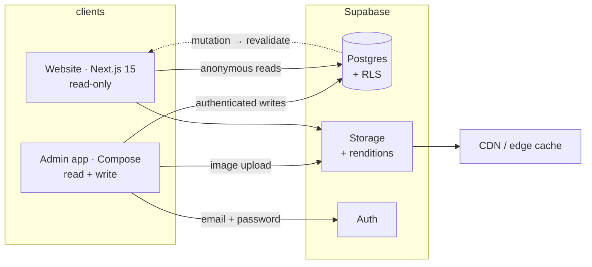

# Architecture

How the system fits together. **Why** it fits together this way belongs in [../adr/](../adr/) — this directory documents the resulting structure, not the decisions behind it.

## The system in one paragraph

A Next.js 15 website and a Kotlin/Compose Android admin app both talk to one Supabase project. The app is the only writer; the website is read-only. Supabase Postgres holds the catalogue, Supabase Storage holds the photographs and serves optimised renditions over a CDN, and row-level security — not application code — is what prevents the public from reading or writing what it shouldn't. When the owner uploads a product, a revalidation signal tells the website to rebuild the affected pages, which is what makes the PRD's one-minute freshness promise possible.

## Documents

| Document | Contents | Task |
|---|---|---|
| `rendering.md` | Per-route rendering strategy, ISR, cache tag placement | M4.7 |
| `sync.md` | Revalidation mechanism, mutation→tag map, stale-page diagnosis runbook | M9.7 |

Both are near-term deliverables. This README carries the system overview until they exist.

## Structural invariants

These hold across the whole system. Breaking one is an architectural change and needs an ADR.

1. **The website never writes.** All mutations originate in the Android app. The website's Supabase client uses the anonymous key and has no write path.
2. **RLS is the security boundary.** Not application code, not a check in a component. If a feature appears to need the service-role key from a client, the policy is wrong — fix the policy. See [ADR-0004](../adr/0004-authentication-and-roles.md).
3. **One schema contract, two clients.** The generated TypeScript types and the hand-written Kotlin models describe the same tables. A migration updates both, in the same change. See [docs/database/](../database/).
4. **Pages read through the data-access layer.** No page or component queries Supabase inline. See [docs/api/](../api/).
5. **Storage paths are derived, never stored ad hoc.** The path convention in [ADR-0005](../adr/0005-image-storage-and-renditions.md) is the only way image locations are constructed.

## Related decisions

- [ADR-0001](../adr/0001-monorepo.md) — why one repository
- [ADR-0002](../adr/0002-nextjs-app-router.md) — Next.js 15 App Router
- [ADR-0003](../adr/0003-supabase-backend.md) — Supabase as the backend platform
- [ADR-0006](../adr/0006-cache-revalidation-strategy.md) — revalidation strategy *(Proposed)*
- [ADR-0007](../adr/0007-android-architecture.md) — Android architecture *(Proposed)*
- [ADR-0009](../adr/0009-website-first-with-mock-data-adapter.md) — website-first build order
