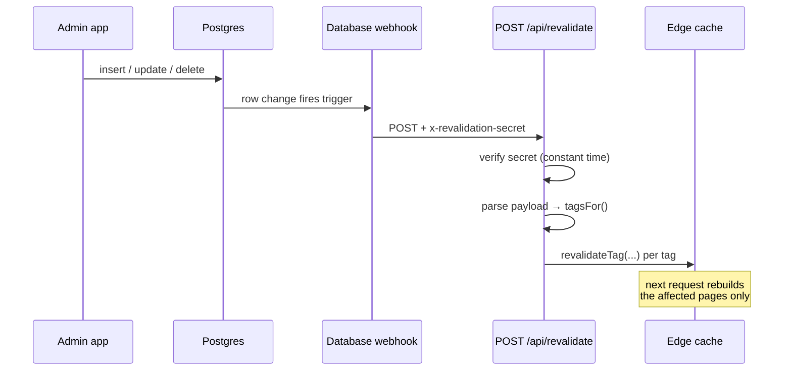

# Live Sync and Content Freshness

Produced by **M9.7**. Implements [ADR-0006](../adr/0006-cache-revalidation-strategy.md), which chose the mechanism; this records what was built and **how to diagnose a page that will not update**.

The one-sentence version: **a Supabase database webhook calls a secret-protected route on the website, which clears the cache tags the changed row affects — and a 10-minute ISR interval catches anything the webhook drops.**

The tag vocabulary itself lives in [rendering.md §2](rendering.md#2--cache-tags) and is not repeated here.

---

## 1 · The path a change takes



Four things have to be true for a change to appear. Each is a separate failure point, and §4 checks them in this order:

1. The row actually changed in the database.
2. The webhook fired and reached the site.
3. The secret matched, so the handler ran.
4. The tags it cleared covered the pages you are looking at.

---

## 2 · The endpoint

`POST /api/revalidate` — [`web/app/api/revalidate/route.ts`](../../web/app/api/revalidate/route.ts)

| Property | Value |
|---|---|
| Auth | `x-revalidation-secret` header, compared with `timingSafeEqual` |
| Runtime | Node (needs `node:crypto`) |
| Caching | `force-dynamic` + `Cache-Control: no-store` |
| Idempotent | Yes — `revalidateTag` on an already-stale tag is a no-op |

### Responses

| Status | Meaning | Webhook should |
|---|---|---|
| 200 | Tags cleared; body lists them | stop |
| 400 | Body was not JSON, or not a shape we recognise | stop — retrying will not help |
| 401 | Secret absent or wrong | stop |
| 500 | `REVALIDATION_SECRET` unset, or `revalidateTag` threw | retry |

The 500-on-missing-config is deliberate. Answering 401 there would send the webhook into a retry loop against an endpoint that can never succeed, and the logs would blame the caller for a deployment fault.

---

## 3 · The mutation → tag map

Implemented by `tagsFor` in [`web/lib/data/revalidate.ts`](../../web/lib/data/revalidate.ts), and asserted by `npm run test:revalidate`.

| Table | Tags cleared | Note |
|---|---|---|
| `products` | `products`, `product:<slug>` | both the new and old slug |
| `categories` | `categories`, `products`, `category:<slug>` | `products` because hiding a category changes which pieces are public |
| `product_images` | `products` | see the limitation below |

### Both slugs, not just the new one

An update carries `record` (the new row) and `old_record` (the previous one). A **renamed slug** would otherwise leave the old URL serving a cached page for a product that no longer lives there. Both are read for this reason.

### `product_images` is coarse, deliberately

The row carries `product_id` and **no slug**, so `product:<slug>` cannot be derived without a database query — on a path that must not fail and must stay fast. So an image reorder clears the `products` lists but not that product's own detail page directly.

**Consequence:** reordering a product's photographs updates its card everywhere within seconds, but its detail page gallery may lag until the 10-minute interval. If that becomes a real complaint, the fix is a slug lookup in the handler, accepting the added failure mode. ADR-0006 left this open; this is the resolution.

---

## 4 · Diagnosing a stale page

Work down the list. Each step rules out one of §1's four failure points.

### Step 1 — Is the database actually changed?

```sql
select slug, name, archived, updated_at
from public.products
where slug = 'the-slug';
```

If the row is unchanged, this is not a caching problem — the app's write failed and the trouble is on the phone.

### Step 2 — Did the webhook fire?

Supabase dashboard → **Database → Webhooks → your hook → Logs**. Look for a delivery at the time of the change.

- **No delivery** → the webhook is not configured for that table, or is disabled. See §5.
- **Delivery with a non-2xx response** → read the status against the table in §2.

### Step 3 — Did the handler run, and what did it clear?

Vercel → **Logs**, filter for `[revalidate]`. Every delivery logs one line:

```
[revalidate] UPDATE on products; cleared: products, product:gold-ring
```

- **No line at all** → the request never reached the function. Check the URL in the webhook and that the deployment is live.
- **A `FAILED` line** → `revalidateTag` threw. The line names the tags and the fallback interval; the site self-corrects within 10 minutes.
- **A line whose tags do not cover your page** → the map is wrong for this mutation. That is a bug in `tagsFor`, and a test case belongs in `revalidate-contract.mjs` before the fix.

### Step 4 — Are you sure you are seeing a cold response?

A browser will happily show you its own cache and let you blame the server.

```bash
curl -sI https://your-domain/product/the-slug | grep -i "x-vercel-cache\|age\|cache-control"
```

`x-vercel-cache: HIT` with a high `age` after a confirmed revalidation means the edge did not get the message. `MISS` or `STALE` means it did.

### Step 5 — Exercise the endpoint by hand

Proves the endpoint independently of Supabase:

```bash
curl -X POST https://your-domain/api/revalidate \
  -H "x-revalidation-secret: $REVALIDATION_SECRET" \
  -H "content-type: application/json" \
  -d '{"type":"UPDATE","table":"products","record":{"slug":"the-slug"},"old_record":null}'
```

A 200 listing the tags means the site side is healthy and the problem is upstream, in the webhook.

---

## 5 · Configuring the webhook

Once per environment. **Preview deployments must not point at the production database** ([CLAUDE.md §9](../../CLAUDE.md)).

1. Generate a secret: `openssl rand -hex 32`
2. Set `REVALIDATION_SECRET` in Vercel → Settings → Environment Variables (Production).
3. Supabase → **Database → Webhooks → Create**, one per table — `products`, `categories`, `product_images`:
   - Events: **Insert, Update, Delete**
   - Type: **HTTP Request**, `POST`, `https://your-domain/api/revalidate`
   - Header: `x-revalidation-secret` = the same value

Miss a table and its mutations fall back to the 10-minute interval — silently. That is the failure mode worth re-reading §4 for.

### Local development

Local `next dev` receives no production webhooks, and does not need them: it does not serve from the ISR cache. Use the `curl` in Step 5 against `http://localhost:3000` to exercise the handler.

---

## 6 · The fallback

`REVALIDATE_SECONDS = 600` in [`web/lib/data/cache.ts`](../../web/lib/data/cache.ts) — the single source for the interval; the endpoint imports it rather than restating the number.

Ten minutes is the deliberate answer to ADR-0006's open sub-question. It is long enough that a catalogue changing a few times a day wastes almost no rebuilds, and short enough that a dropped webhook is an annoyance rather than an outage. **The webhook, not this interval, is what meets the PRD's one-minute promise.**

No `Cache-Control` is set on catalogue pages, and that is intentional: Vercel derives the CDN's `s-maxage` from each route's `revalidate` value, so one number drives both caches. An explicit header would let them drift, and a stale edge serving old HTML after a successful `revalidateTag` is exactly the bug M9.4 exists to prevent.

---

## 7 · Measured freshness

See [the launch checklist §6](../deployment/launch-checklist.md#6--sync-freshness--m96) for the recorded M9.6 timings and the procedure that produced them.

---

## Related

- [ADR-0006](../adr/0006-cache-revalidation-strategy.md) — why a webhook, and why not Realtime
- [rendering.md](rendering.md) — per-route rendering and the tag vocabulary
- [../deployment/environments.md](../deployment/environments.md) — environment variables per deployment
